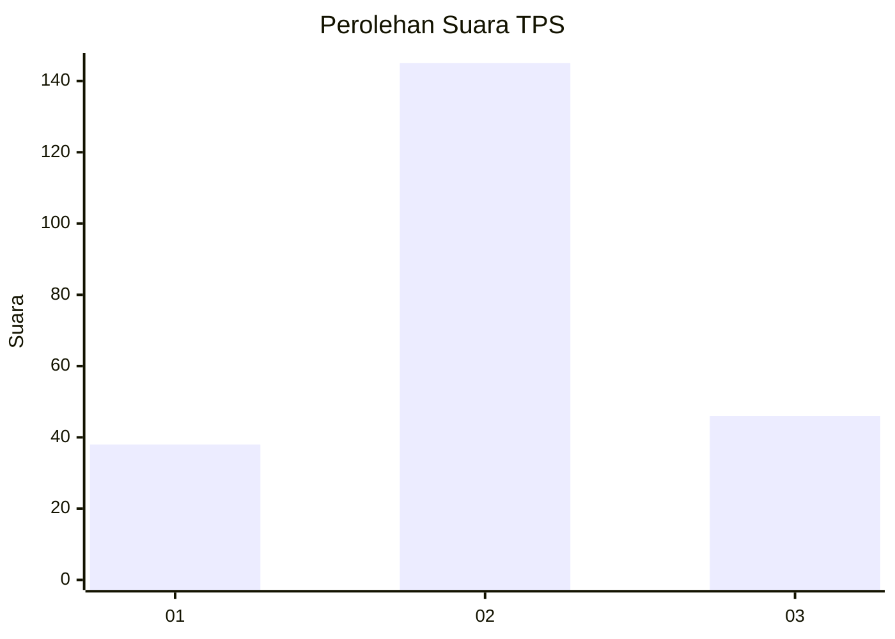
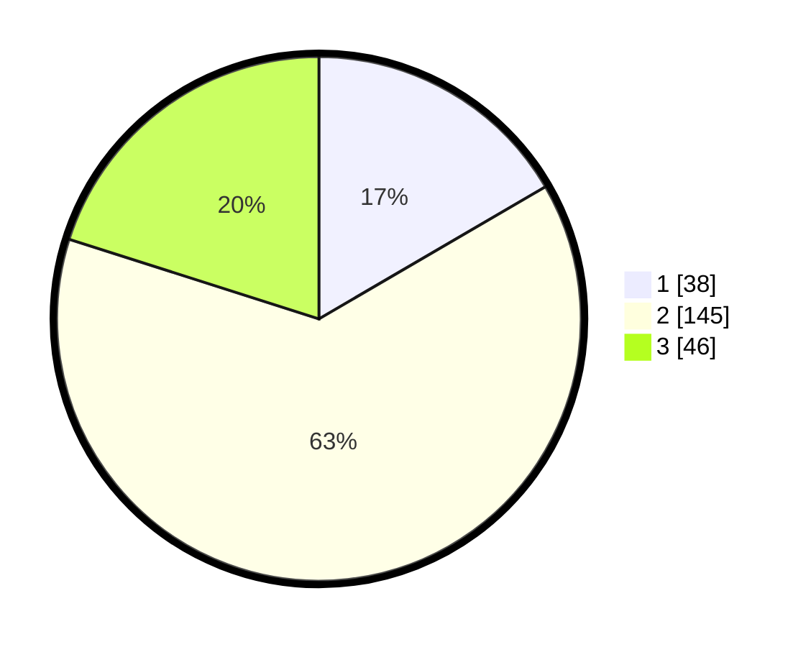

# Hasil

## Grafik

## Tabel

| No. | Nama Paslon    | Suara | Suara (raw) | Persentase |
|:--- |:-------------- | -----:| -----------:| ----------:|
| 1   | ANIES MUHAIMIN | 38    | [38][p-1]   | 16,59      |
| 2   | PRABOWO GIBRAN | 145   | [145][p-2]  | 63,32      |
| 3   | GANJAR MAHFUD  | 46    | [46][p-3]   | 20,09      |

[p-1]: https://github.com/gigit-pemilu/pemilu-2024/blob/main/pilpres/hitung-suara/sub/35-jawa-timur/sub/05-blitar/sub/03-srengat/sub/2001-karanggayam/sub/010-tps/sub/paslon-1.txt
[p-2]: https://github.com/gigit-pemilu/pemilu-2024/blob/main/pilpres/hitung-suara/sub/35-jawa-timur/sub/05-blitar/sub/03-srengat/sub/2001-karanggayam/sub/010-tps/sub/paslon-2.txt
[p-3]: https://github.com/gigit-pemilu/pemilu-2024/blob/main/pilpres/hitung-suara/sub/35-jawa-timur/sub/05-blitar/sub/03-srengat/sub/2001-karanggayam/sub/010-tps/sub/paslon-3.txt

## Foto C Plano

https://sirekap-obj-formc.kpu.go.id/bbfd/pemilu/ppwp/35/05/03/20/01/3505032001010-20240221-235622--bebf476a-54f7-47d7-8f21-dec597553f55.jpg

https://sirekap-obj-formc.kpu.go.id/bbfd/pemilu/ppwp/35/05/03/20/01/3505032001010-20240221-235639--b789ad25-7d43-405e-b539-010e76159204.jpg

https://sirekap-obj-formc.kpu.go.id/bbfd/pemilu/ppwp/35/05/03/20/01/3505032001010-20240221-235654--d8e73d50-33ea-416e-b396-5b8f8fab7331.jpg

## Metadata

| Key        | Value               |
| ---------- | ------------------- |
| Time Stamp | 2024-02-22 18:00:00 |

