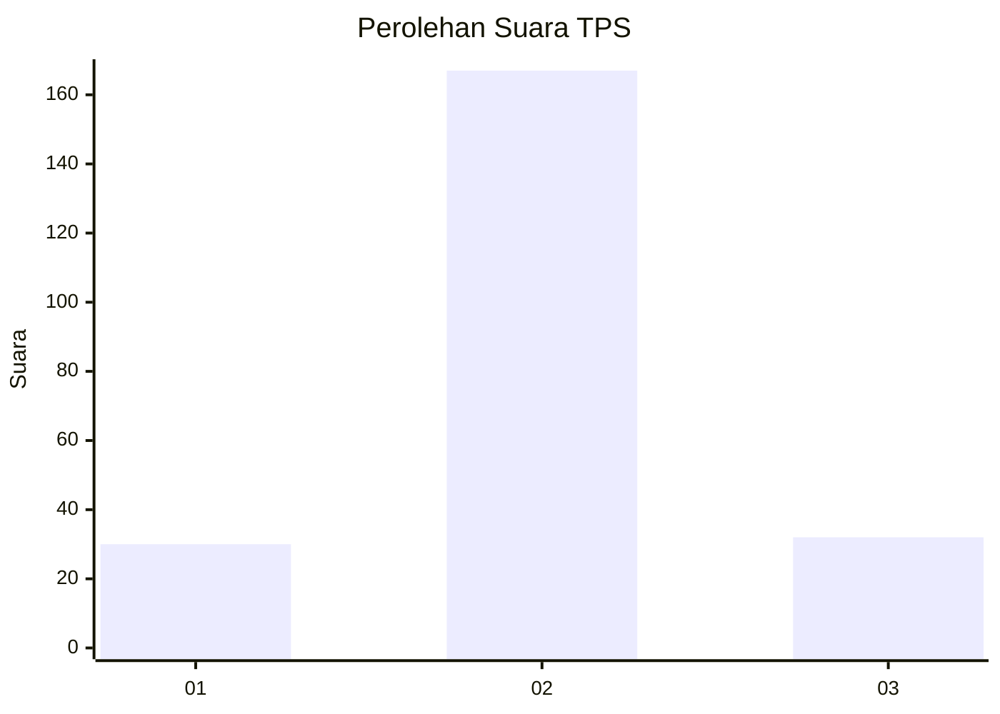
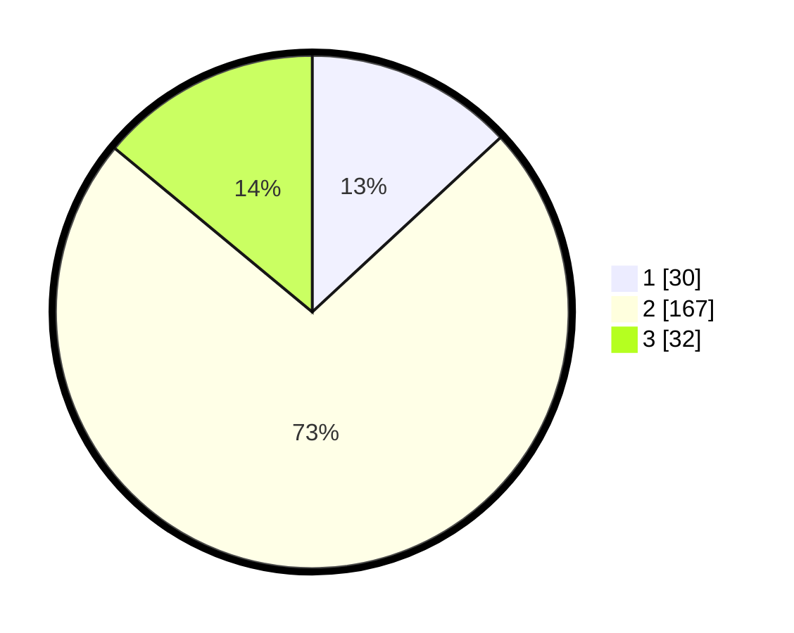

# Hasil

## Grafik

## Tabel

| No. | Nama Paslon    | Suara | Suara (raw) | Persentase |
|:--- |:-------------- | -----:| -----------:| ----------:|
| 1   | ANIES MUHAIMIN | 30    | [30][p-1]   | 13,10      |
| 2   | PRABOWO GIBRAN | 167   | [167][p-2]  | 72,93      |
| 3   | GANJAR MAHFUD  | 32    | [32][p-3]   | 13,97      |

[p-1]: https://github.com/gigit-pemilu/pemilu-2024-35-jawa-timur/blob/main/pilpres/hitung-suara/sub/35-jawa-timur/sub/05-blitar/sub/03-srengat/sub/2001-karanggayam/sub/011-tps/sub/paslon-1.txt
[p-2]: https://github.com/gigit-pemilu/pemilu-2024-35-jawa-timur/blob/main/pilpres/hitung-suara/sub/35-jawa-timur/sub/05-blitar/sub/03-srengat/sub/2001-karanggayam/sub/011-tps/sub/paslon-2.txt
[p-3]: https://github.com/gigit-pemilu/pemilu-2024-35-jawa-timur/blob/main/pilpres/hitung-suara/sub/35-jawa-timur/sub/05-blitar/sub/03-srengat/sub/2001-karanggayam/sub/011-tps/sub/paslon-3.txt

## Foto C Plano

https://sirekap-obj-formc.kpu.go.id/bacd/pemilu/ppwp/35/05/03/20/01/3505032001011-20240214-214640--8997f956-82bd-4414-b8ae-2ebc5c08d25f.jpg

https://sirekap-obj-formc.kpu.go.id/bacd/pemilu/ppwp/35/05/03/20/01/3505032001011-20240215-004035--f8b2fb24-3e15-4713-860a-3916175d1647.jpg

https://sirekap-obj-formc.kpu.go.id/bacd/pemilu/ppwp/35/05/03/20/01/3505032001011-20240215-004044--43a3e96d-5e1f-4e2e-a4dd-817a1b2dd0d0.jpg

## Metadata

| Key        | Value               |
| ---------- | ------------------- |
| Time Stamp | 2024-02-15 12:00:28 |

