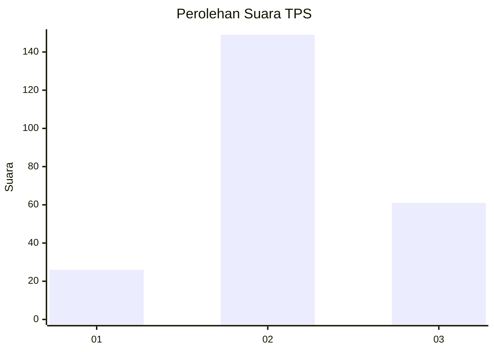
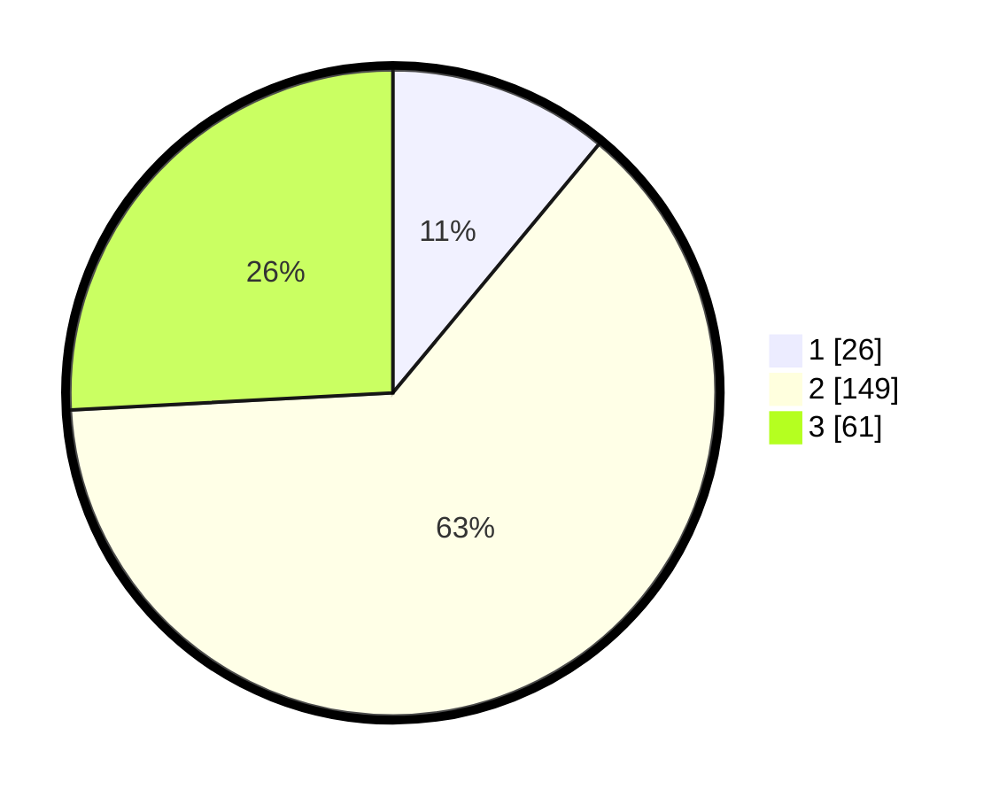

# Hasil

## Grafik

## Tabel

| No. | Nama Paslon    | Suara | Suara (raw) | Persentase |
|:--- |:-------------- | -----:| -----------:| ----------:|
| 1   | ANIES MUHAIMIN | 26    | [26][p-1]   | 11,02      |
| 2   | PRABOWO GIBRAN | 149   | [149][p-2]  | 63,14      |
| 3   | GANJAR MAHFUD  | 61    | [61][p-3]   | 25,85      |

[p-1]: https://github.com/gigit-pemilu/pemilu-2024/blob/main/pilpres/hitung-suara/sub/35-jawa-timur/sub/05-blitar/sub/03-srengat/sub/2002-dermojayan/sub/008-tps/sub/paslon-1.txt
[p-2]: https://github.com/gigit-pemilu/pemilu-2024/blob/main/pilpres/hitung-suara/sub/35-jawa-timur/sub/05-blitar/sub/03-srengat/sub/2002-dermojayan/sub/008-tps/sub/paslon-2.txt
[p-3]: https://github.com/gigit-pemilu/pemilu-2024/blob/main/pilpres/hitung-suara/sub/35-jawa-timur/sub/05-blitar/sub/03-srengat/sub/2002-dermojayan/sub/008-tps/sub/paslon-3.txt

## Foto C Plano

https://sirekap-obj-formc.kpu.go.id/aaf3/pemilu/ppwp/35/05/03/20/02/3505032002008-20240215-002209--fb71906b-2e3c-4629-a370-c2e28e8d6344.jpg

https://sirekap-obj-formc.kpu.go.id/aaf3/pemilu/ppwp/35/05/03/20/02/3505032002008-20240215-002353--e2a393ac-9bba-4956-9db6-3c850609c327.jpg

https://sirekap-obj-formc.kpu.go.id/aaf3/pemilu/ppwp/35/05/03/20/02/3505032002008-20240215-002446--c5c9adb9-f5c5-4402-b85e-9abb22cabbaf.jpg

## Metadata

| Key        | Value               |
| ---------- | ------------------- |
| Time Stamp | 2024-02-22 17:00:00 |

