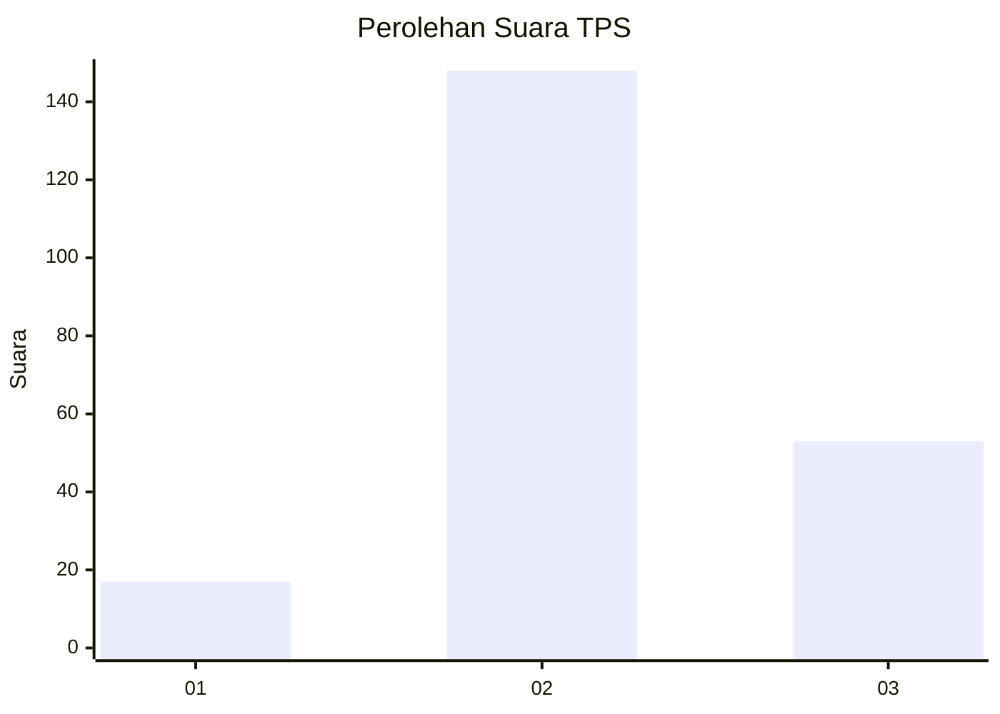
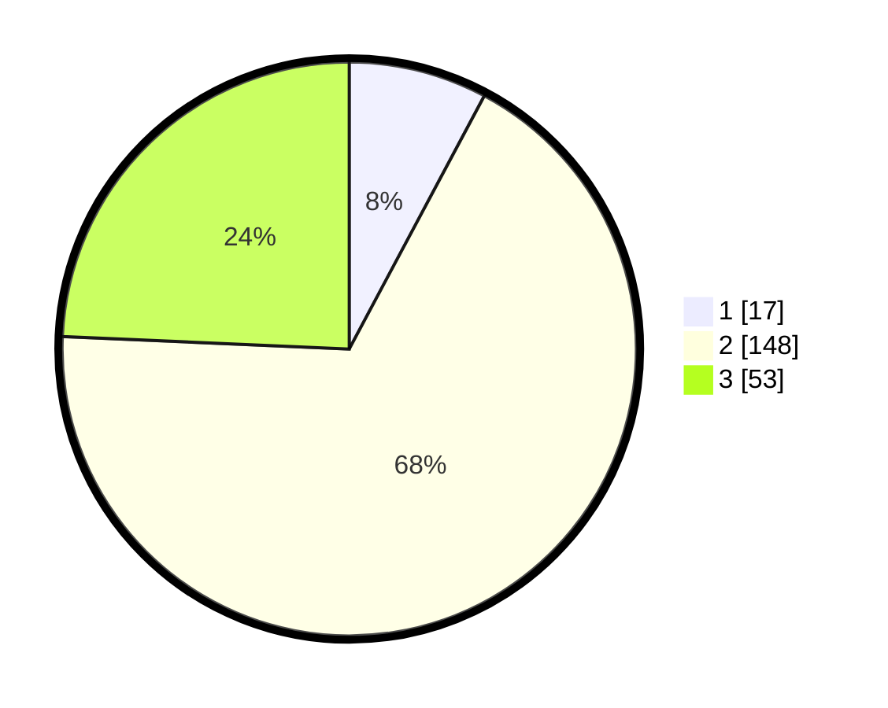

# Hasil

## Grafik

## Tabel

| No. | Nama Paslon    | Suara | Suara (raw) | Persentase |
|:--- |:-------------- | -----:| -----------:| ----------:|
| 1   | ANIES MUHAIMIN | 17    | [17][p-1]   | 7,80       |
| 2   | PRABOWO GIBRAN | 148   | [148][p-2]  | 67,89      |
| 3   | GANJAR MAHFUD  | 53    | [53][p-3]   | 24,31      |

[p-1]: https://github.com/gigit-pemilu/pemilu-2024/blob/main/pilpres/hitung-suara/sub/35-jawa-timur/sub/05-blitar/sub/03-srengat/sub/2012-bagelenan/sub/002-tps/sub/paslon-1.txt
[p-2]: https://github.com/gigit-pemilu/pemilu-2024/blob/main/pilpres/hitung-suara/sub/35-jawa-timur/sub/05-blitar/sub/03-srengat/sub/2012-bagelenan/sub/002-tps/sub/paslon-2.txt
[p-3]: https://github.com/gigit-pemilu/pemilu-2024/blob/main/pilpres/hitung-suara/sub/35-jawa-timur/sub/05-blitar/sub/03-srengat/sub/2012-bagelenan/sub/002-tps/sub/paslon-3.txt

## Foto C Plano

https://sirekap-obj-formc.kpu.go.id/7248/pemilu/ppwp/35/05/03/20/12/3505032012002-20240214-194019--cfd1e011-9f8f-4dcd-87c2-e90e304d8bb6.jpg

https://sirekap-obj-formc.kpu.go.id/7248/pemilu/ppwp/35/05/03/20/12/3505032012002-20240214-194500--b61a1a44-b9c4-41db-b340-f29a8dda99c4.jpg

https://sirekap-obj-formc.kpu.go.id/7248/pemilu/ppwp/35/05/03/20/12/3505032012002-20240214-194506--b5f7330e-6cf1-4ae0-8a7e-dc975ab25fbb.jpg

## Metadata

| Key        | Value               |
| ---------- | ------------------- |
| Time Stamp | 2024-02-14 21:46:01 |

