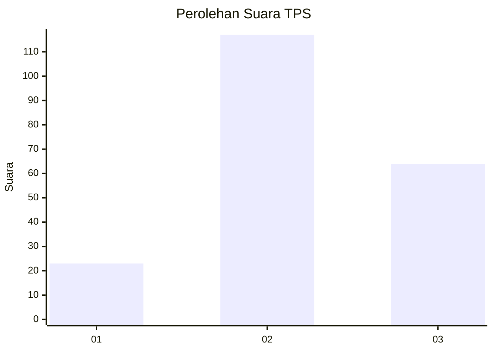
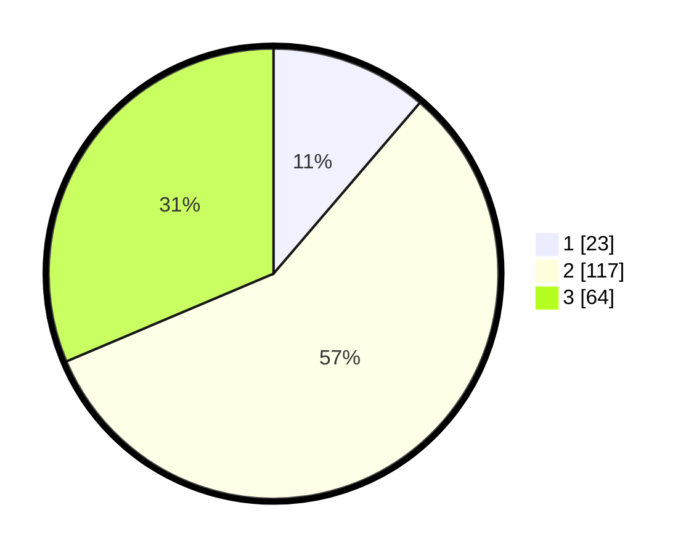

# Hasil

## Grafik

## Tabel

| No. | Nama Paslon    | Suara | Suara (raw) | Persentase |
|:--- |:-------------- | -----:| -----------:| ----------:|
| 1   | ANIES MUHAIMIN | 23    | [23][p-1]   | 11,27      |
| 2   | PRABOWO GIBRAN | 117   | [117][p-2]  | 57,35      |
| 3   | GANJAR MAHFUD  | 64    | [64][p-3]   | 31,37      |

[p-1]: https://github.com/gigit-pemilu/pemilu-2024/blob/main/pilpres/hitung-suara/sub/35-jawa-timur/sub/05-blitar/sub/03-srengat/sub/2012-bagelenan/sub/003-tps/sub/paslon-1.txt
[p-2]: https://github.com/gigit-pemilu/pemilu-2024/blob/main/pilpres/hitung-suara/sub/35-jawa-timur/sub/05-blitar/sub/03-srengat/sub/2012-bagelenan/sub/003-tps/sub/paslon-2.txt
[p-3]: https://github.com/gigit-pemilu/pemilu-2024/blob/main/pilpres/hitung-suara/sub/35-jawa-timur/sub/05-blitar/sub/03-srengat/sub/2012-bagelenan/sub/003-tps/sub/paslon-3.txt

## Foto C Plano

https://sirekap-obj-formc.kpu.go.id/0a3d/pemilu/ppwp/35/05/03/20/12/3505032012003-20240215-161338--2c5def7c-189a-48fa-b557-e1cef2f6352b.jpg

https://sirekap-obj-formc.kpu.go.id/0a3d/pemilu/ppwp/35/05/03/20/12/3505032012003-20240217-123603--3d132ec9-6896-41dc-82f1-de53385a2979.jpg

https://sirekap-obj-formc.kpu.go.id/0a3d/pemilu/ppwp/35/05/03/20/12/3505032012003-20240215-161816--de933b5a-48f3-414c-84e1-4ee79bbfd7f7.jpg

## Metadata

| Key        | Value               |
| ---------- | ------------------- |
| Time Stamp | 2024-02-21 17:00:00 |

