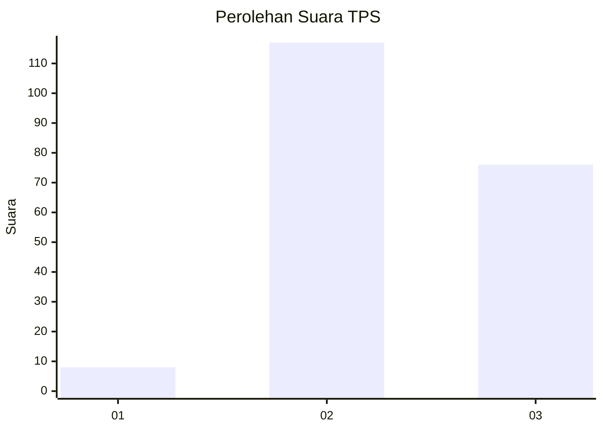
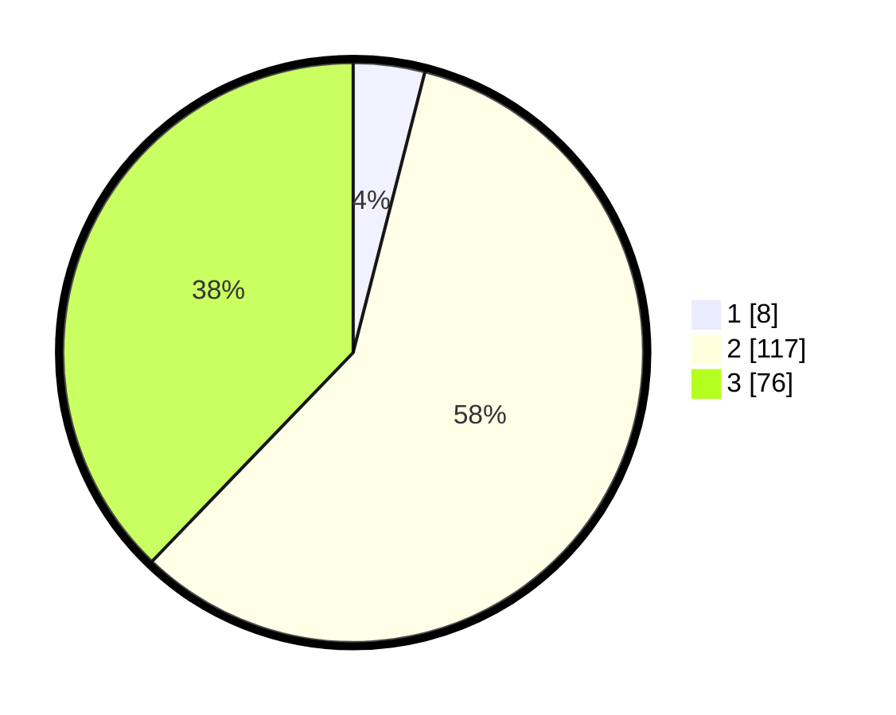

# Hasil

## Grafik

## Tabel

| No. | Nama Paslon    | Suara | Suara (raw) | Persentase |
|:--- |:-------------- | -----:| -----------:| ----------:|
| 1   | ANIES MUHAIMIN | 8     | [8][p-1]    | 3,98       |
| 2   | PRABOWO GIBRAN | 117   | [117][p-2]  | 58,21      |
| 3   | GANJAR MAHFUD  | 76    | [76][p-3]   | 37,81      |

[p-1]: https://github.com/gigit-pemilu/pemilu-2024/blob/main/pilpres/hitung-suara/sub/35-jawa-timur/sub/05-blitar/sub/03-srengat/sub/2016-ngaglik/sub/006-tps/sub/paslon-1.txt
[p-2]: https://github.com/gigit-pemilu/pemilu-2024/blob/main/pilpres/hitung-suara/sub/35-jawa-timur/sub/05-blitar/sub/03-srengat/sub/2016-ngaglik/sub/006-tps/sub/paslon-2.txt
[p-3]: https://github.com/gigit-pemilu/pemilu-2024/blob/main/pilpres/hitung-suara/sub/35-jawa-timur/sub/05-blitar/sub/03-srengat/sub/2016-ngaglik/sub/006-tps/sub/paslon-3.txt

## Foto C Plano

https://sirekap-obj-formc.kpu.go.id/624e/pemilu/ppwp/35/05/03/20/16/3505032016006-20240216-173127--9129701d-d6cd-4449-8253-641471d65e0a.jpg

https://sirekap-obj-formc.kpu.go.id/624e/pemilu/ppwp/35/05/03/20/16/3505032016006-20240214-222506--38271155-5962-4938-af4a-bf3ba7bd1e27.jpg

https://sirekap-obj-formc.kpu.go.id/624e/pemilu/ppwp/35/05/03/20/16/3505032016006-20240214-222554--1412acad-9ca5-4edf-9b5c-4f2d49c98dd5.jpg

## Metadata

| Key        | Value               |
| ---------- | ------------------- |
| Time Stamp | 2024-02-16 21:01:00 |

