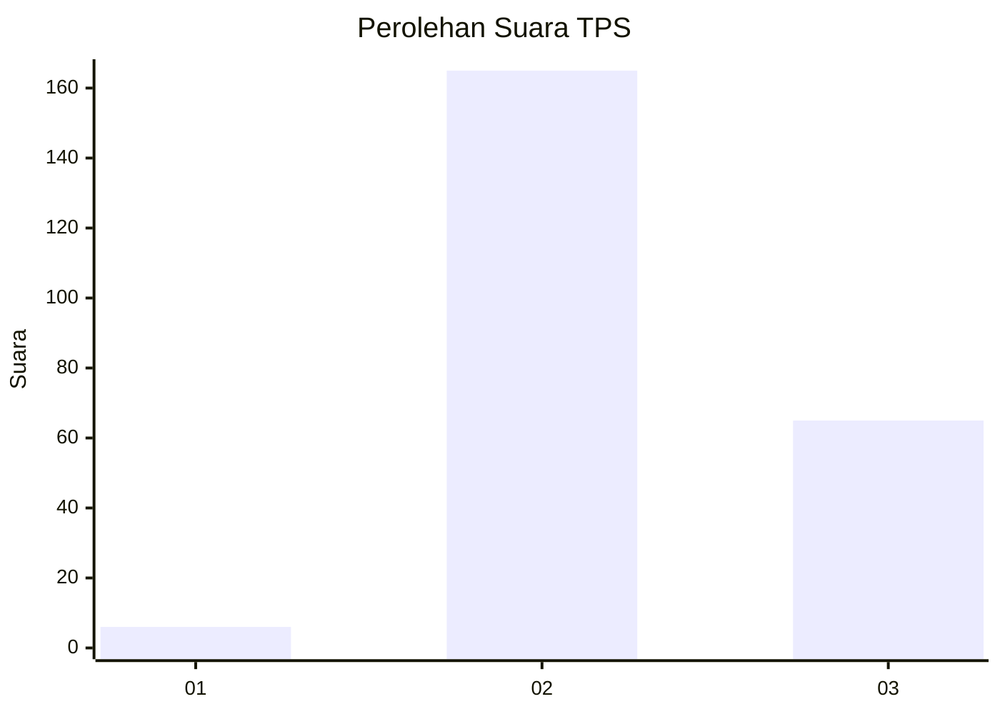
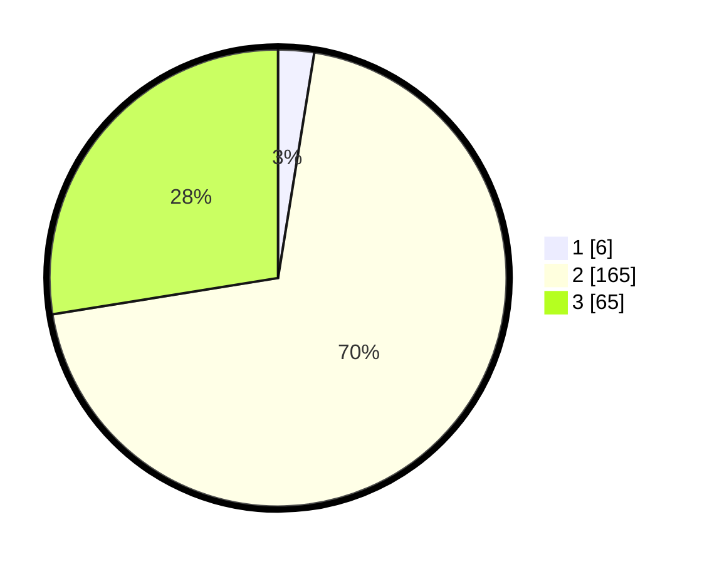

# Hasil

## Grafik

## Tabel

| No. | Nama Paslon    | Suara | Suara (raw) | Persentase |
|:--- |:-------------- | -----:| -----------:| ----------:|
| 1   | ANIES MUHAIMIN | 6     | [6][p-1]    | 2,54       |
| 2   | PRABOWO GIBRAN | 165   | [165][p-2]  | 69,92      |
| 3   | GANJAR MAHFUD  | 65    | [65][p-3]   | 27,54      |

[p-1]: https://github.com/gigit-pemilu/pemilu-2024/blob/main/pilpres/hitung-suara/sub/35-jawa-timur/sub/05-blitar/sub/04-kademangan/sub/2002-maron/sub/001-tps/sub/paslon-1.txt
[p-2]: https://github.com/gigit-pemilu/pemilu-2024/blob/main/pilpres/hitung-suara/sub/35-jawa-timur/sub/05-blitar/sub/04-kademangan/sub/2002-maron/sub/001-tps/sub/paslon-2.txt
[p-3]: https://github.com/gigit-pemilu/pemilu-2024/blob/main/pilpres/hitung-suara/sub/35-jawa-timur/sub/05-blitar/sub/04-kademangan/sub/2002-maron/sub/001-tps/sub/paslon-3.txt

## Foto C Plano

https://sirekap-obj-formc.kpu.go.id/02c5/pemilu/ppwp/35/05/04/20/02/3505042002001-20240214-215452--956ce837-9473-4819-ac87-9365b4be6b74.jpg

https://sirekap-obj-formc.kpu.go.id/02c5/pemilu/ppwp/35/05/04/20/02/3505042002001-20240214-215711--f5adb681-f654-49aa-81cf-93790cb56c19.jpg

https://sirekap-obj-formc.kpu.go.id/02c5/pemilu/ppwp/35/05/04/20/02/3505042002001-20240214-215930--d9c9717b-c5a0-4202-a2f2-f56924366d70.jpg

## Metadata

| Key        | Value               |
| ---------- | ------------------- |
| Time Stamp | 2024-02-15 12:00:28 |

