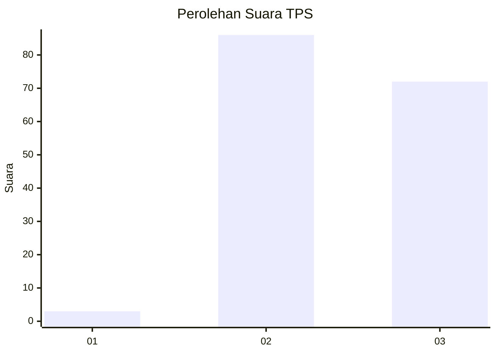
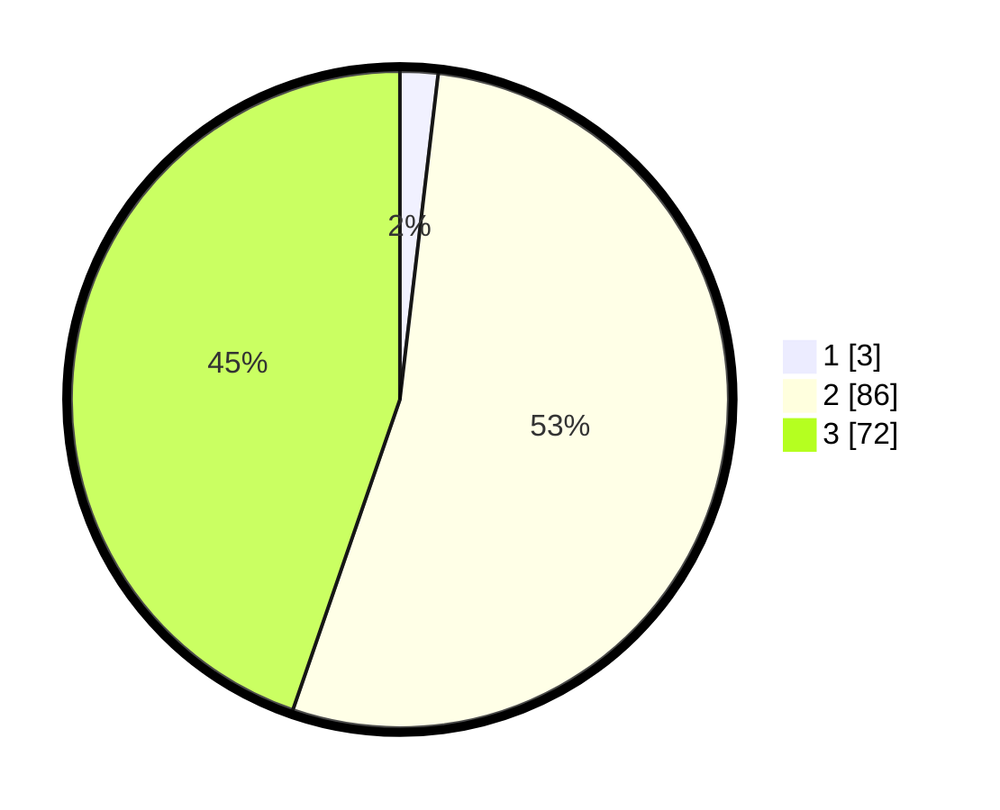

# Hasil

## Grafik

## Tabel

| No. | Nama Paslon    | Suara | Suara (raw) | Persentase |
|:--- |:-------------- | -----:| -----------:| ----------:|
| 1   | ANIES MUHAIMIN | 3     | [3][p-1]    | 1,86       |
| 2   | PRABOWO GIBRAN | 86    | [86][p-2]   | 53,42      |
| 3   | GANJAR MAHFUD  | 72    | [72][p-3]   | 44,72      |

[p-1]: https://github.com/gigit-pemilu/pemilu-2024/blob/main/pilpres/hitung-suara/sub/35-jawa-timur/sub/05-blitar/sub/04-kademangan/sub/2003-pakisaji/sub/002-tps/sub/paslon-1.txt
[p-2]: https://github.com/gigit-pemilu/pemilu-2024/blob/main/pilpres/hitung-suara/sub/35-jawa-timur/sub/05-blitar/sub/04-kademangan/sub/2003-pakisaji/sub/002-tps/sub/paslon-2.txt
[p-3]: https://github.com/gigit-pemilu/pemilu-2024/blob/main/pilpres/hitung-suara/sub/35-jawa-timur/sub/05-blitar/sub/04-kademangan/sub/2003-pakisaji/sub/002-tps/sub/paslon-3.txt

## Foto C Plano

https://sirekap-obj-formc.kpu.go.id/322b/pemilu/ppwp/35/05/04/20/03/3505042003002-20240216-162045--76b47af7-bacf-441e-a3a0-128df057eb7b.jpg

https://sirekap-obj-formc.kpu.go.id/322b/pemilu/ppwp/35/05/04/20/03/3505042003002-20240216-150301--5c95de7f-98b9-4496-af3b-deb723003c04.jpg

https://sirekap-obj-formc.kpu.go.id/322b/pemilu/ppwp/35/05/04/20/03/3505042003002-20240216-150450--cbe921f0-d5e1-4d68-b524-55e82225ffaf.jpg

## Metadata

| Key        | Value               |
| ---------- | ------------------- |
| Time Stamp | 2024-02-17 13:37:34 |

