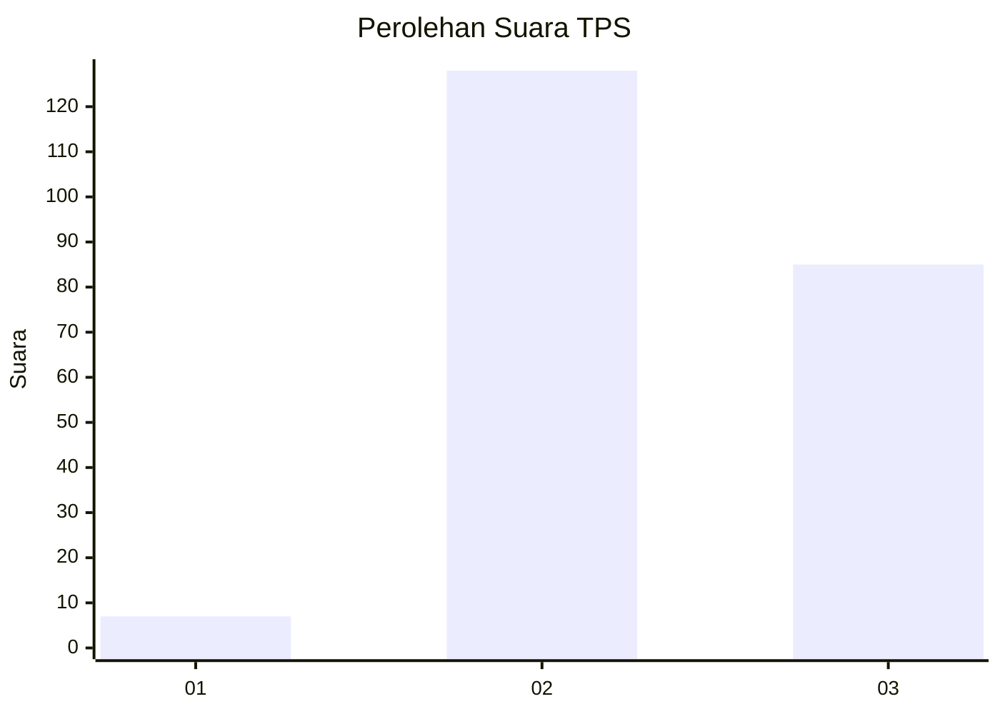
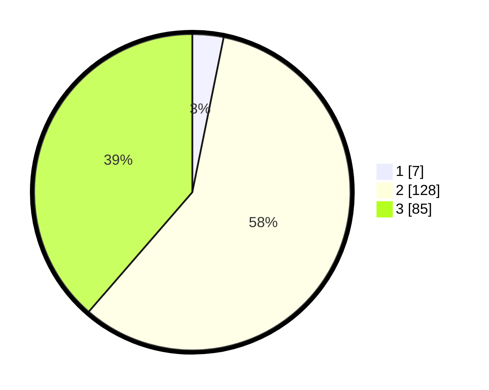

# Hasil

## Grafik

## Tabel

| No. | Nama Paslon    | Suara | Suara (raw) | Persentase |
|:--- |:-------------- | -----:| -----------:| ----------:|
| 1   | ANIES MUHAIMIN | 7     | [7][p-1]    | 3,18       |
| 2   | PRABOWO GIBRAN | 128   | [128][p-2]  | 58,18      |
| 3   | GANJAR MAHFUD  | 85    | [85][p-3]   | 38,64      |

[p-1]: https://github.com/gigit-pemilu/pemilu-2024/blob/main/pilpres/hitung-suara/sub/35-jawa-timur/sub/05-blitar/sub/04-kademangan/sub/2005-bendosari/sub/005-tps/sub/paslon-1.txt
[p-2]: https://github.com/gigit-pemilu/pemilu-2024/blob/main/pilpres/hitung-suara/sub/35-jawa-timur/sub/05-blitar/sub/04-kademangan/sub/2005-bendosari/sub/005-tps/sub/paslon-2.txt
[p-3]: https://github.com/gigit-pemilu/pemilu-2024/blob/main/pilpres/hitung-suara/sub/35-jawa-timur/sub/05-blitar/sub/04-kademangan/sub/2005-bendosari/sub/005-tps/sub/paslon-3.txt

## Foto C Plano

https://sirekap-obj-formc.kpu.go.id/89a9/pemilu/ppwp/35/05/04/20/05/3505042005005-20240214-235928--0ca350e6-388e-48a8-9e43-afc4a72a73ce.jpg

https://sirekap-obj-formc.kpu.go.id/89a9/pemilu/ppwp/35/05/04/20/05/3505042005005-20240214-235954--4312f944-8e98-42da-ab9f-31c101bc8412.jpg

https://sirekap-obj-formc.kpu.go.id/89a9/pemilu/ppwp/35/05/04/20/05/3505042005005-20240215-000201--45894a26-f755-4506-aab7-131ff8a1f7c3.jpg

## Metadata

| Key        | Value               |
| ---------- | ------------------- |
| Time Stamp | 2024-02-16 08:30:27 |

