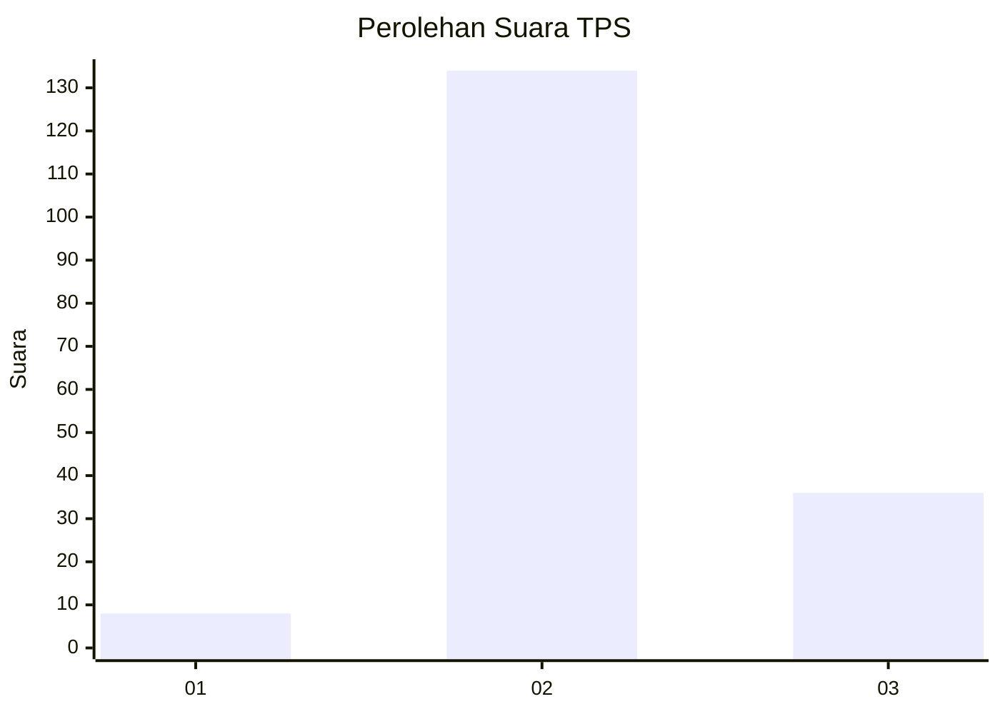

# Hasil

## Grafik

## Tabel

| No. | Nama Paslon    | Suara | Suara (raw) | Persentase |
|:--- |:-------------- | -----:| -----------:| ----------:|
| 1   | ANIES MUHAIMIN | 8     | [8][p-1]    | 4,49       |
| 2   | PRABOWO GIBRAN | 134   | [134][p-2]  | 75,28      |
| 3   | GANJAR MAHFUD  | 36    | [36][p-3]   | 20,22      |

[p-1]: https://github.com/gigit-pemilu/pemilu-2024-35-jawa-timur/blob/main/pilpres/hitung-suara/sub/35-jawa-timur/sub/05-blitar/sub/04-kademangan/sub/2005-bendosari/sub/008-tps/sub/paslon-1.txt
[p-2]: https://github.com/gigit-pemilu/pemilu-2024-35-jawa-timur/blob/main/pilpres/hitung-suara/sub/35-jawa-timur/sub/05-blitar/sub/04-kademangan/sub/2005-bendosari/sub/008-tps/sub/paslon-2.txt
[p-3]: https://github.com/gigit-pemilu/pemilu-2024-35-jawa-timur/blob/main/pilpres/hitung-suara/sub/35-jawa-timur/sub/05-blitar/sub/04-kademangan/sub/2005-bendosari/sub/008-tps/sub/paslon-3.txt

## Foto C Plano

https://sirekap-obj-formc.kpu.go.id/2ac3/pemilu/ppwp/35/05/04/20/05/3505042005008-20240217-190014--44a349fd-e0db-41ab-8448-ff79fa379c40.jpg

https://sirekap-obj-formc.kpu.go.id/2ac3/pemilu/ppwp/35/05/04/20/05/3505042005008-20240220-103242--fa61cb66-6127-4e7d-abf5-fa7c9f08c803.jpg

https://sirekap-obj-formc.kpu.go.id/2ac3/pemilu/ppwp/35/05/04/20/05/3505042005008-20240217-184317--c4dcd41b-ea94-475c-8352-89315c4a18e6.jpg

## Metadata

| Key        | Value               |
| ---------- | ------------------- |
| Time Stamp | 2024-02-24 22:31:28 |

