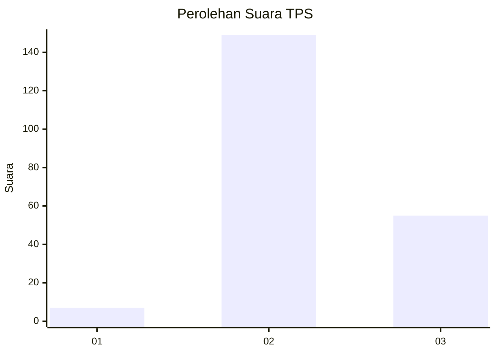
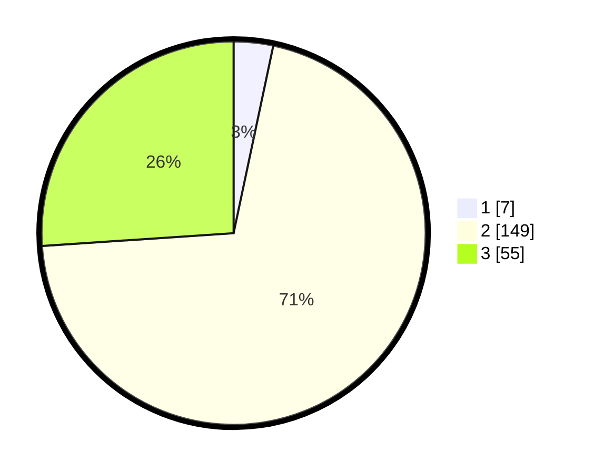

# Hasil

## Grafik

## Tabel

| No. | Nama Paslon    | Suara | Suara (raw) | Persentase |
|:--- |:-------------- | -----:| -----------:| ----------:|
| 1   | ANIES MUHAIMIN | 7     | [7][p-1]    | 3,32       |
| 2   | PRABOWO GIBRAN | 149   | [149][p-2]  | 70,62      |
| 3   | GANJAR MAHFUD  | 55    | [55][p-3]   | 26,07      |

[p-1]: https://github.com/gigit-pemilu/pemilu-2024-35-jawa-timur/blob/main/pilpres/hitung-suara/sub/35-jawa-timur/sub/05-blitar/sub/04-kademangan/sub/2006-sumberjo/sub/006-tps/sub/paslon-1.txt
[p-2]: https://github.com/gigit-pemilu/pemilu-2024-35-jawa-timur/blob/main/pilpres/hitung-suara/sub/35-jawa-timur/sub/05-blitar/sub/04-kademangan/sub/2006-sumberjo/sub/006-tps/sub/paslon-2.txt
[p-3]: https://github.com/gigit-pemilu/pemilu-2024-35-jawa-timur/blob/main/pilpres/hitung-suara/sub/35-jawa-timur/sub/05-blitar/sub/04-kademangan/sub/2006-sumberjo/sub/006-tps/sub/paslon-3.txt

## Foto C Plano

https://sirekap-obj-formc.kpu.go.id/771f/pemilu/ppwp/35/05/04/20/06/3505042006006-20240214-222126--a3e05d73-ce12-4a3b-8575-9e8364eeb6ed.jpg

https://sirekap-obj-formc.kpu.go.id/771f/pemilu/ppwp/35/05/04/20/06/3505042006006-20240215-003851--c7ed8db4-67a7-4f18-8c79-5e2df2d33444.jpg

https://sirekap-obj-formc.kpu.go.id/771f/pemilu/ppwp/35/05/04/20/06/3505042006006-20240214-222328--0e0603ee-50fa-4105-8ce4-1149041def99.jpg

## Metadata

| Key        | Value               |
| ---------- | ------------------- |
| Time Stamp | 2024-02-15 12:00:28 |

