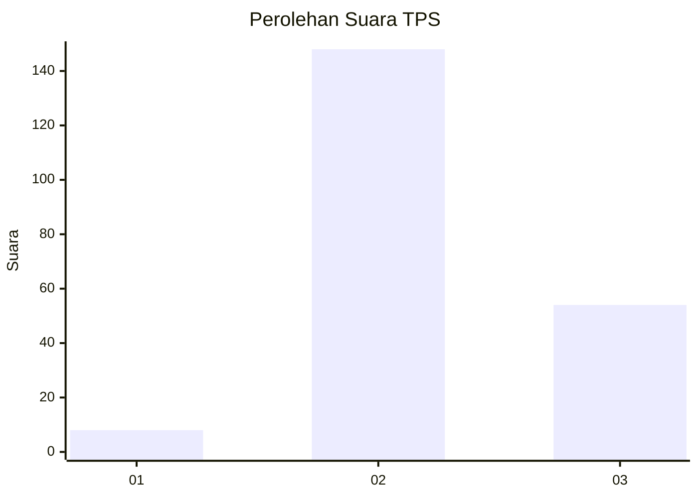
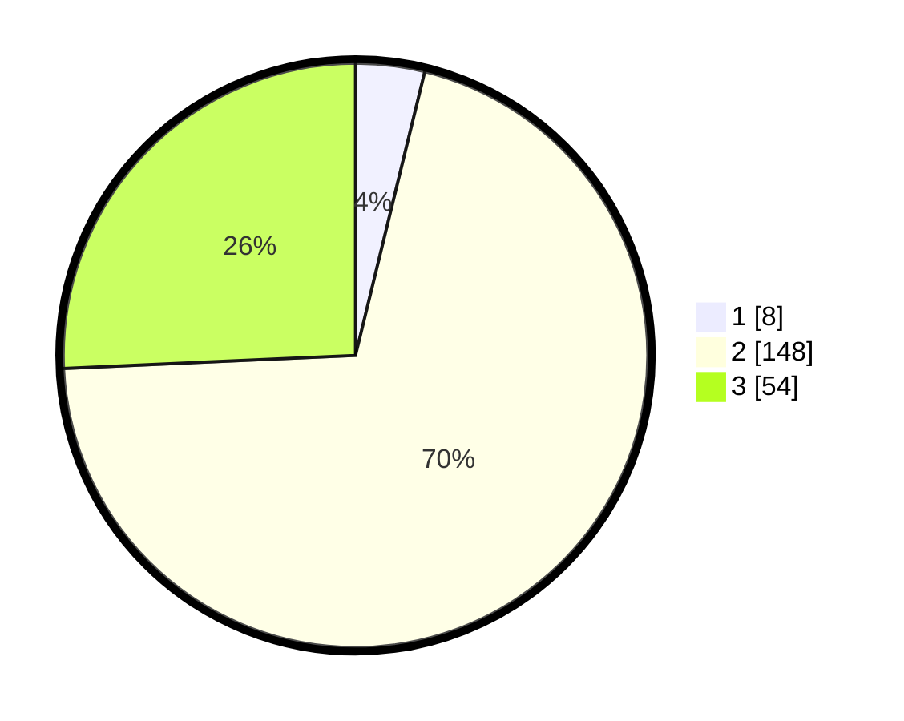

# Hasil

## Grafik

## Tabel

| No. | Nama Paslon    | Suara | Suara (raw) | Persentase |
|:--- |:-------------- | -----:| -----------:| ----------:|
| 1   | ANIES MUHAIMIN | 8     | [8][p-1]    | 3,81       |
| 2   | PRABOWO GIBRAN | 148   | [148][p-2]  | 70,48      |
| 3   | GANJAR MAHFUD  | 54    | [54][p-3]   | 25,71      |

[p-1]: https://github.com/gigit-pemilu/pemilu-2024/blob/main/pilpres/hitung-suara/sub/35-jawa-timur/sub/05-blitar/sub/04-kademangan/sub/2006-sumberjo/sub/009-tps/sub/paslon-1.txt
[p-2]: https://github.com/gigit-pemilu/pemilu-2024/blob/main/pilpres/hitung-suara/sub/35-jawa-timur/sub/05-blitar/sub/04-kademangan/sub/2006-sumberjo/sub/009-tps/sub/paslon-2.txt
[p-3]: https://github.com/gigit-pemilu/pemilu-2024/blob/main/pilpres/hitung-suara/sub/35-jawa-timur/sub/05-blitar/sub/04-kademangan/sub/2006-sumberjo/sub/009-tps/sub/paslon-3.txt

## Foto C Plano

https://sirekap-obj-formc.kpu.go.id/2956/pemilu/ppwp/35/05/04/20/06/3505042006009-20240219-102918--7624055e-90c8-46f3-8b27-d0a4b0646bf8.jpg

https://sirekap-obj-formc.kpu.go.id/2956/pemilu/ppwp/35/05/04/20/06/3505042006009-20240219-102327--b48e202a-ee81-453a-a6b2-5cb97f0bf686.jpg

https://sirekap-obj-formc.kpu.go.id/2956/pemilu/ppwp/35/05/04/20/06/3505042006009-20240219-102445--a2c50291-6877-4ff1-bce4-0724f29cfa46.jpg

## Metadata

| Key        | Value               |
| ---------- | ------------------- |
| Time Stamp | 2024-02-22 17:00:00 |

