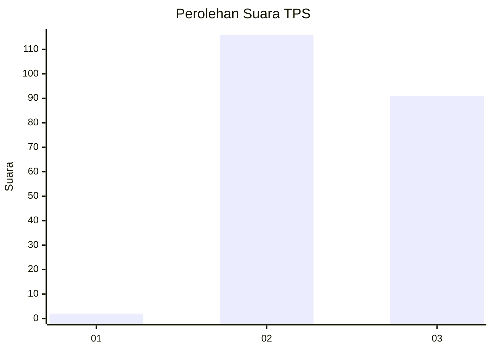
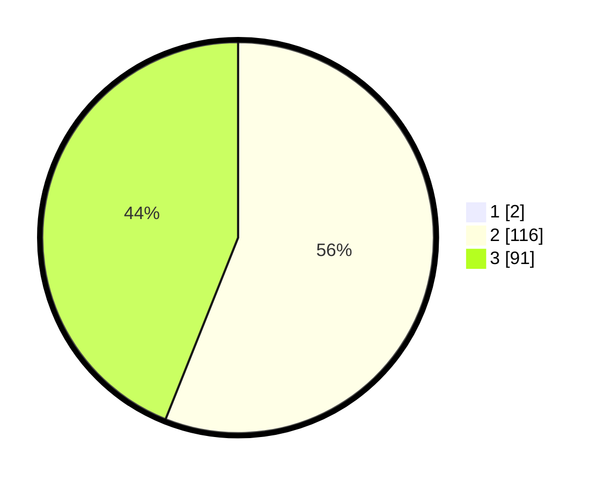

# Hasil

## Grafik

## Tabel

| No. | Nama Paslon    | Suara | Suara (raw) | Persentase |
|:--- |:-------------- | -----:| -----------:| ----------:|
| 1   | ANIES MUHAIMIN | 2     | [2][p-1]    | 0,96       |
| 2   | PRABOWO GIBRAN | 116   | [116][p-2]  | 55,50      |
| 3   | GANJAR MAHFUD  | 91    | [91][p-3]   | 43,54      |

[p-1]: https://github.com/gigit-pemilu/pemilu-2024-35-jawa-timur/blob/main/pilpres/hitung-suara/sub/35-jawa-timur/sub/05-blitar/sub/04-kademangan/sub/2007-suruhwadang/sub/001-tps/sub/paslon-1.txt
[p-2]: https://github.com/gigit-pemilu/pemilu-2024-35-jawa-timur/blob/main/pilpres/hitung-suara/sub/35-jawa-timur/sub/05-blitar/sub/04-kademangan/sub/2007-suruhwadang/sub/001-tps/sub/paslon-2.txt
[p-3]: https://github.com/gigit-pemilu/pemilu-2024-35-jawa-timur/blob/main/pilpres/hitung-suara/sub/35-jawa-timur/sub/05-blitar/sub/04-kademangan/sub/2007-suruhwadang/sub/001-tps/sub/paslon-3.txt

## Foto C Plano

https://sirekap-obj-formc.kpu.go.id/96ef/pemilu/ppwp/35/05/04/20/07/3505042007001-20240219-201550--2cd4c8ac-c3e6-4bef-9c7b-526d3a1d89ee.jpg

https://sirekap-obj-formc.kpu.go.id/96ef/pemilu/ppwp/35/05/04/20/07/3505042007001-20240216-230732--292743ee-9256-46fd-9b4a-5ccce1afd545.jpg

https://sirekap-obj-formc.kpu.go.id/96ef/pemilu/ppwp/35/05/04/20/07/3505042007001-20240216-232141--c46ec9c9-3a87-4f7a-8e09-f53e1f9d9782.jpg

## Metadata

| Key        | Value               |
| ---------- | ------------------- |
| Time Stamp | 2024-02-19 21:00:00 |

