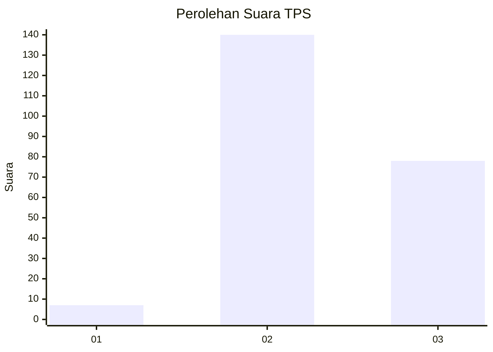
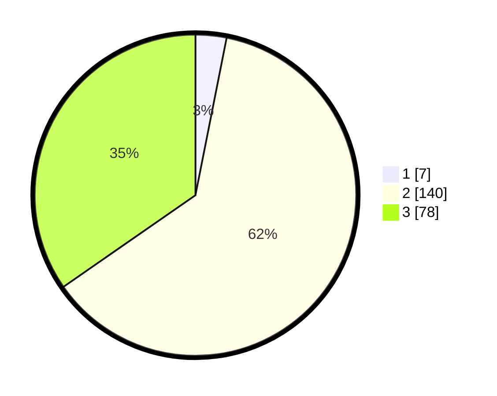

# Hasil

## Grafik

## Tabel

| No. | Nama Paslon    | Suara | Suara (raw) | Persentase |
|:--- |:-------------- | -----:| -----------:| ----------:|
| 1   | ANIES MUHAIMIN | 7     | [7][p-1]    | 3,11       |
| 2   | PRABOWO GIBRAN | 140   | [140][p-2]  | 62,22      |
| 3   | GANJAR MAHFUD  | 78    | [78][p-3]   | 34,67      |

[p-1]: https://github.com/gigit-pemilu/pemilu-2024-35-jawa-timur/blob/main/pilpres/hitung-suara/sub/35-jawa-timur/sub/05-blitar/sub/04-kademangan/sub/2007-suruhwadang/sub/004-tps/sub/paslon-1.txt
[p-2]: https://github.com/gigit-pemilu/pemilu-2024-35-jawa-timur/blob/main/pilpres/hitung-suara/sub/35-jawa-timur/sub/05-blitar/sub/04-kademangan/sub/2007-suruhwadang/sub/004-tps/sub/paslon-2.txt
[p-3]: https://github.com/gigit-pemilu/pemilu-2024-35-jawa-timur/blob/main/pilpres/hitung-suara/sub/35-jawa-timur/sub/05-blitar/sub/04-kademangan/sub/2007-suruhwadang/sub/004-tps/sub/paslon-3.txt

## Foto C Plano

https://sirekap-obj-formc.kpu.go.id/0802/pemilu/ppwp/35/05/04/20/07/3505042007004-20240219-232706--46ea6321-3cae-49df-8486-5aff8f5bf0d3.jpg

https://sirekap-obj-formc.kpu.go.id/0802/pemilu/ppwp/35/05/04/20/07/3505042007004-20240219-235137--dcc7f807-7dc8-4630-a12b-ce8e34f29a50.jpg

https://sirekap-obj-formc.kpu.go.id/0802/pemilu/ppwp/35/05/04/20/07/3505042007004-20240219-234206--6d066655-cb58-40f2-acdc-0c7fc463b933.jpg

## Metadata

| Key        | Value               |
| ---------- | ------------------- |
| Time Stamp | 2024-02-22 17:00:00 |

