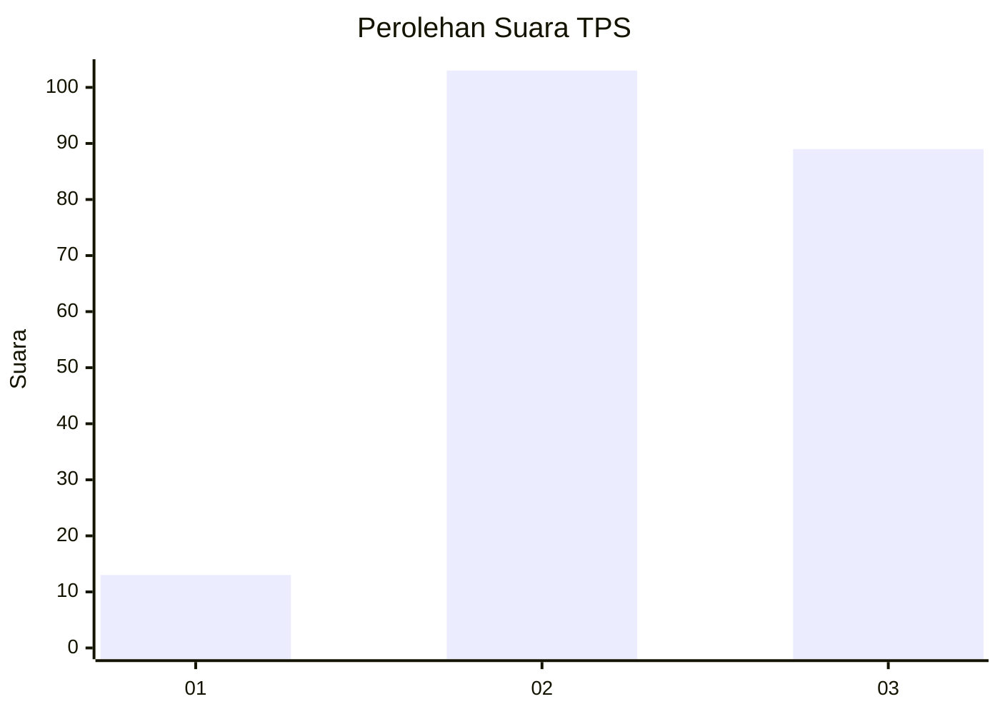
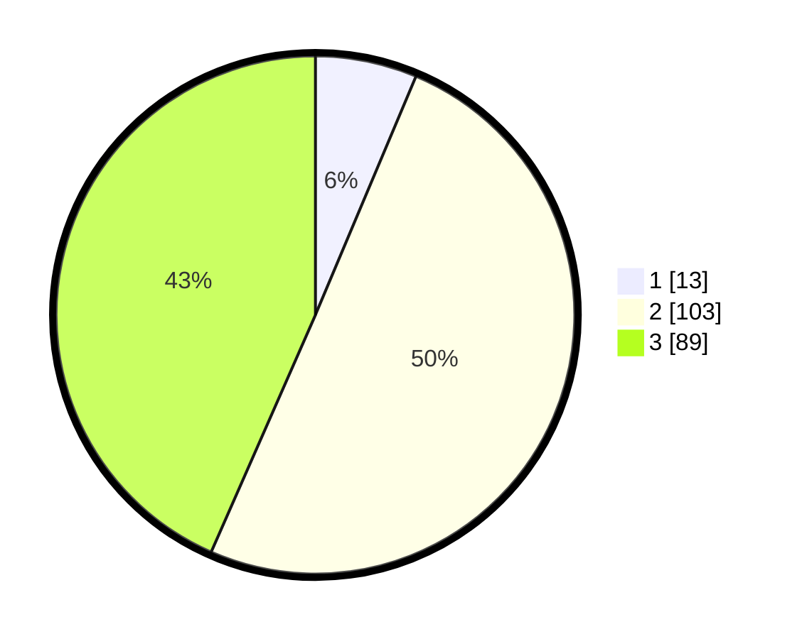

# Hasil

## Grafik

## Tabel

| No. | Nama Paslon    | Suara | Suara (raw) | Persentase |
|:--- |:-------------- | -----:| -----------:| ----------:|
| 1   | ANIES MUHAIMIN | 13    | [13][p-1]   | 6,34       |
| 2   | PRABOWO GIBRAN | 103   | [103][p-2]  | 50,24      |
| 3   | GANJAR MAHFUD  | 89    | [89][p-3]   | 43,41      |

[p-1]: https://github.com/gigit-pemilu/pemilu-2024/blob/main/pilpres/hitung-suara/sub/35-jawa-timur/sub/05-blitar/sub/04-kademangan/sub/2008-plumpungrejo/sub/001-tps/sub/paslon-1.txt
[p-2]: https://github.com/gigit-pemilu/pemilu-2024/blob/main/pilpres/hitung-suara/sub/35-jawa-timur/sub/05-blitar/sub/04-kademangan/sub/2008-plumpungrejo/sub/001-tps/sub/paslon-2.txt
[p-3]: https://github.com/gigit-pemilu/pemilu-2024/blob/main/pilpres/hitung-suara/sub/35-jawa-timur/sub/05-blitar/sub/04-kademangan/sub/2008-plumpungrejo/sub/001-tps/sub/paslon-3.txt

## Foto C Plano

https://sirekap-obj-formc.kpu.go.id/ca85/pemilu/ppwp/35/05/04/20/08/3505042008001-20240220-164523--499c79c6-32a5-46f8-80bd-330a6982aa9a.jpg

https://sirekap-obj-formc.kpu.go.id/ca85/pemilu/ppwp/35/05/04/20/08/3505042008001-20240220-164643--1c34f0a1-0c43-40b3-a11e-1a142dc73b49.jpg

https://sirekap-obj-formc.kpu.go.id/ca85/pemilu/ppwp/35/05/04/20/08/3505042008001-20240220-165213--64c46af5-3a42-4ff3-8c35-cc01eda84472.jpg

## Metadata

| Key        | Value               |
| ---------- | ------------------- |
| Time Stamp | 2024-02-24 22:31:28 |

