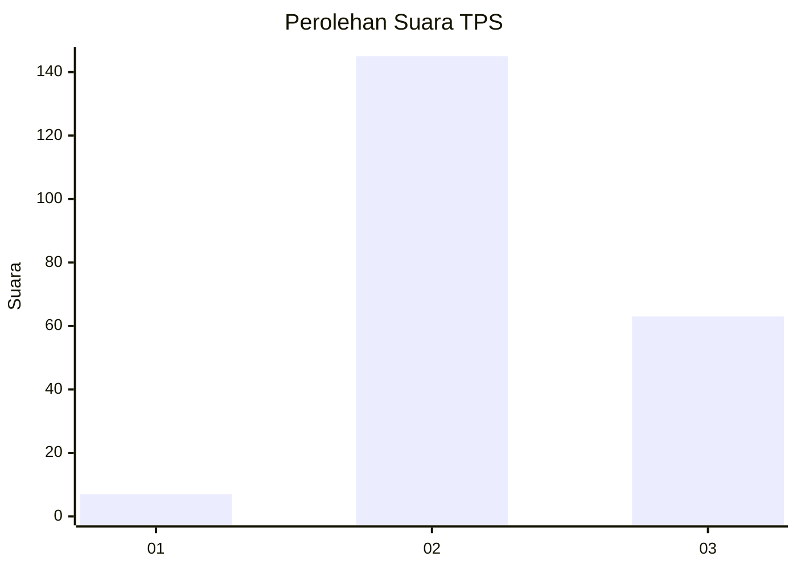

# Hasil

## Grafik

## Tabel

| No. | Nama Paslon    | Suara | Suara (raw) | Persentase |
|:--- |:-------------- | -----:| -----------:| ----------:|
| 1   | ANIES MUHAIMIN | 7     | [7][p-1]    | 3,26       |
| 2   | PRABOWO GIBRAN | 145   | [145][p-2]  | 67,44      |
| 3   | GANJAR MAHFUD  | 63    | [63][p-3]   | 29,30      |

[p-1]: https://github.com/gigit-pemilu/pemilu-2024-35-jawa-timur/blob/main/pilpres/hitung-suara/sub/35-jawa-timur/sub/05-blitar/sub/04-kademangan/sub/2008-plumpungrejo/sub/002-tps/sub/paslon-1.txt
[p-2]: https://github.com/gigit-pemilu/pemilu-2024-35-jawa-timur/blob/main/pilpres/hitung-suara/sub/35-jawa-timur/sub/05-blitar/sub/04-kademangan/sub/2008-plumpungrejo/sub/002-tps/sub/paslon-2.txt
[p-3]: https://github.com/gigit-pemilu/pemilu-2024-35-jawa-timur/blob/main/pilpres/hitung-suara/sub/35-jawa-timur/sub/05-blitar/sub/04-kademangan/sub/2008-plumpungrejo/sub/002-tps/sub/paslon-3.txt

## Foto C Plano

https://sirekap-obj-formc.kpu.go.id/2d22/pemilu/ppwp/35/05/04/20/08/3505042008002-20240220-181546--eec8b1e4-da2a-4c91-81e9-2de05f195a55.jpg

https://sirekap-obj-formc.kpu.go.id/2d22/pemilu/ppwp/35/05/04/20/08/3505042008002-20240220-181631--9c67425e-2b83-4b49-abff-197605a7ede0.jpg

https://sirekap-obj-formc.kpu.go.id/2d22/pemilu/ppwp/35/05/04/20/08/3505042008002-20240220-181659--4f3efaa7-0bd9-4858-ae33-d4fc3f91d3df.jpg

## Metadata

| Key        | Value               |
| ---------- | ------------------- |
| Time Stamp | 2024-02-22 18:00:00 |

