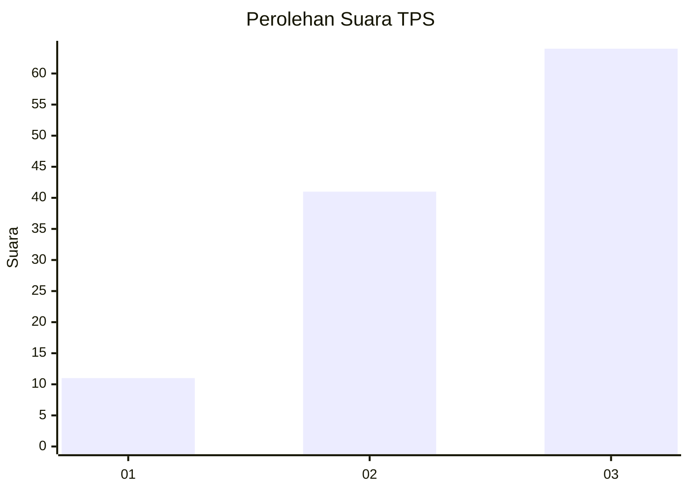
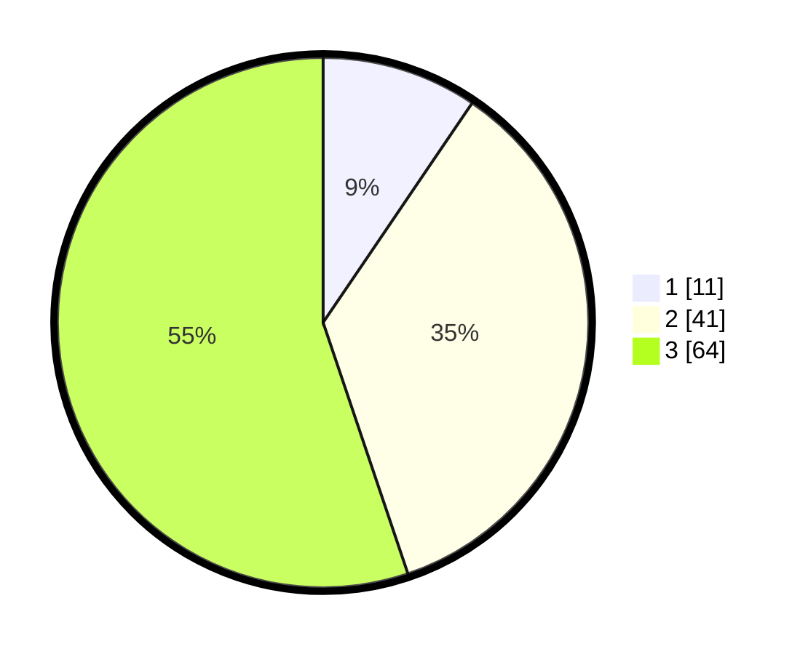

# Hasil

## Grafik

## Tabel

| No. | Nama Paslon    | Suara | Suara (raw) | Persentase |
|:--- |:-------------- | -----:| -----------:| ----------:|
| 1   | ANIES MUHAIMIN | 11    | [11][p-1]   | 9,48       |
| 2   | PRABOWO GIBRAN | 41    | [41][p-2]   | 35,34      |
| 3   | GANJAR MAHFUD  | 64    | [64][p-3]   | 55,17      |

[p-1]: https://github.com/gigit-pemilu/pemilu-2024-35-jawa-timur/blob/main/pilpres/hitung-suara/sub/35-jawa-timur/sub/05-blitar/sub/04-kademangan/sub/2009-jimbe/sub/009-tps/sub/paslon-1.txt
[p-2]: https://github.com/gigit-pemilu/pemilu-2024-35-jawa-timur/blob/main/pilpres/hitung-suara/sub/35-jawa-timur/sub/05-blitar/sub/04-kademangan/sub/2009-jimbe/sub/009-tps/sub/paslon-2.txt
[p-3]: https://github.com/gigit-pemilu/pemilu-2024-35-jawa-timur/blob/main/pilpres/hitung-suara/sub/35-jawa-timur/sub/05-blitar/sub/04-kademangan/sub/2009-jimbe/sub/009-tps/sub/paslon-3.txt

## Foto C Plano

https://sirekap-obj-formc.kpu.go.id/c007/pemilu/ppwp/35/05/04/20/09/3505042009009-20240218-202719--8dfb1c21-1e28-4adc-812b-0dd25a69aa49.jpg

https://sirekap-obj-formc.kpu.go.id/c007/pemilu/ppwp/35/05/04/20/09/3505042009009-20240217-203756--351a016a-10d8-4940-abe4-3d7365cd7655.jpg

https://sirekap-obj-formc.kpu.go.id/c007/pemilu/ppwp/35/05/04/20/09/3505042009009-20240219-163618--0a0925e2-b0e9-4737-b9c3-5cf1955b5b59.jpg

## Metadata

| Key        | Value               |
| ---------- | ------------------- |
| Time Stamp | 2024-02-24 22:31:28 |

