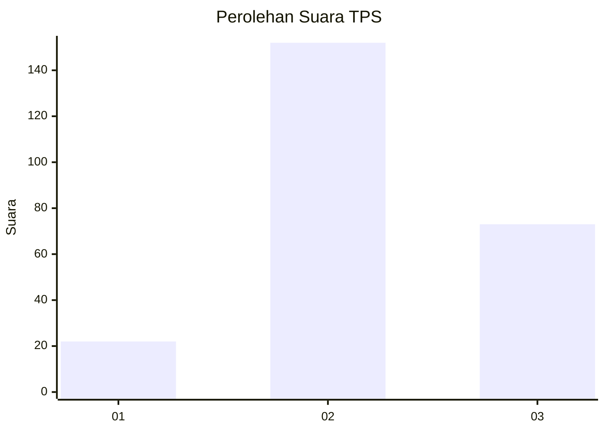
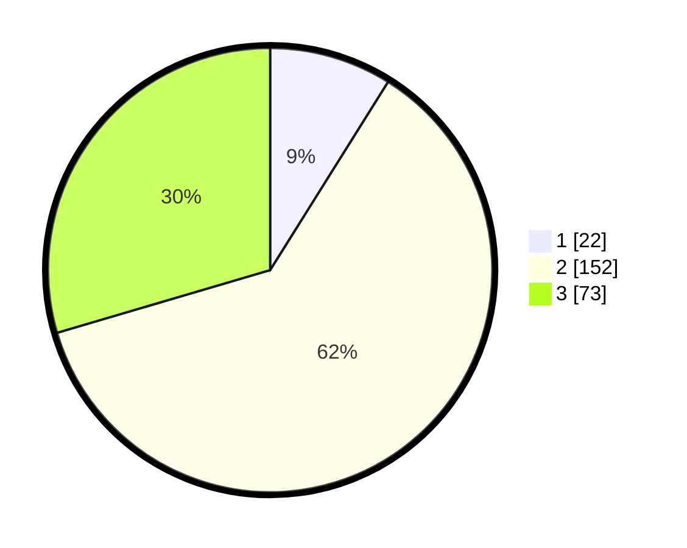

# Hasil

## Grafik

## Tabel

| No. | Nama Paslon    | Suara | Suara (raw) | Persentase |
|:--- |:-------------- | -----:| -----------:| ----------:|
| 1   | ANIES MUHAIMIN | 22    | [22][p-1]   | 8,91       |
| 2   | PRABOWO GIBRAN | 152   | [152][p-2]  | 61,54      |
| 3   | GANJAR MAHFUD  | 73    | [73][p-3]   | 29,55      |

[p-1]: https://github.com/gigit-pemilu/pemilu-2024-35-jawa-timur/blob/main/pilpres/hitung-suara/sub/35-jawa-timur/sub/05-blitar/sub/04-kademangan/sub/2010-dawuhan/sub/001-tps/sub/paslon-1.txt
[p-2]: https://github.com/gigit-pemilu/pemilu-2024-35-jawa-timur/blob/main/pilpres/hitung-suara/sub/35-jawa-timur/sub/05-blitar/sub/04-kademangan/sub/2010-dawuhan/sub/001-tps/sub/paslon-2.txt
[p-3]: https://github.com/gigit-pemilu/pemilu-2024-35-jawa-timur/blob/main/pilpres/hitung-suara/sub/35-jawa-timur/sub/05-blitar/sub/04-kademangan/sub/2010-dawuhan/sub/001-tps/sub/paslon-3.txt

## Foto C Plano

https://sirekap-obj-formc.kpu.go.id/bdf6/pemilu/ppwp/35/05/04/20/10/3505042010001-20240216-195259--b34c8b8a-4c0f-4365-82aa-7815ded5c024.jpg

https://sirekap-obj-formc.kpu.go.id/bdf6/pemilu/ppwp/35/05/04/20/10/3505042010001-20240215-021218--7a4be28f-9959-49cf-b8ba-023926fad538.jpg

https://sirekap-obj-formc.kpu.go.id/bdf6/pemilu/ppwp/35/05/04/20/10/3505042010001-20240215-021333--e150ab63-1e36-498e-8fd1-11694c6d69b6.jpg

## Metadata

| Key        | Value               |
| ---------- | ------------------- |
| Time Stamp | 2024-02-16 21:01:00 |

