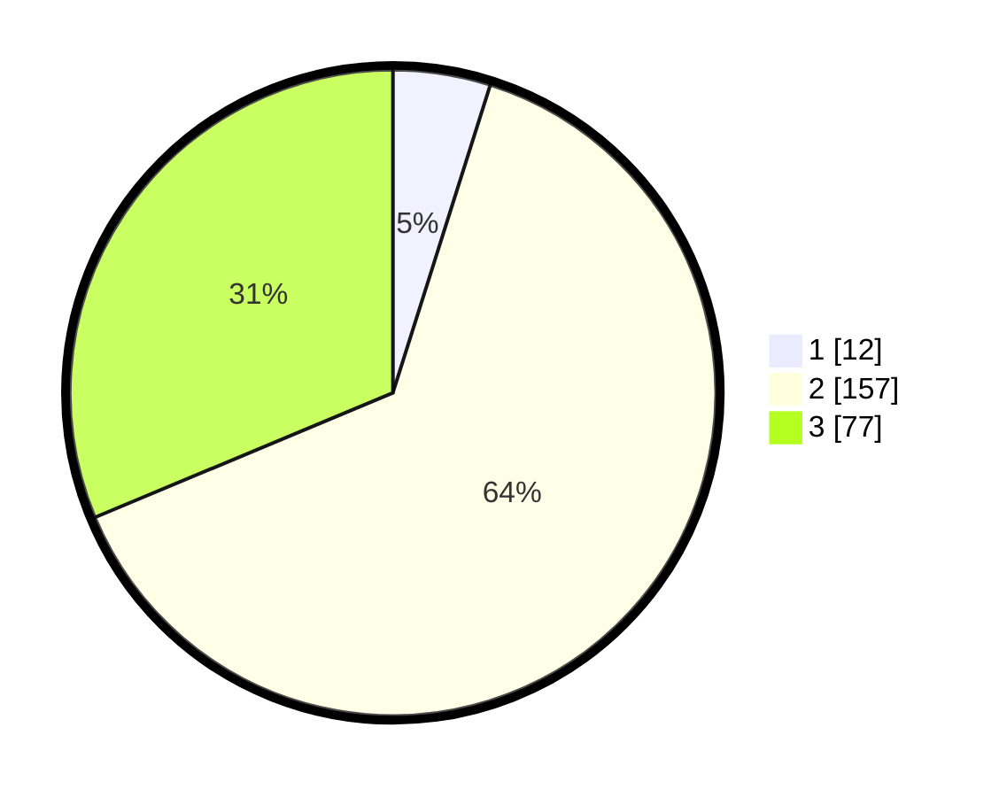

# Hasil

## Grafik

## Tabel

| No. | Nama Paslon    | Suara | Suara (raw) | Persentase |
|:--- |:-------------- | -----:| -----------:| ----------:|
| 1   | ANIES MUHAIMIN | 12    | [12][p-1]   | 4,88       |
| 2   | PRABOWO GIBRAN | 157   | [157][p-2]  | 63,82      |
| 3   | GANJAR MAHFUD  | 77    | [77][p-3]   | 31,30      |

[p-1]: https://github.com/gigit-pemilu/pemilu-2024-35-jawa-timur/blob/main/pilpres/hitung-suara/sub/35-jawa-timur/sub/05-blitar/sub/04-kademangan/sub/2010-dawuhan/sub/003-tps/sub/paslon-1.txt
[p-2]: https://github.com/gigit-pemilu/pemilu-2024-35-jawa-timur/blob/main/pilpres/hitung-suara/sub/35-jawa-timur/sub/05-blitar/sub/04-kademangan/sub/2010-dawuhan/sub/003-tps/sub/paslon-2.txt
[p-3]: https://github.com/gigit-pemilu/pemilu-2024-35-jawa-timur/blob/main/pilpres/hitung-suara/sub/35-jawa-timur/sub/05-blitar/sub/04-kademangan/sub/2010-dawuhan/sub/003-tps/sub/paslon-3.txt

## Foto C Plano

https://sirekap-obj-formc.kpu.go.id/5faf/pemilu/ppwp/35/05/04/20/10/3505042010003-20240215-010104--714832a7-655c-4cc1-8fe6-4b319b19b040.jpg

https://sirekap-obj-formc.kpu.go.id/5faf/pemilu/ppwp/35/05/04/20/10/3505042010003-20240215-010144--53f1551c-abaa-4d3a-8cd2-5f2f2a08be85.jpg

https://sirekap-obj-formc.kpu.go.id/5faf/pemilu/ppwp/35/05/04/20/10/3505042010003-20240215-010214--db29615d-dbd4-4465-822b-b023cc469177.jpg

## Metadata

| Key        | Value               |
| ---------- | ------------------- |
| Time Stamp | 2024-02-17 10:00:02 |

