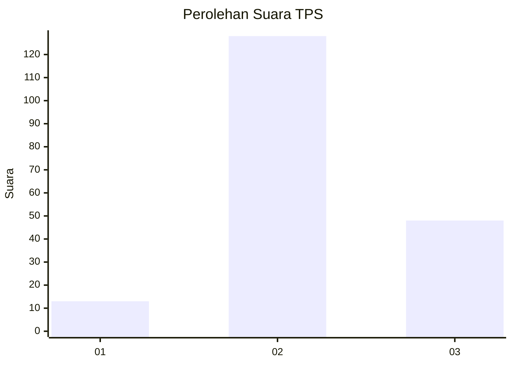
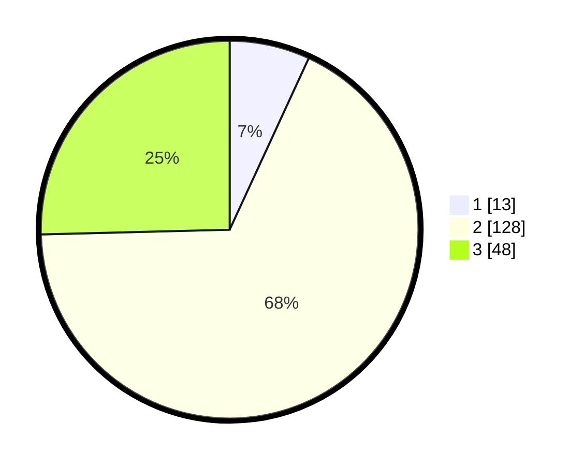

# Hasil

## Grafik

## Tabel

| No. | Nama Paslon    | Suara | Suara (raw) | Persentase |
|:--- |:-------------- | -----:| -----------:| ----------:|
| 1   | ANIES MUHAIMIN | 13    | [13][p-1]   | 6,88       |
| 2   | PRABOWO GIBRAN | 128   | [128][p-2]  | 67,72      |
| 3   | GANJAR MAHFUD  | 48    | [48][p-3]   | 25,40      |

[p-1]: https://github.com/gigit-pemilu/pemilu-2024-35-jawa-timur/blob/main/pilpres/hitung-suara/sub/35-jawa-timur/sub/05-blitar/sub/04-kademangan/sub/2010-dawuhan/sub/005-tps/sub/paslon-1.txt
[p-2]: https://github.com/gigit-pemilu/pemilu-2024-35-jawa-timur/blob/main/pilpres/hitung-suara/sub/35-jawa-timur/sub/05-blitar/sub/04-kademangan/sub/2010-dawuhan/sub/005-tps/sub/paslon-2.txt
[p-3]: https://github.com/gigit-pemilu/pemilu-2024-35-jawa-timur/blob/main/pilpres/hitung-suara/sub/35-jawa-timur/sub/05-blitar/sub/04-kademangan/sub/2010-dawuhan/sub/005-tps/sub/paslon-3.txt

## Foto C Plano

https://sirekap-obj-formc.kpu.go.id/7a68/pemilu/ppwp/35/05/04/20/10/3505042010005-20240214-204024--03a11fb0-2db0-4719-9660-8fe13d190582.jpg

https://sirekap-obj-formc.kpu.go.id/7a68/pemilu/ppwp/35/05/04/20/10/3505042010005-20240214-204123--d8bd9b67-ccbb-4966-a080-914054ba01d8.jpg

https://sirekap-obj-formc.kpu.go.id/7a68/pemilu/ppwp/35/05/04/20/10/3505042010005-20240214-204257--1e619f7a-cfe8-4a79-abf7-03eb49cbc496.jpg

## Metadata

| Key        | Value               |
| ---------- | ------------------- |
| Time Stamp | 2024-02-15 12:00:28 |

