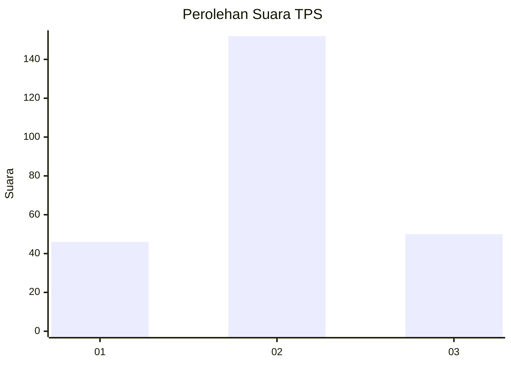
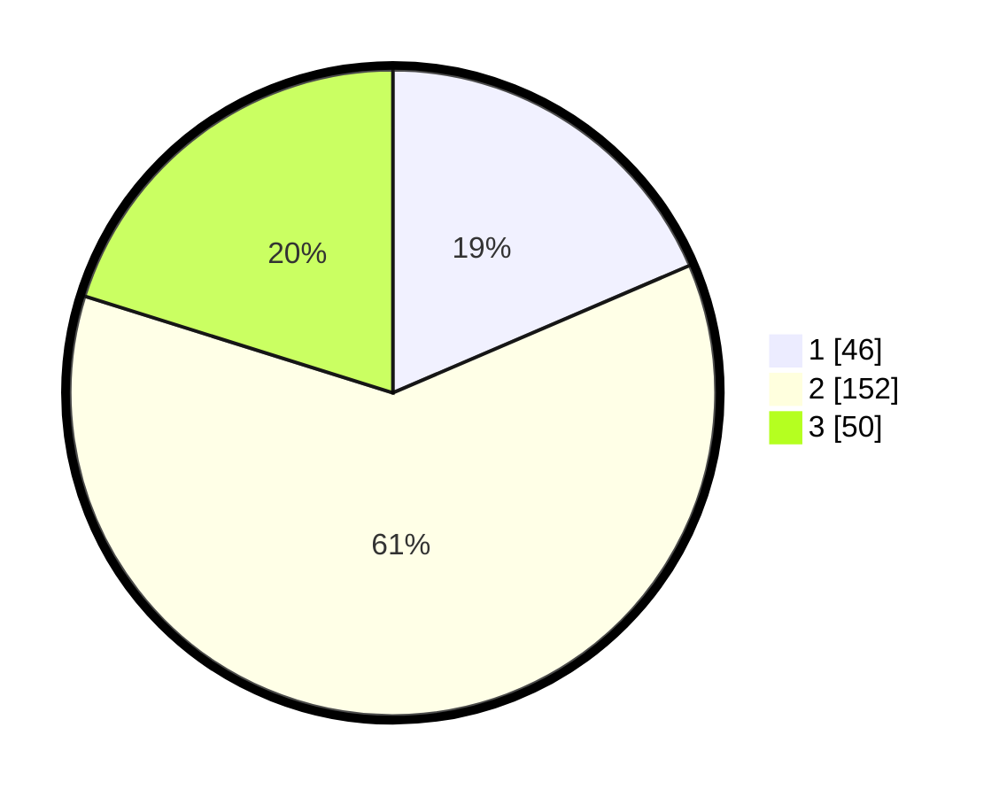

# Hasil

## Grafik

## Tabel

| No. | Nama Paslon    | Suara | Suara (raw) | Persentase |
|:--- |:-------------- | -----:| -----------:| ----------:|
| 1   | ANIES MUHAIMIN | 46    | [46][p-1]   | 18,55      |
| 2   | PRABOWO GIBRAN | 152   | [152][p-2]  | 61,29      |
| 3   | GANJAR MAHFUD  | 50    | [50][p-3]   | 20,16      |

[p-1]: https://github.com/gigit-pemilu/pemilu-2024-35-jawa-timur/blob/main/pilpres/hitung-suara/sub/35-jawa-timur/sub/05-blitar/sub/04-kademangan/sub/2010-dawuhan/sub/008-tps/sub/paslon-1.txt
[p-2]: https://github.com/gigit-pemilu/pemilu-2024-35-jawa-timur/blob/main/pilpres/hitung-suara/sub/35-jawa-timur/sub/05-blitar/sub/04-kademangan/sub/2010-dawuhan/sub/008-tps/sub/paslon-2.txt
[p-3]: https://github.com/gigit-pemilu/pemilu-2024-35-jawa-timur/blob/main/pilpres/hitung-suara/sub/35-jawa-timur/sub/05-blitar/sub/04-kademangan/sub/2010-dawuhan/sub/008-tps/sub/paslon-3.txt

## Foto C Plano

https://sirekap-obj-formc.kpu.go.id/b802/pemilu/ppwp/35/05/04/20/10/3505042010008-20240215-011329--e495ed53-6504-44e0-a27c-634495b53a8a.jpg

https://sirekap-obj-formc.kpu.go.id/b802/pemilu/ppwp/35/05/04/20/10/3505042010008-20240217-154425--40195a4b-bb16-47c2-85dd-fe0fe68bacf9.jpg

https://sirekap-obj-formc.kpu.go.id/b802/pemilu/ppwp/35/05/04/20/10/3505042010008-20240217-154225--54aa4497-a8cc-4e1d-827b-20ccaf85c863.jpg

## Metadata

| Key        | Value               |
| ---------- | ------------------- |
| Time Stamp | 2024-02-19 06:16:00 |

