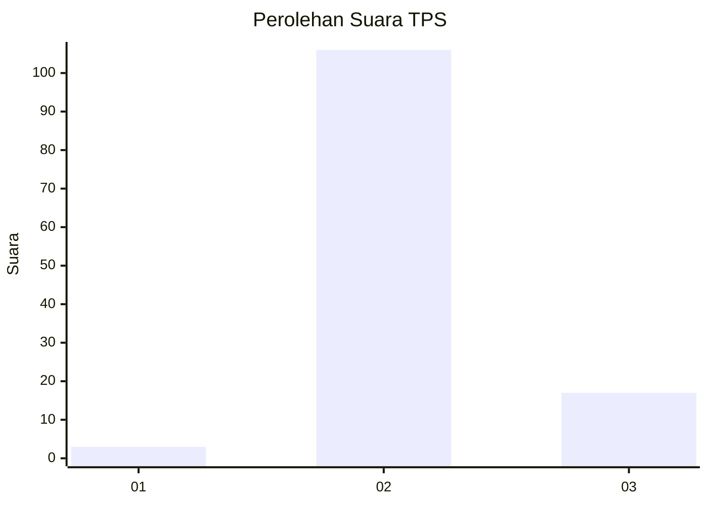
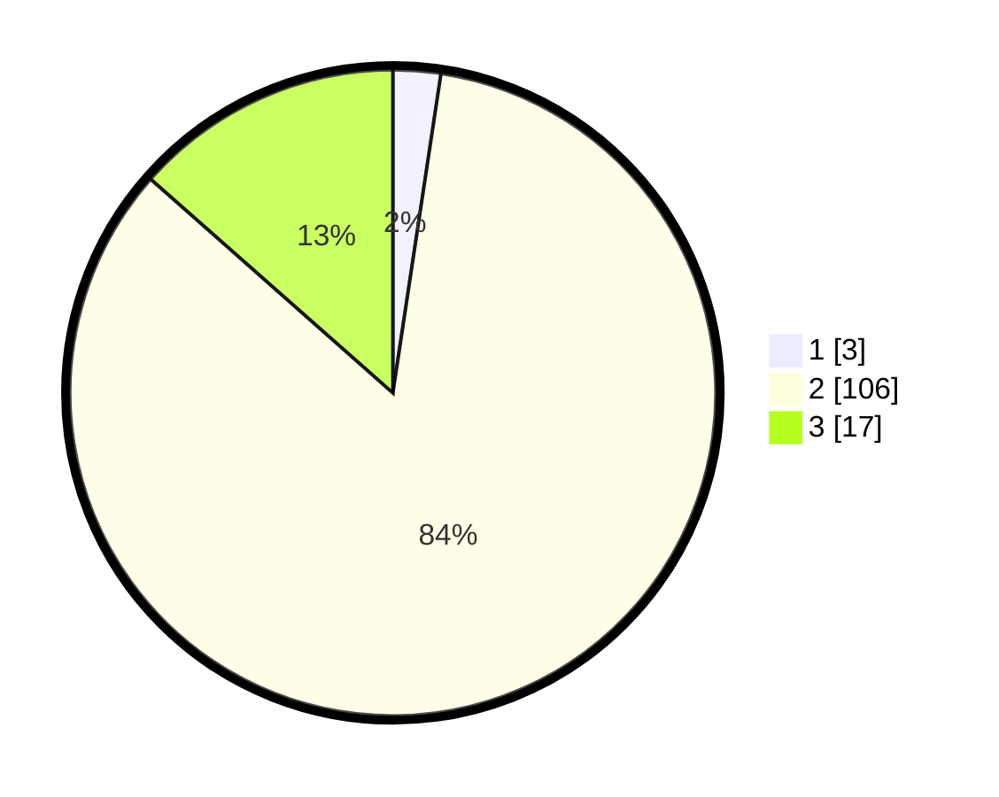

# Hasil

## Grafik

## Tabel

| No. | Nama Paslon    | Suara | Suara (raw) | Persentase |
|:--- |:-------------- | -----:| -----------:| ----------:|
| 1   | ANIES MUHAIMIN | 3     | [3][p-1]    | 2,38       |
| 2   | PRABOWO GIBRAN | 106   | [106][p-2]  | 84,13      |
| 3   | GANJAR MAHFUD  | 17    | [17][p-3]   | 13,49      |

[p-1]: https://github.com/gigit-pemilu/pemilu-2024/blob/main/pilpres/hitung-suara/sub/35-jawa-timur/sub/05-blitar/sub/04-kademangan/sub/2010-dawuhan/sub/012-tps/sub/paslon-1.txt
[p-2]: https://github.com/gigit-pemilu/pemilu-2024/blob/main/pilpres/hitung-suara/sub/35-jawa-timur/sub/05-blitar/sub/04-kademangan/sub/2010-dawuhan/sub/012-tps/sub/paslon-2.txt
[p-3]: https://github.com/gigit-pemilu/pemilu-2024/blob/main/pilpres/hitung-suara/sub/35-jawa-timur/sub/05-blitar/sub/04-kademangan/sub/2010-dawuhan/sub/012-tps/sub/paslon-3.txt

## Foto C Plano

https://sirekap-obj-formc.kpu.go.id/bad2/pemilu/ppwp/35/05/04/20/10/3505042010012-20240215-010633--a7e12a57-ad12-4e7b-912e-09e9e35db00d.jpg

https://sirekap-obj-formc.kpu.go.id/bad2/pemilu/ppwp/35/05/04/20/10/3505042010012-20240215-010745--c4e81c66-88d4-456e-bed1-42ba1f5dfbfb.jpg

https://sirekap-obj-formc.kpu.go.id/bad2/pemilu/ppwp/35/05/04/20/10/3505042010012-20240215-010920--f63c5c89-5053-4977-b019-adebd14582d0.jpg

## Metadata

| Key        | Value               |
| ---------- | ------------------- |
| Time Stamp | 2024-02-15 12:00:28 |

