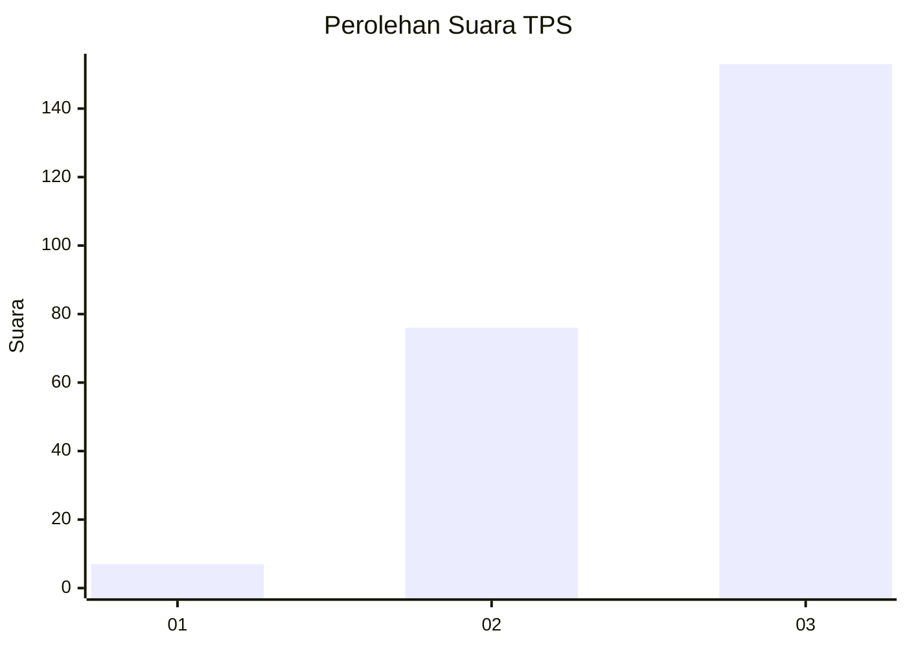
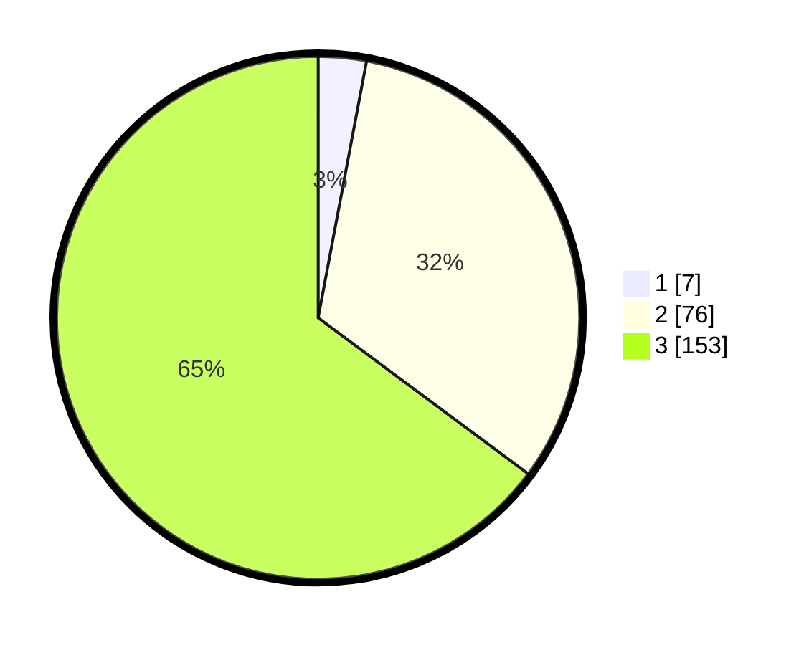

# Hasil

## Grafik

## Tabel

| No. | Nama Paslon    | Suara | Suara (raw) | Persentase |
|:--- |:-------------- | -----:| -----------:| ----------:|
| 1   | ANIES MUHAIMIN | 7     | [7][p-1]    | 2,97       |
| 2   | PRABOWO GIBRAN | 76    | [76][p-2]   | 32,20      |
| 3   | GANJAR MAHFUD  | 153   | [153][p-3]  | 64,83      |

[p-1]: https://github.com/gigit-pemilu/pemilu-2024-35-jawa-timur/blob/main/pilpres/hitung-suara/sub/35-jawa-timur/sub/05-blitar/sub/04-kademangan/sub/2010-dawuhan/sub/014-tps/sub/paslon-1.txt
[p-2]: https://github.com/gigit-pemilu/pemilu-2024-35-jawa-timur/blob/main/pilpres/hitung-suara/sub/35-jawa-timur/sub/05-blitar/sub/04-kademangan/sub/2010-dawuhan/sub/014-tps/sub/paslon-2.txt
[p-3]: https://github.com/gigit-pemilu/pemilu-2024-35-jawa-timur/blob/main/pilpres/hitung-suara/sub/35-jawa-timur/sub/05-blitar/sub/04-kademangan/sub/2010-dawuhan/sub/014-tps/sub/paslon-3.txt

## Foto C Plano

https://sirekap-obj-formc.kpu.go.id/8c5b/pemilu/ppwp/35/05/04/20/10/3505042010014-20240217-095550--7cc6d1ae-3690-47ab-aef8-6e5b23e9b2c3.jpg

https://sirekap-obj-formc.kpu.go.id/8c5b/pemilu/ppwp/35/05/04/20/10/3505042010014-20240217-104604--aae271c6-59e6-4a16-b0c6-a2b9f5f40b02.jpg

https://sirekap-obj-formc.kpu.go.id/8c5b/pemilu/ppwp/35/05/04/20/10/3505042010014-20240217-095341--e26de2ca-541f-4fbe-8a93-8049c563fba1.jpg

## Metadata

| Key        | Value               |
| ---------- | ------------------- |
| Time Stamp | 2024-02-17 13:37:34 |

