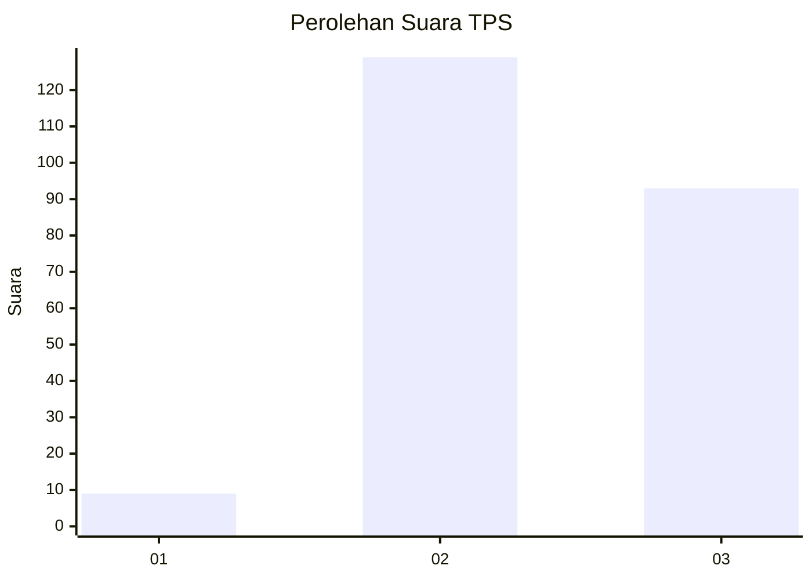
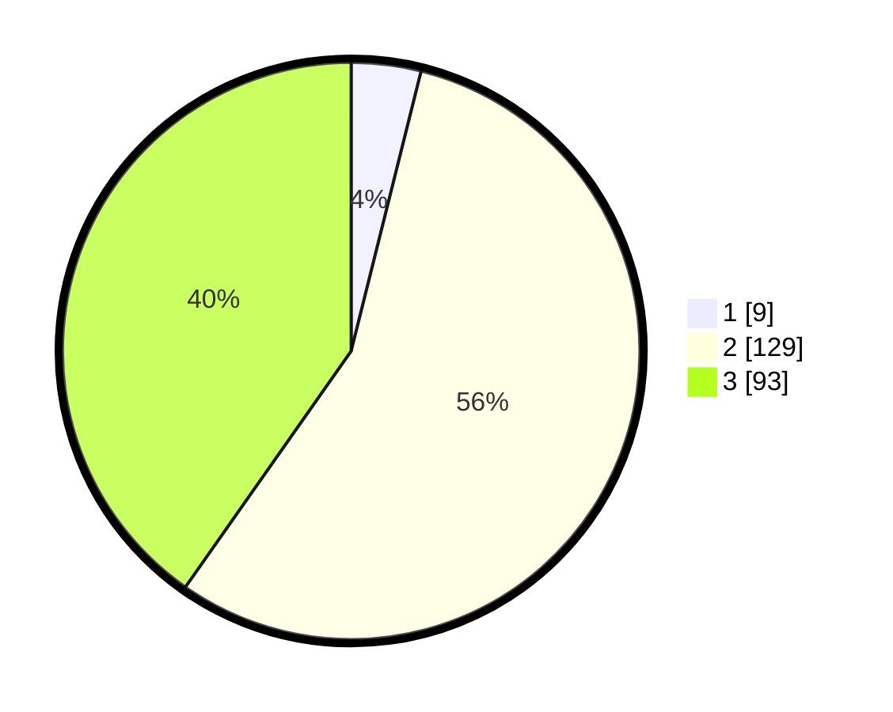

# Hasil

## Grafik

## Tabel

| No. | Nama Paslon    | Suara | Suara (raw) | Persentase |
|:--- |:-------------- | -----:| -----------:| ----------:|
| 1   | ANIES MUHAIMIN | 9     | [9][p-1]    | 3,90       |
| 2   | PRABOWO GIBRAN | 129   | [129][p-2]  | 55,84      |
| 3   | GANJAR MAHFUD  | 93    | [93][p-3]   | 40,26      |

[p-1]: https://github.com/gigit-pemilu/pemilu-2024-35-jawa-timur/blob/main/pilpres/hitung-suara/sub/35-jawa-timur/sub/05-blitar/sub/04-kademangan/sub/2010-dawuhan/sub/021-tps/sub/paslon-1.txt
[p-2]: https://github.com/gigit-pemilu/pemilu-2024-35-jawa-timur/blob/main/pilpres/hitung-suara/sub/35-jawa-timur/sub/05-blitar/sub/04-kademangan/sub/2010-dawuhan/sub/021-tps/sub/paslon-2.txt
[p-3]: https://github.com/gigit-pemilu/pemilu-2024-35-jawa-timur/blob/main/pilpres/hitung-suara/sub/35-jawa-timur/sub/05-blitar/sub/04-kademangan/sub/2010-dawuhan/sub/021-tps/sub/paslon-3.txt

## Foto C Plano

https://sirekap-obj-formc.kpu.go.id/968e/pemilu/ppwp/35/05/04/20/10/3505042010021-20240214-215657--8b2dddaf-39b8-444b-8c5b-dc439fe87b1d.jpg

https://sirekap-obj-formc.kpu.go.id/968e/pemilu/ppwp/35/05/04/20/10/3505042010021-20240214-220105--165e9c51-47d7-445b-ae1f-67270be5a8c2.jpg

https://sirekap-obj-formc.kpu.go.id/968e/pemilu/ppwp/35/05/04/20/10/3505042010021-20240214-220301--627991a5-c698-4ff1-9220-02880e1db4d7.jpg

## Metadata

| Key        | Value               |
| ---------- | ------------------- |
| Time Stamp | 2024-02-15 12:00:28 |

