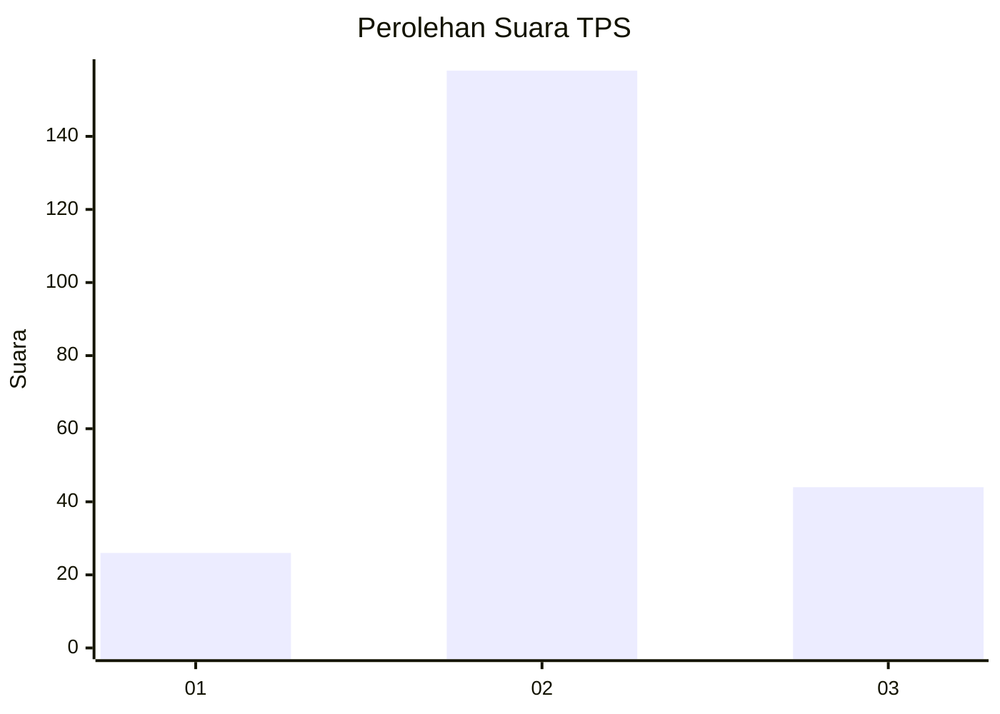
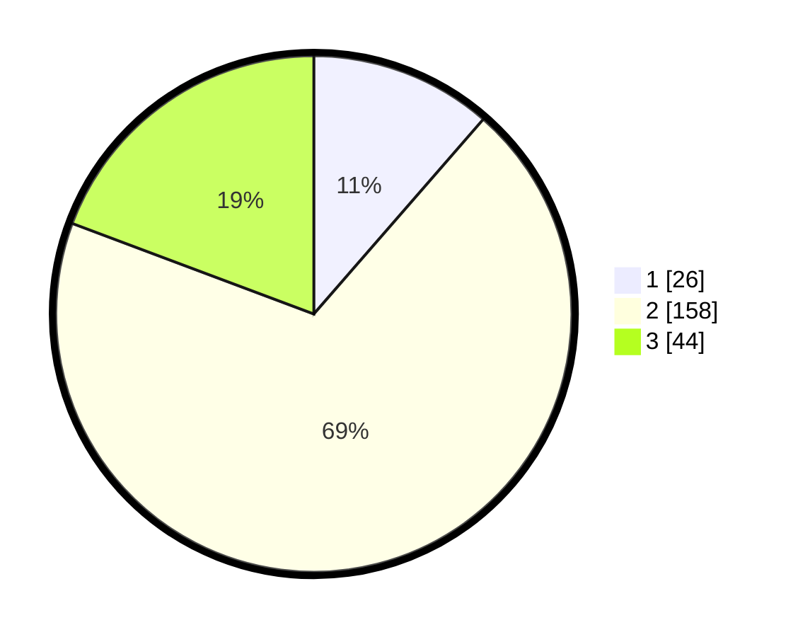

# Hasil

## Grafik

## Tabel

| No. | Nama Paslon    | Suara | Suara (raw) | Persentase |
|:--- |:-------------- | -----:| -----------:| ----------:|
| 1   | ANIES MUHAIMIN | 26    | [26][p-1]   | 11,40      |
| 2   | PRABOWO GIBRAN | 158   | [158][p-2]  | 69,30      |
| 3   | GANJAR MAHFUD  | 44    | [44][p-3]   | 19,30      |

[p-1]: https://github.com/gigit-pemilu/pemilu-2024-35-jawa-timur/blob/main/pilpres/hitung-suara/sub/35-jawa-timur/sub/05-blitar/sub/04-kademangan/sub/2012-sumberjati/sub/001-tps/sub/paslon-1.txt
[p-2]: https://github.com/gigit-pemilu/pemilu-2024-35-jawa-timur/blob/main/pilpres/hitung-suara/sub/35-jawa-timur/sub/05-blitar/sub/04-kademangan/sub/2012-sumberjati/sub/001-tps/sub/paslon-2.txt
[p-3]: https://github.com/gigit-pemilu/pemilu-2024-35-jawa-timur/blob/main/pilpres/hitung-suara/sub/35-jawa-timur/sub/05-blitar/sub/04-kademangan/sub/2012-sumberjati/sub/001-tps/sub/paslon-3.txt

## Foto C Plano

https://sirekap-obj-formc.kpu.go.id/408e/pemilu/ppwp/35/05/04/20/12/3505042012001-20240214-155247--10f3b13a-8f5e-4f51-a8a7-19d3627e3a74.jpg

https://sirekap-obj-formc.kpu.go.id/408e/pemilu/ppwp/35/05/04/20/12/3505042012001-20240214-155554--8c241e60-3579-4787-8211-f1f9938e7ee8.jpg

https://sirekap-obj-formc.kpu.go.id/408e/pemilu/ppwp/35/05/04/20/12/3505042012001-20240214-155657--fdcb8aef-8323-41a9-88ae-fe8f488e9931.jpg

## Metadata

| Key        | Value               |
| ---------- | ------------------- |
| Time Stamp | 2024-02-15 12:00:28 |

