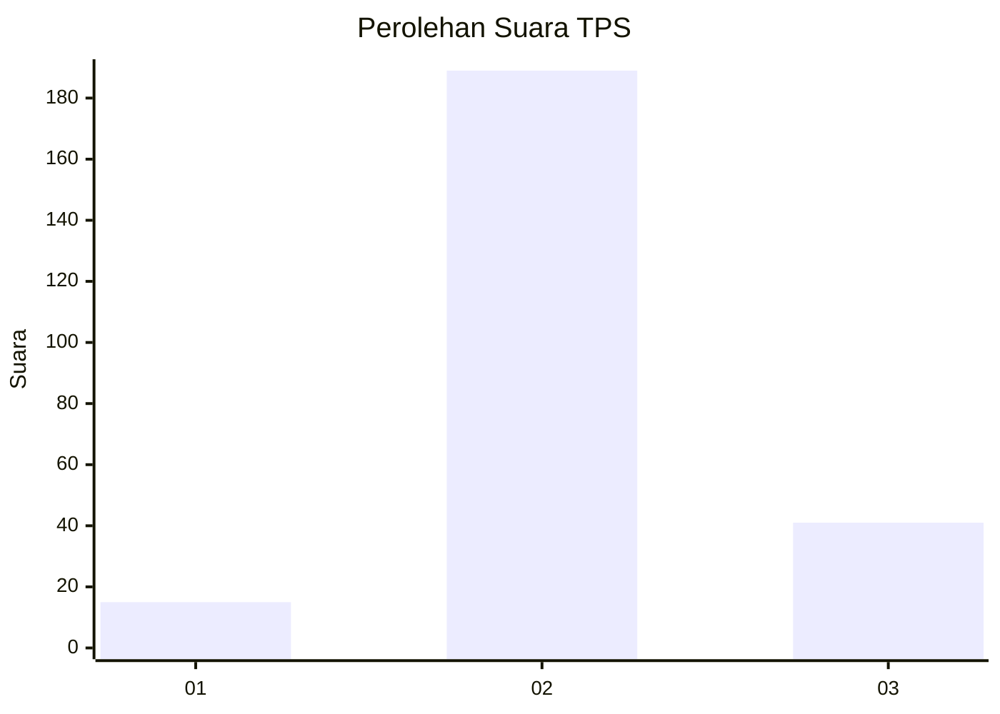
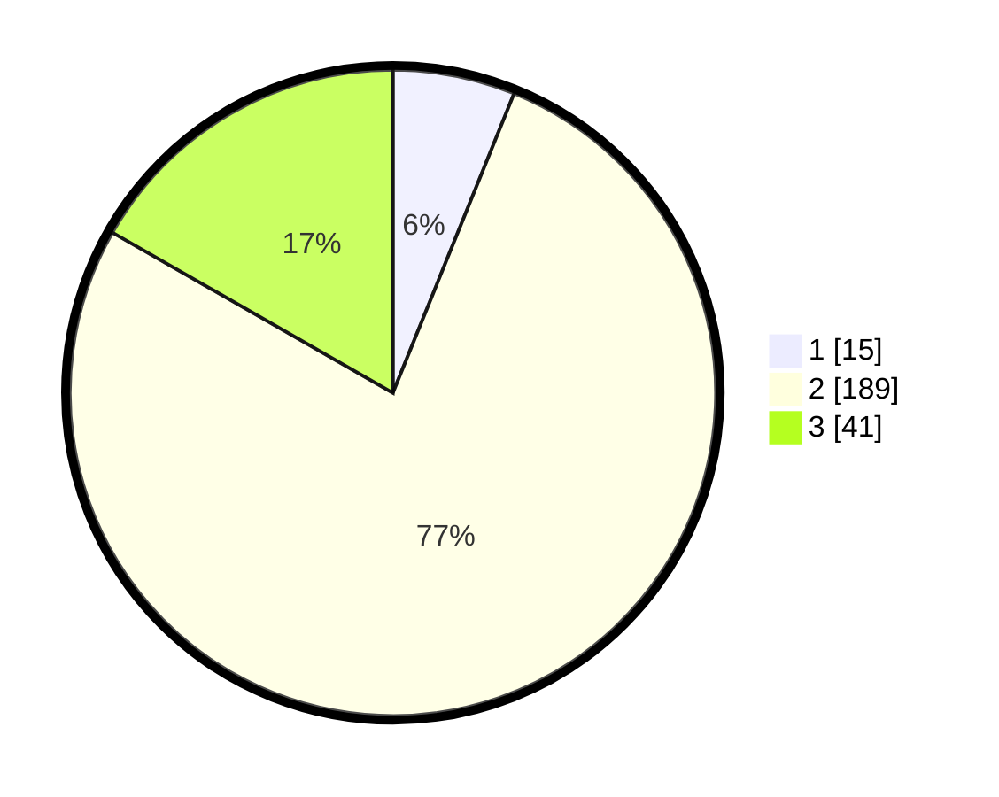

# Hasil

## Grafik

## Tabel

| No. | Nama Paslon    | Suara | Suara (raw) | Persentase |
|:--- |:-------------- | -----:| -----------:| ----------:|
| 1   | ANIES MUHAIMIN | 15    | [15][p-1]   | 6,12       |
| 2   | PRABOWO GIBRAN | 189   | [189][p-2]  | 77,14      |
| 3   | GANJAR MAHFUD  | 41    | [41][p-3]   | 16,73      |

[p-1]: https://github.com/gigit-pemilu/pemilu-2024/blob/main/pilpres/hitung-suara/sub/35-jawa-timur/sub/05-blitar/sub/04-kademangan/sub/2013-rejowinangun/sub/001-tps/sub/paslon-1.txt
[p-2]: https://github.com/gigit-pemilu/pemilu-2024/blob/main/pilpres/hitung-suara/sub/35-jawa-timur/sub/05-blitar/sub/04-kademangan/sub/2013-rejowinangun/sub/001-tps/sub/paslon-2.txt
[p-3]: https://github.com/gigit-pemilu/pemilu-2024/blob/main/pilpres/hitung-suara/sub/35-jawa-timur/sub/05-blitar/sub/04-kademangan/sub/2013-rejowinangun/sub/001-tps/sub/paslon-3.txt

## Foto C Plano

https://sirekap-obj-formc.kpu.go.id/56f0/pemilu/ppwp/35/05/04/20/13/3505042013001-20240214-201137--4019d5c3-8747-4a99-a7fb-aab5f737e280.jpg

https://sirekap-obj-formc.kpu.go.id/56f0/pemilu/ppwp/35/05/04/20/13/3505042013001-20240214-201639--9ecd6346-efbf-49ed-85c4-83c628686adc.jpg

https://sirekap-obj-formc.kpu.go.id/56f0/pemilu/ppwp/35/05/04/20/13/3505042013001-20240214-195248--ab436af9-b6ff-4b9a-b82e-dc36ab1c872e.jpg

## Metadata

| Key        | Value               |
| ---------- | ------------------- |
| Time Stamp | 2024-02-15 00:56:54 |

