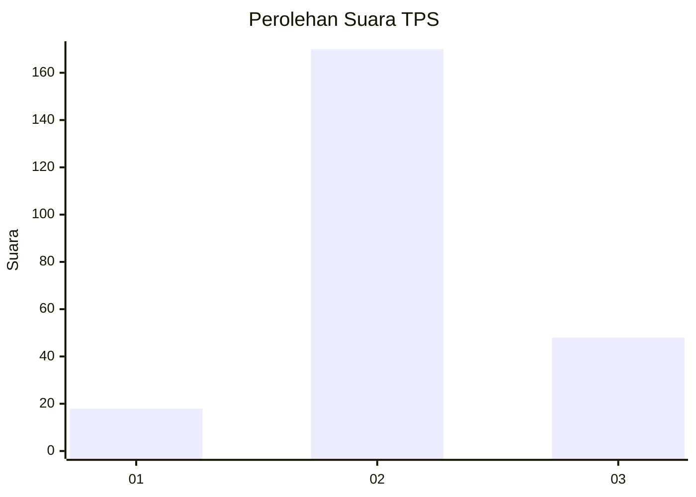
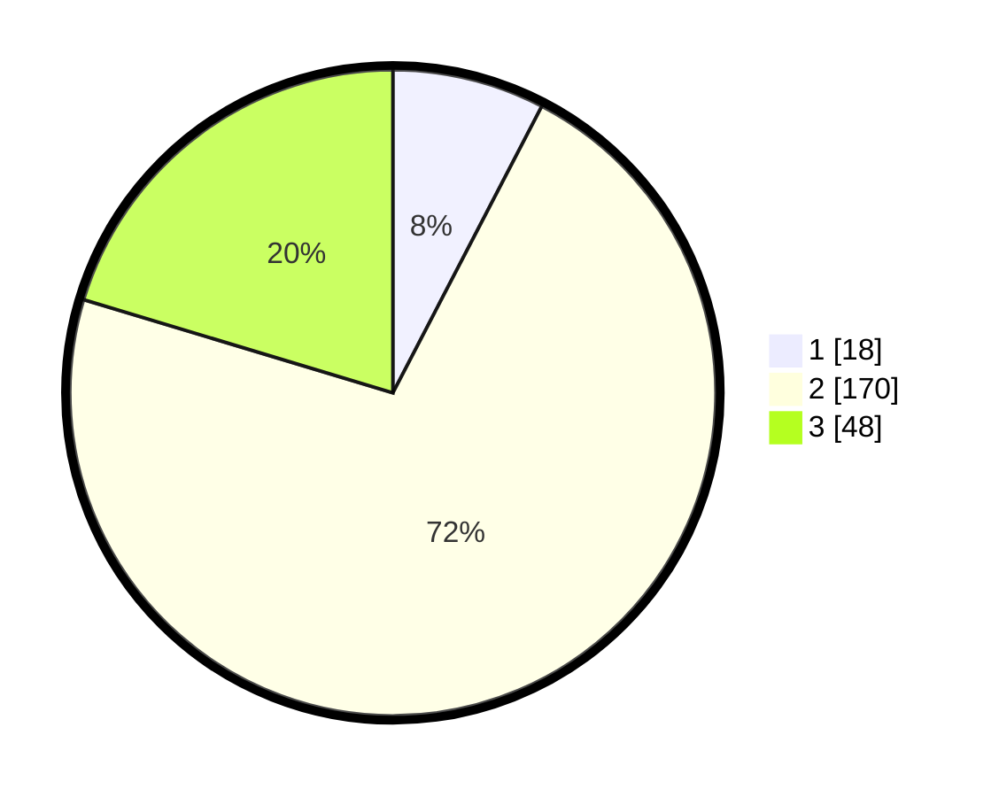

# Hasil

## Grafik

## Tabel

| No. | Nama Paslon    | Suara | Suara (raw) | Persentase |
|:--- |:-------------- | -----:| -----------:| ----------:|
| 1   | ANIES MUHAIMIN | 18    | [18][p-1]   | 7,63       |
| 2   | PRABOWO GIBRAN | 170   | [170][p-2]  | 72,03      |
| 3   | GANJAR MAHFUD  | 48    | [48][p-3]   | 20,34      |

[p-1]: https://github.com/gigit-pemilu/pemilu-2024/blob/main/pilpres/hitung-suara/sub/35-jawa-timur/sub/05-blitar/sub/04-kademangan/sub/2013-rejowinangun/sub/003-tps/sub/paslon-1.txt
[p-2]: https://github.com/gigit-pemilu/pemilu-2024/blob/main/pilpres/hitung-suara/sub/35-jawa-timur/sub/05-blitar/sub/04-kademangan/sub/2013-rejowinangun/sub/003-tps/sub/paslon-2.txt
[p-3]: https://github.com/gigit-pemilu/pemilu-2024/blob/main/pilpres/hitung-suara/sub/35-jawa-timur/sub/05-blitar/sub/04-kademangan/sub/2013-rejowinangun/sub/003-tps/sub/paslon-3.txt

## Foto C Plano

https://sirekap-obj-formc.kpu.go.id/bcaa/pemilu/ppwp/35/05/04/20/13/3505042013003-20240214-215209--e6da5365-b11c-4757-968b-d37af318a94f.jpg

https://sirekap-obj-formc.kpu.go.id/bcaa/pemilu/ppwp/35/05/04/20/13/3505042013003-20240214-201845--6b3159c4-5778-4971-80b2-82c58d07edb7.jpg

https://sirekap-obj-formc.kpu.go.id/bcaa/pemilu/ppwp/35/05/04/20/13/3505042013003-20240214-202105--7ad6348f-4d27-4959-be61-0eef69b6325f.jpg

## Metadata

| Key        | Value               |
| ---------- | ------------------- |
| Time Stamp | 2024-02-15 12:00:28 |

