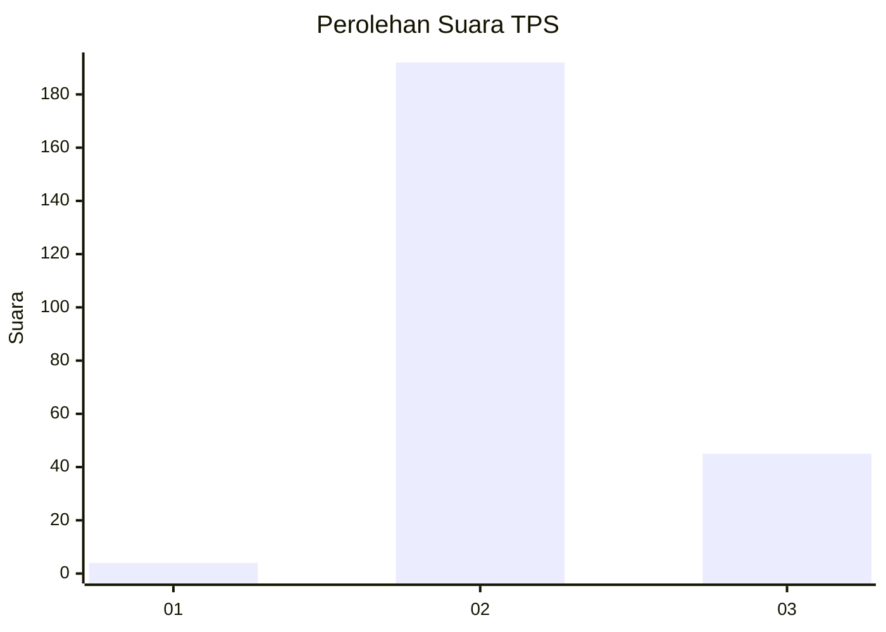
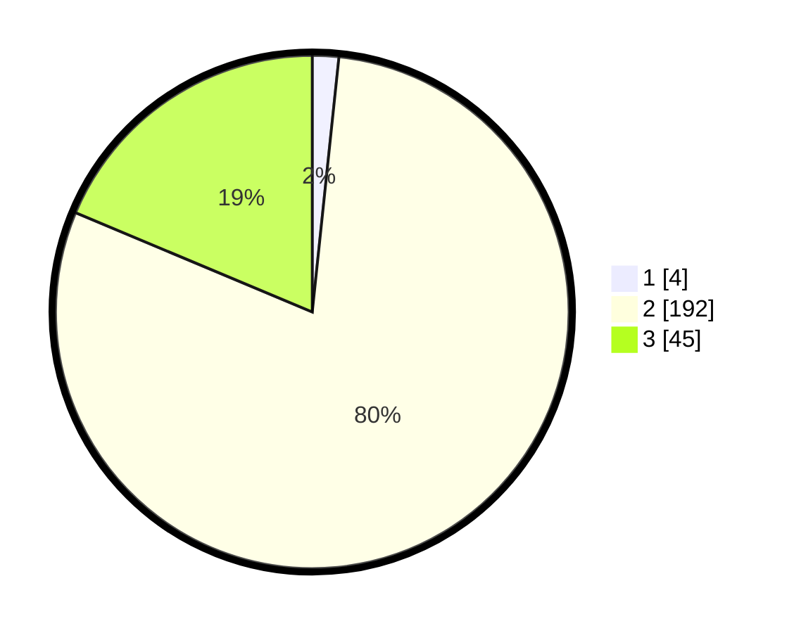

# Hasil

## Grafik

## Tabel

| No. | Nama Paslon    | Suara | Suara (raw) | Persentase |
|:--- |:-------------- | -----:| -----------:| ----------:|
| 1   | ANIES MUHAIMIN | 4     | [4][p-1]    | 1,66       |
| 2   | PRABOWO GIBRAN | 192   | [192][p-2]  | 79,67      |
| 3   | GANJAR MAHFUD  | 45    | [45][p-3]   | 18,67      |

[p-1]: https://github.com/gigit-pemilu/pemilu-2024/blob/main/pilpres/hitung-suara/sub/35-jawa-timur/sub/05-blitar/sub/05-bakung/sub/2001-pulerejo/sub/004-tps/sub/paslon-1.txt
[p-2]: https://github.com/gigit-pemilu/pemilu-2024/blob/main/pilpres/hitung-suara/sub/35-jawa-timur/sub/05-blitar/sub/05-bakung/sub/2001-pulerejo/sub/004-tps/sub/paslon-2.txt
[p-3]: https://github.com/gigit-pemilu/pemilu-2024/blob/main/pilpres/hitung-suara/sub/35-jawa-timur/sub/05-blitar/sub/05-bakung/sub/2001-pulerejo/sub/004-tps/sub/paslon-3.txt

## Foto C Plano

https://sirekap-obj-formc.kpu.go.id/5e5f/pemilu/ppwp/35/05/05/20/01/3505052001004-20240216-084857--9753ad1a-e573-4a3f-8f08-e3d47196aa87.jpg

https://sirekap-obj-formc.kpu.go.id/5e5f/pemilu/ppwp/35/05/05/20/01/3505052001004-20240220-172214--53155746-7a58-4902-a123-d8552b7f1449.jpg

## Metadata

| Key        | Value               |
| ---------- | ------------------- |
| Time Stamp | 2024-02-25 22:00:00 |

