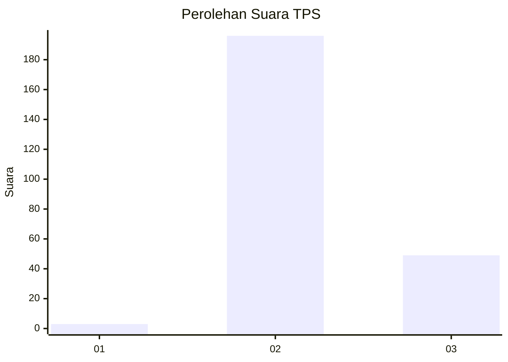

# Hasil

## Grafik

## Tabel

| No. | Nama Paslon    | Suara | Suara (raw) | Persentase |
|:--- |:-------------- | -----:| -----------:| ----------:|
| 1   | ANIES MUHAIMIN | 3     | [3][p-1]    | 1,21       |
| 2   | PRABOWO GIBRAN | 196   | [196][p-2]  | 79,03      |
| 3   | GANJAR MAHFUD  | 49    | [49][p-3]   | 19,76      |

[p-1]: https://github.com/gigit-pemilu/pemilu-2024/blob/main/pilpres/hitung-suara/sub/35-jawa-timur/sub/05-blitar/sub/05-bakung/sub/2001-pulerejo/sub/005-tps/sub/paslon-1.txt
[p-2]: https://github.com/gigit-pemilu/pemilu-2024/blob/main/pilpres/hitung-suara/sub/35-jawa-timur/sub/05-blitar/sub/05-bakung/sub/2001-pulerejo/sub/005-tps/sub/paslon-2.txt
[p-3]: https://github.com/gigit-pemilu/pemilu-2024/blob/main/pilpres/hitung-suara/sub/35-jawa-timur/sub/05-blitar/sub/05-bakung/sub/2001-pulerejo/sub/005-tps/sub/paslon-3.txt

## Foto C Plano

https://sirekap-obj-formc.kpu.go.id/e5b4/pemilu/ppwp/35/05/05/20/01/3505052001005-20240216-215235--bf07f848-e0d4-4168-8f10-0280a1b02ba7.jpg

https://sirekap-obj-formc.kpu.go.id/e5b4/pemilu/ppwp/35/05/05/20/01/3505052001005-20240216-215641--89d09f4c-6c25-41b2-9168-af1eb48b0ae4.jpg

https://sirekap-obj-formc.kpu.go.id/e5b4/pemilu/ppwp/35/05/05/20/01/3505052001005-20240216-215946--883c2a81-535a-4464-bd2c-e29399590874.jpg

## Metadata

| Key        | Value               |
| ---------- | ------------------- |
| Time Stamp | 2024-02-17 13:37:34 |

## DATA PEMILIH TETAP

Jumlah pemilih dalam DPT: **629**.
 * L: **15**.
 * P: **114**.

## DATA PENGGUNA HAK PILIH

Jumlah pengguna hak pilih dalam DPT: **612**.
 * L: **200**.
 * P: **12**.

Jumlah pengguna hak pilih dalam DPTb: **8**.
 * L: **50**.
 * P: **0**.

Jumlah pengguna hak pilih dalam DPK: **10**.
 * L: **500**.
 * P: **0**.

Jumlah pengguna hak pilih: **205**.
 * L: **126**.
 * P: **129**.

## JUMLAH SUARA SAH DAN TIDAK SAH

JUMLAH SELURUH SUARA SAH: **248**.

JUMLAH SUARA TIDAK SAH: **6**.

JUMLAH SELURUH SUARA SAH DAN SUARA TIDAK SAH: **254**.

