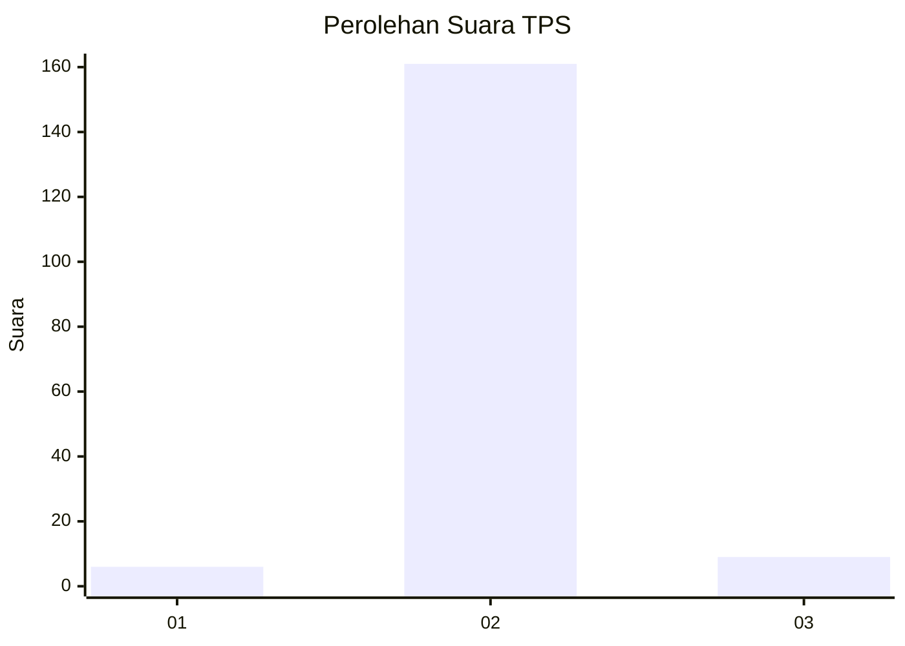
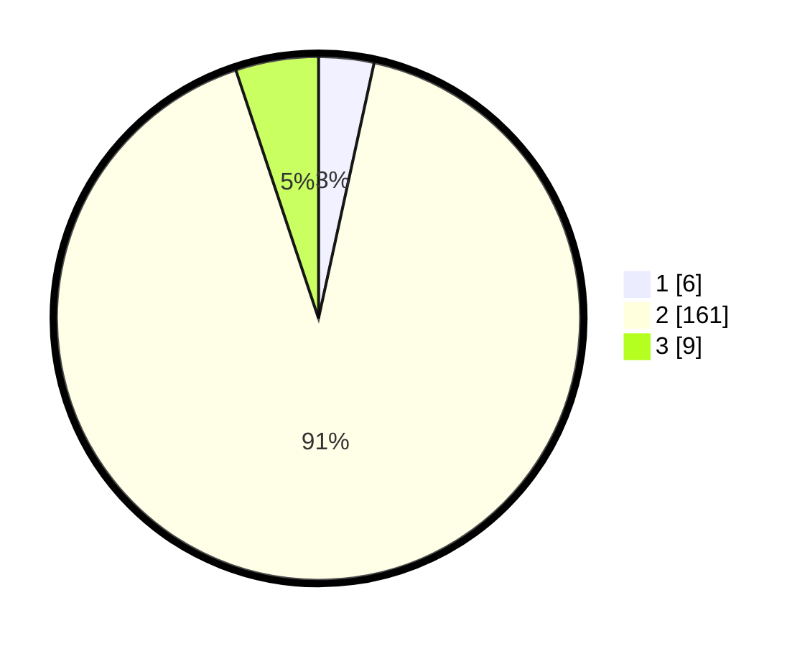

# Hasil

## Grafik

## Tabel

| No. | Nama Paslon    | Suara | Suara (raw) | Persentase |
|:--- |:-------------- | -----:| -----------:| ----------:|
| 1   | ANIES MUHAIMIN | 6     | [6][p-1]    | 3,41       |
| 2   | PRABOWO GIBRAN | 161   | [161][p-2]  | 91,48      |
| 3   | GANJAR MAHFUD  | 9     | [9][p-3]    | 5,11       |

[p-1]: https://github.com/gigit-pemilu/pemilu-2024-35-jawa-timur/blob/main/pilpres/hitung-suara/sub/35-jawa-timur/sub/05-blitar/sub/05-bakung/sub/2002-tumpakoyot/sub/006-tps/sub/paslon-1.txt
[p-2]: https://github.com/gigit-pemilu/pemilu-2024-35-jawa-timur/blob/main/pilpres/hitung-suara/sub/35-jawa-timur/sub/05-blitar/sub/05-bakung/sub/2002-tumpakoyot/sub/006-tps/sub/paslon-2.txt
[p-3]: https://github.com/gigit-pemilu/pemilu-2024-35-jawa-timur/blob/main/pilpres/hitung-suara/sub/35-jawa-timur/sub/05-blitar/sub/05-bakung/sub/2002-tumpakoyot/sub/006-tps/sub/paslon-3.txt

## Foto C Plano

https://sirekap-obj-formc.kpu.go.id/ea42/pemilu/ppwp/35/05/05/20/02/3505052002006-20240216-205731--b2f26c26-abb7-4c41-8769-18788353818f.jpg

https://sirekap-obj-formc.kpu.go.id/ea42/pemilu/ppwp/35/05/05/20/02/3505052002006-20240216-205938--304218f3-3231-46a7-97f7-46b1eccdd1f4.jpg

## Metadata

| Key        | Value               |
| ---------- | ------------------- |
| Time Stamp | 2024-02-24 22:31:28 |

