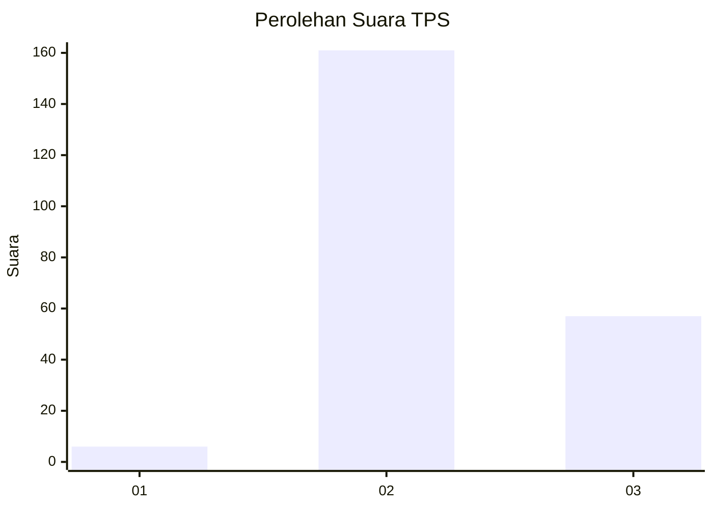
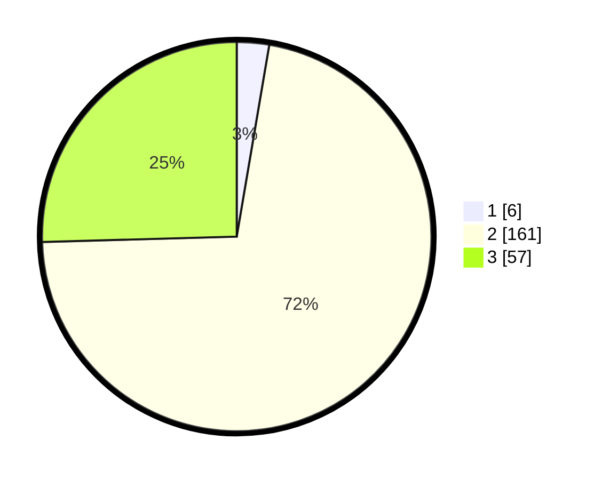

# Hasil

## Grafik

## Tabel

| No. | Nama Paslon    | Suara | Suara (raw) | Persentase |
|:--- |:-------------- | -----:| -----------:| ----------:|
| 1   | ANIES MUHAIMIN | 6     | [6][p-1]    | 2,68       |
| 2   | PRABOWO GIBRAN | 161   | [161][p-2]  | 71,88      |
| 3   | GANJAR MAHFUD  | 57    | [57][p-3]   | 25,45      |

[p-1]: https://github.com/gigit-pemilu/pemilu-2024/blob/main/pilpres/hitung-suara/sub/35-jawa-timur/sub/05-blitar/sub/05-bakung/sub/2003-plandirejo/sub/005-tps/sub/paslon-1.txt
[p-2]: https://github.com/gigit-pemilu/pemilu-2024/blob/main/pilpres/hitung-suara/sub/35-jawa-timur/sub/05-blitar/sub/05-bakung/sub/2003-plandirejo/sub/005-tps/sub/paslon-2.txt
[p-3]: https://github.com/gigit-pemilu/pemilu-2024/blob/main/pilpres/hitung-suara/sub/35-jawa-timur/sub/05-blitar/sub/05-bakung/sub/2003-plandirejo/sub/005-tps/sub/paslon-3.txt

## Foto C Plano

https://sirekap-obj-formc.kpu.go.id/11ff/pemilu/ppwp/35/05/05/20/03/3505052003005-20240214-224535--a088911a-2adc-4af7-a7a0-1d95841ba529.jpg

https://sirekap-obj-formc.kpu.go.id/11ff/pemilu/ppwp/35/05/05/20/03/3505052003005-20240214-223324--a9b56f27-791f-4ee3-b69f-90b187f2e1a3.jpg

https://sirekap-obj-formc.kpu.go.id/11ff/pemilu/ppwp/35/05/05/20/03/3505052003005-20240214-234222--5696d8ca-af26-4bae-b908-b7d7635d5c5f.jpg

## Metadata

| Key        | Value               |
| ---------- | ------------------- |
| Time Stamp | 2024-02-16 08:00:28 |

