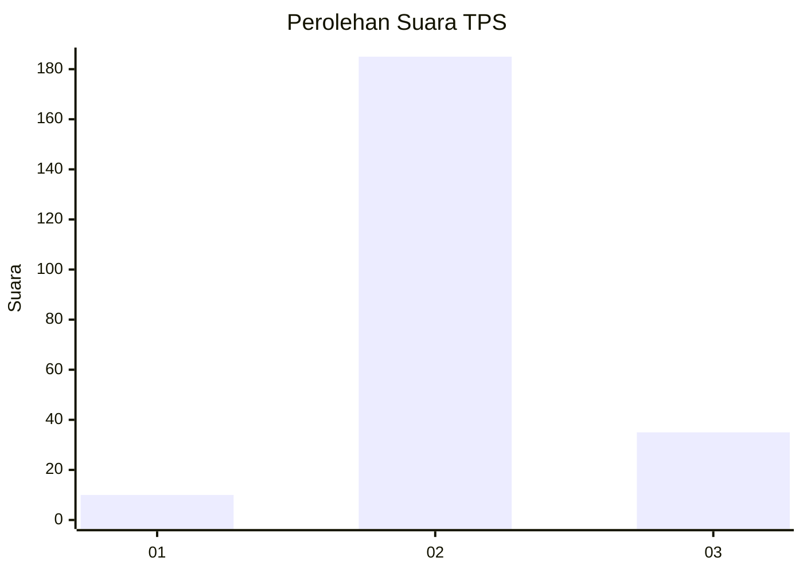
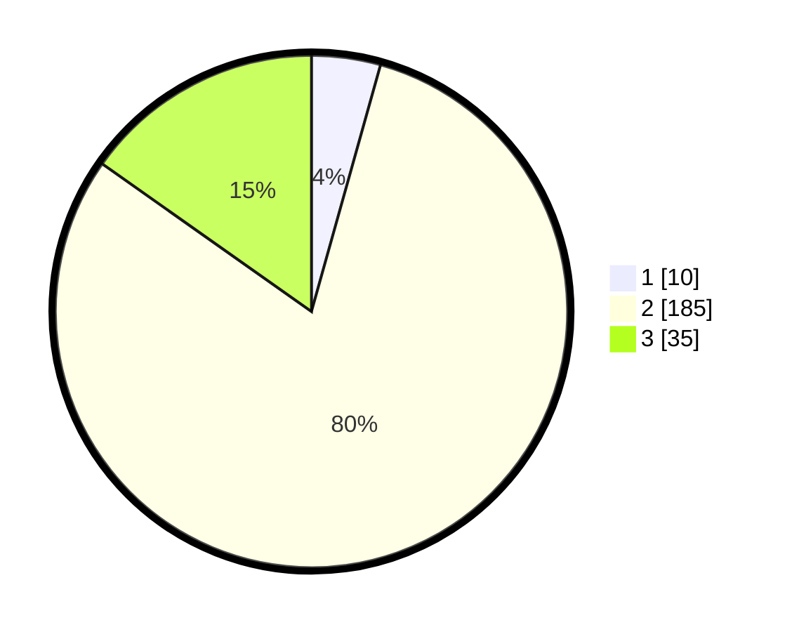

# Hasil

## Grafik

## Tabel

| No. | Nama Paslon    | Suara | Suara (raw) | Persentase |
|:--- |:-------------- | -----:| -----------:| ----------:|
| 1   | ANIES MUHAIMIN | 10    | [10][p-1]   | 4,35       |
| 2   | PRABOWO GIBRAN | 185   | [185][p-2]  | 80,43      |
| 3   | GANJAR MAHFUD  | 35    | [35][p-3]   | 15,22      |

[p-1]: https://github.com/gigit-pemilu/pemilu-2024-35-jawa-timur/blob/main/pilpres/hitung-suara/sub/35-jawa-timur/sub/05-blitar/sub/05-bakung/sub/2003-plandirejo/sub/006-tps/sub/paslon-1.txt
[p-2]: https://github.com/gigit-pemilu/pemilu-2024-35-jawa-timur/blob/main/pilpres/hitung-suara/sub/35-jawa-timur/sub/05-blitar/sub/05-bakung/sub/2003-plandirejo/sub/006-tps/sub/paslon-2.txt
[p-3]: https://github.com/gigit-pemilu/pemilu-2024-35-jawa-timur/blob/main/pilpres/hitung-suara/sub/35-jawa-timur/sub/05-blitar/sub/05-bakung/sub/2003-plandirejo/sub/006-tps/sub/paslon-3.txt

## Foto C Plano

https://sirekap-obj-formc.kpu.go.id/b261/pemilu/ppwp/35/05/05/20/03/3505052003006-20240218-094419--7693a15e-4efc-4336-a9d5-8afc9f1bb3ee.jpg

https://sirekap-obj-formc.kpu.go.id/b261/pemilu/ppwp/35/05/05/20/03/3505052003006-20240218-094627--03555d71-dba8-4c71-93c3-07414edfd518.jpg

https://sirekap-obj-formc.kpu.go.id/b261/pemilu/ppwp/35/05/05/20/03/3505052003006-20240218-115638--5c25343b-0d09-488a-aa2a-f21e40481c31.jpg

## Metadata

| Key        | Value               |
| ---------- | ------------------- |
| Time Stamp | 2024-02-21 18:00:00 |

