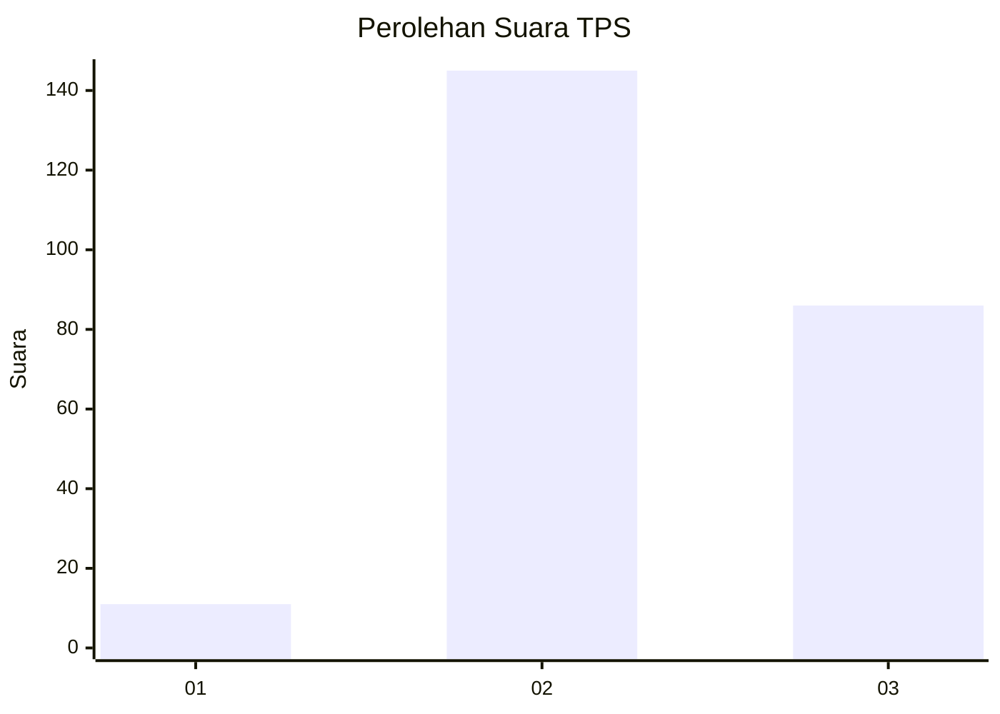
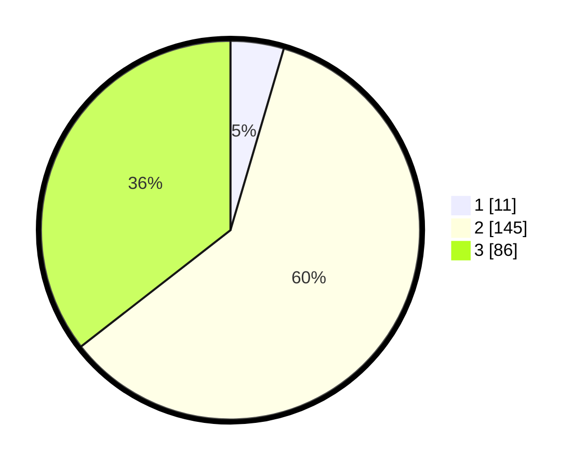

# Hasil

## Grafik

## Tabel

| No. | Nama Paslon    | Suara | Suara (raw) | Persentase |
|:--- |:-------------- | -----:| -----------:| ----------:|
| 1   | ANIES MUHAIMIN | 11    | [11][p-1]   | 4,55       |
| 2   | PRABOWO GIBRAN | 145   | [145][p-2]  | 59,92      |
| 3   | GANJAR MAHFUD  | 86    | [86][p-3]   | 35,54      |

[p-1]: https://github.com/gigit-pemilu/pemilu-2024/blob/main/pilpres/hitung-suara/sub/35-jawa-timur/sub/05-blitar/sub/05-bakung/sub/2003-plandirejo/sub/007-tps/sub/paslon-1.txt
[p-2]: https://github.com/gigit-pemilu/pemilu-2024/blob/main/pilpres/hitung-suara/sub/35-jawa-timur/sub/05-blitar/sub/05-bakung/sub/2003-plandirejo/sub/007-tps/sub/paslon-2.txt
[p-3]: https://github.com/gigit-pemilu/pemilu-2024/blob/main/pilpres/hitung-suara/sub/35-jawa-timur/sub/05-blitar/sub/05-bakung/sub/2003-plandirejo/sub/007-tps/sub/paslon-3.txt

## Foto C Plano

https://sirekap-obj-formc.kpu.go.id/6499/pemilu/ppwp/35/05/05/20/03/3505052003007-20240218-142723--e908ee8c-a9e7-4671-ae86-e45ae14aadfa.jpg

https://sirekap-obj-formc.kpu.go.id/6499/pemilu/ppwp/35/05/05/20/03/3505052003007-20240218-002336--d5a2bfac-6395-41e6-9a7c-ca15ab4bf91b.jpg

https://sirekap-obj-formc.kpu.go.id/6499/pemilu/ppwp/35/05/05/20/03/3505052003007-20240217-235752--076638c0-88a0-448d-85d0-70e56f5395c8.jpg

## Metadata

| Key        | Value               |
| ---------- | ------------------- |
| Time Stamp | 2024-02-19 06:16:00 |

