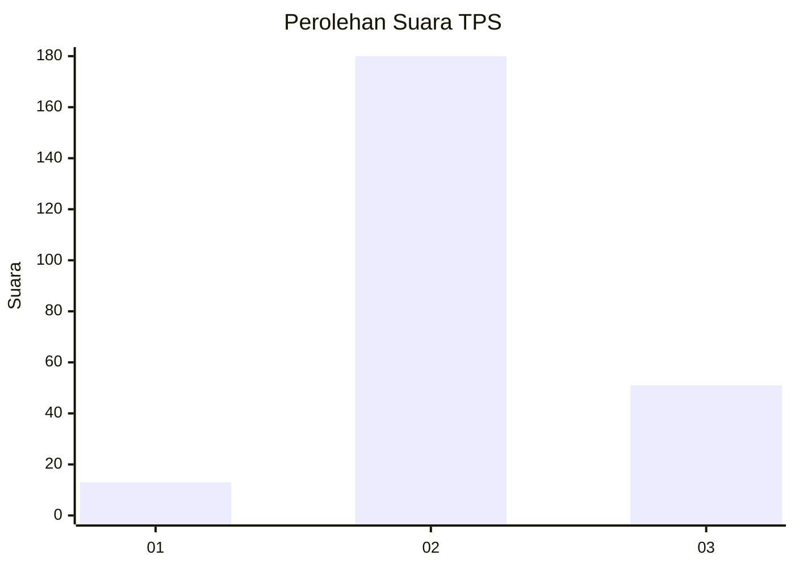

# Hasil

## Grafik

## Tabel

| No. | Nama Paslon    | Suara | Suara (raw) | Persentase |
|:--- |:-------------- | -----:| -----------:| ----------:|
| 1   | ANIES MUHAIMIN | 13    | [13][p-1]   | 5,33       |
| 2   | PRABOWO GIBRAN | 180   | [180][p-2]  | 73,77      |
| 3   | GANJAR MAHFUD  | 51    | [51][p-3]   | 20,90      |

[p-1]: https://github.com/gigit-pemilu/pemilu-2024-35-jawa-timur/blob/main/pilpres/hitung-suara/sub/35-jawa-timur/sub/05-blitar/sub/05-bakung/sub/2003-plandirejo/sub/008-tps/sub/paslon-1.txt
[p-2]: https://github.com/gigit-pemilu/pemilu-2024-35-jawa-timur/blob/main/pilpres/hitung-suara/sub/35-jawa-timur/sub/05-blitar/sub/05-bakung/sub/2003-plandirejo/sub/008-tps/sub/paslon-2.txt
[p-3]: https://github.com/gigit-pemilu/pemilu-2024-35-jawa-timur/blob/main/pilpres/hitung-suara/sub/35-jawa-timur/sub/05-blitar/sub/05-bakung/sub/2003-plandirejo/sub/008-tps/sub/paslon-3.txt

## Foto C Plano

https://sirekap-obj-formc.kpu.go.id/fd17/pemilu/ppwp/35/05/05/20/03/3505052003008-20240216-215401--d151d64d-f71e-4916-8c0f-f45dc0d43608.jpg

https://sirekap-obj-formc.kpu.go.id/fd17/pemilu/ppwp/35/05/05/20/03/3505052003008-20240216-215100--d752ad3e-7a39-44be-8124-eceb476a7825.jpg

https://sirekap-obj-formc.kpu.go.id/fd17/pemilu/ppwp/35/05/05/20/03/3505052003008-20240216-220949--bd079c7d-d78c-46e2-acda-f81a83b7c41f.jpg

## Metadata

| Key        | Value               |
| ---------- | ------------------- |
| Time Stamp | 2024-02-17 13:37:34 |

