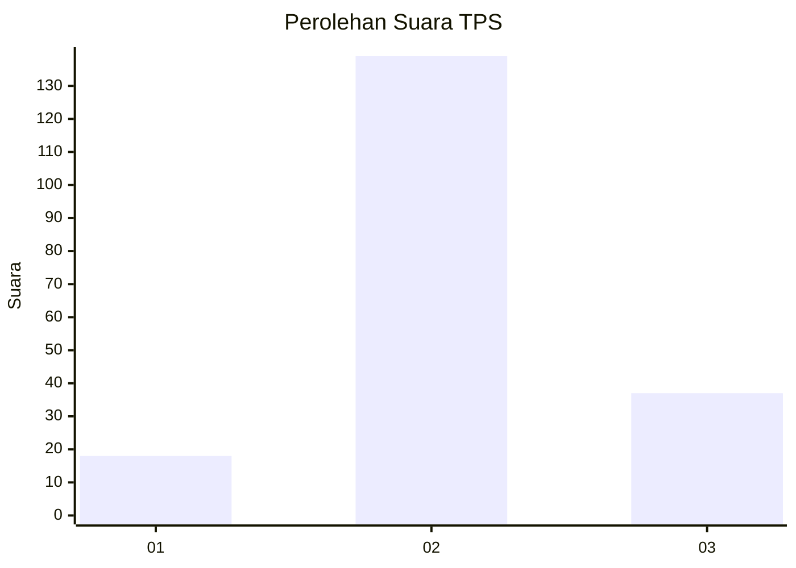
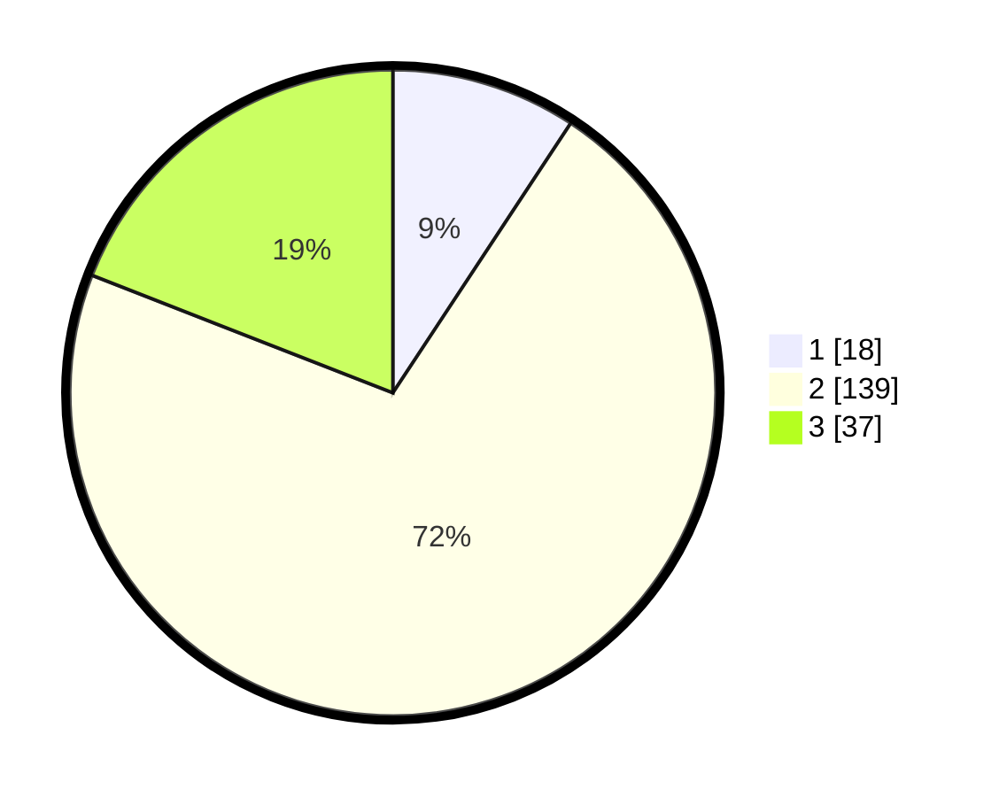

# Hasil

## Grafik

## Tabel

| No. | Nama Paslon    | Suara | Suara (raw) | Persentase |
|:--- |:-------------- | -----:| -----------:| ----------:|
| 1   | ANIES MUHAIMIN | 18    | [18][p-1]   | 9,28       |
| 2   | PRABOWO GIBRAN | 139   | [139][p-2]  | 71,65      |
| 3   | GANJAR MAHFUD  | 37    | [37][p-3]   | 19,07      |

[p-1]: https://github.com/gigit-pemilu/pemilu-2024/blob/main/pilpres/hitung-suara/sub/35-jawa-timur/sub/05-blitar/sub/05-bakung/sub/2005-bakung/sub/001-tps/sub/paslon-1.txt
[p-2]: https://github.com/gigit-pemilu/pemilu-2024/blob/main/pilpres/hitung-suara/sub/35-jawa-timur/sub/05-blitar/sub/05-bakung/sub/2005-bakung/sub/001-tps/sub/paslon-2.txt
[p-3]: https://github.com/gigit-pemilu/pemilu-2024/blob/main/pilpres/hitung-suara/sub/35-jawa-timur/sub/05-blitar/sub/05-bakung/sub/2005-bakung/sub/001-tps/sub/paslon-3.txt

## Foto C Plano

https://sirekap-obj-formc.kpu.go.id/7172/pemilu/ppwp/35/05/05/20/05/3505052005001-20240215-044727--f47ae190-b2f3-431b-9c74-8392098bafc3.jpg

https://sirekap-obj-formc.kpu.go.id/7172/pemilu/ppwp/35/05/05/20/05/3505052005001-20240215-044747--e365e8e8-8607-498e-9b42-d2c55e953325.jpg

https://sirekap-obj-formc.kpu.go.id/7172/pemilu/ppwp/35/05/05/20/05/3505052005001-20240215-044804--eb4831bb-95c1-4451-9ca1-cd8fe2e611fc.jpg

## Metadata

| Key        | Value               |
| ---------- | ------------------- |
| Time Stamp | 2024-02-15 09:00:24 |

