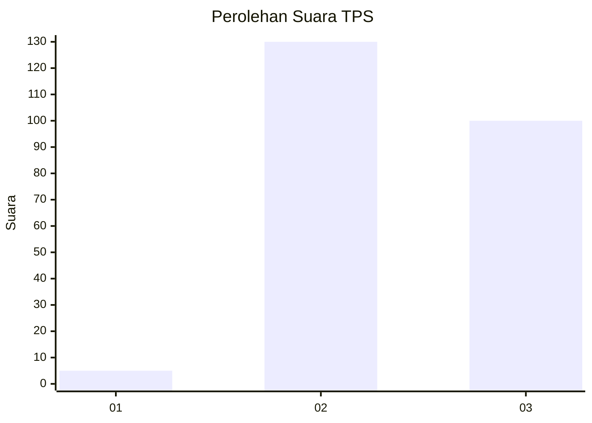
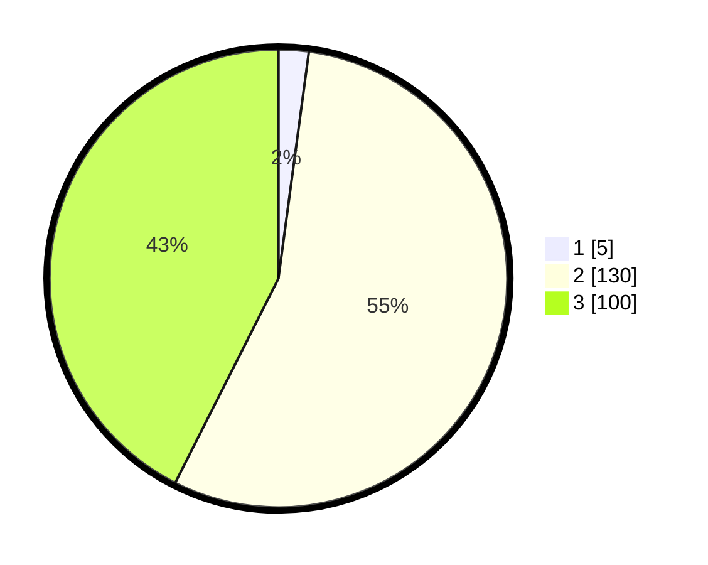

# Hasil

## Grafik

## Tabel

| No. | Nama Paslon    | Suara | Suara (raw) | Persentase |
|:--- |:-------------- | -----:| -----------:| ----------:|
| 1   | ANIES MUHAIMIN | 5     | [5][p-1]    | 2,13       |
| 2   | PRABOWO GIBRAN | 130   | [130][p-2]  | 55,32      |
| 3   | GANJAR MAHFUD  | 100   | [100][p-3]  | 42,55      |

[p-1]: https://github.com/gigit-pemilu/pemilu-2024-35-jawa-timur/blob/main/pilpres/hitung-suara/sub/35-jawa-timur/sub/05-blitar/sub/05-bakung/sub/2005-bakung/sub/005-tps/sub/paslon-1.txt
[p-2]: https://github.com/gigit-pemilu/pemilu-2024-35-jawa-timur/blob/main/pilpres/hitung-suara/sub/35-jawa-timur/sub/05-blitar/sub/05-bakung/sub/2005-bakung/sub/005-tps/sub/paslon-2.txt
[p-3]: https://github.com/gigit-pemilu/pemilu-2024-35-jawa-timur/blob/main/pilpres/hitung-suara/sub/35-jawa-timur/sub/05-blitar/sub/05-bakung/sub/2005-bakung/sub/005-tps/sub/paslon-3.txt

## Foto C Plano

https://sirekap-obj-formc.kpu.go.id/d5ed/pemilu/ppwp/35/05/05/20/05/3505052005005-20240214-201425--711d68f4-cdb9-41a0-9e2c-61ba4fad46d9.jpg

https://sirekap-obj-formc.kpu.go.id/d5ed/pemilu/ppwp/35/05/05/20/05/3505052005005-20240215-025657--01966d85-ef64-46c4-a9c7-fb80ca5216fc.jpg

https://sirekap-obj-formc.kpu.go.id/d5ed/pemilu/ppwp/35/05/05/20/05/3505052005005-20240215-025744--78a4c911-acd6-4655-a67e-cde2735ff72e.jpg

## Metadata

| Key        | Value               |
| ---------- | ------------------- |
| Time Stamp | 2024-02-15 09:00:24 |

