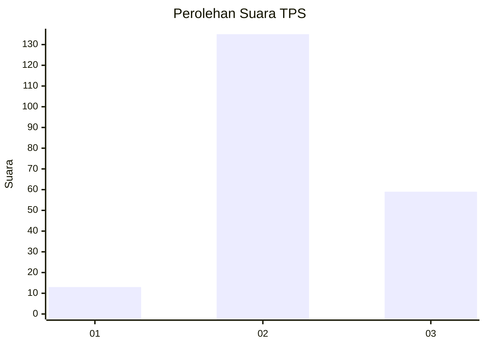
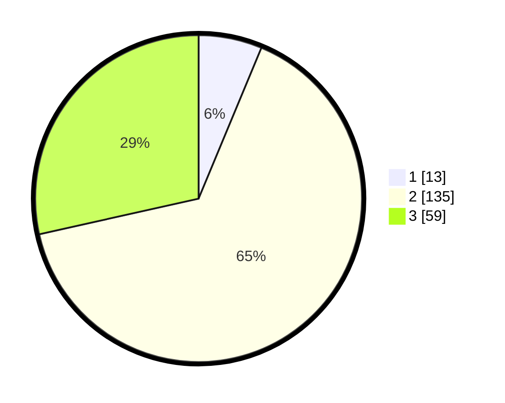

# Hasil

## Grafik

## Tabel

| No. | Nama Paslon    | Suara | Suara (raw) | Persentase |
|:--- |:-------------- | -----:| -----------:| ----------:|
| 1   | ANIES MUHAIMIN | 13    | [13][p-1]   | 6,28       |
| 2   | PRABOWO GIBRAN | 135   | [135][p-2]  | 65,22      |
| 3   | GANJAR MAHFUD  | 59    | [59][p-3]   | 28,50      |

[p-1]: https://github.com/gigit-pemilu/pemilu-2024-35-jawa-timur/blob/main/pilpres/hitung-suara/sub/35-jawa-timur/sub/05-blitar/sub/05-bakung/sub/2006-ngrejo/sub/005-tps/sub/paslon-1.txt
[p-2]: https://github.com/gigit-pemilu/pemilu-2024-35-jawa-timur/blob/main/pilpres/hitung-suara/sub/35-jawa-timur/sub/05-blitar/sub/05-bakung/sub/2006-ngrejo/sub/005-tps/sub/paslon-2.txt
[p-3]: https://github.com/gigit-pemilu/pemilu-2024-35-jawa-timur/blob/main/pilpres/hitung-suara/sub/35-jawa-timur/sub/05-blitar/sub/05-bakung/sub/2006-ngrejo/sub/005-tps/sub/paslon-3.txt

## Foto C Plano

https://sirekap-obj-formc.kpu.go.id/1682/pemilu/ppwp/35/05/05/20/06/3505052006005-20240217-132434--367e3cfa-4b14-4f65-936c-8b06172e5fd0.jpg

https://sirekap-obj-formc.kpu.go.id/1682/pemilu/ppwp/35/05/05/20/06/3505052006005-20240214-221713--4c8d47d0-6e19-4c44-b1fd-252e630cf02a.jpg

https://sirekap-obj-formc.kpu.go.id/1682/pemilu/ppwp/35/05/05/20/06/3505052006005-20240214-221802--28324a86-2d2e-4a6c-b5a0-fea122876e0a.jpg

## Metadata

| Key        | Value               |
| ---------- | ------------------- |
| Time Stamp | 2024-02-17 13:37:34 |

