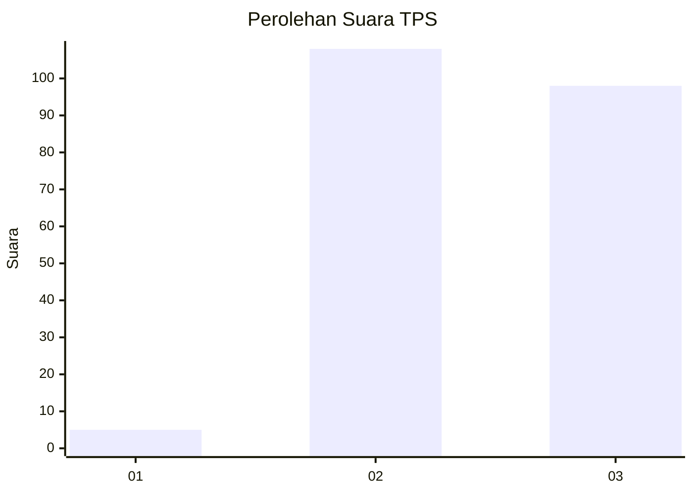
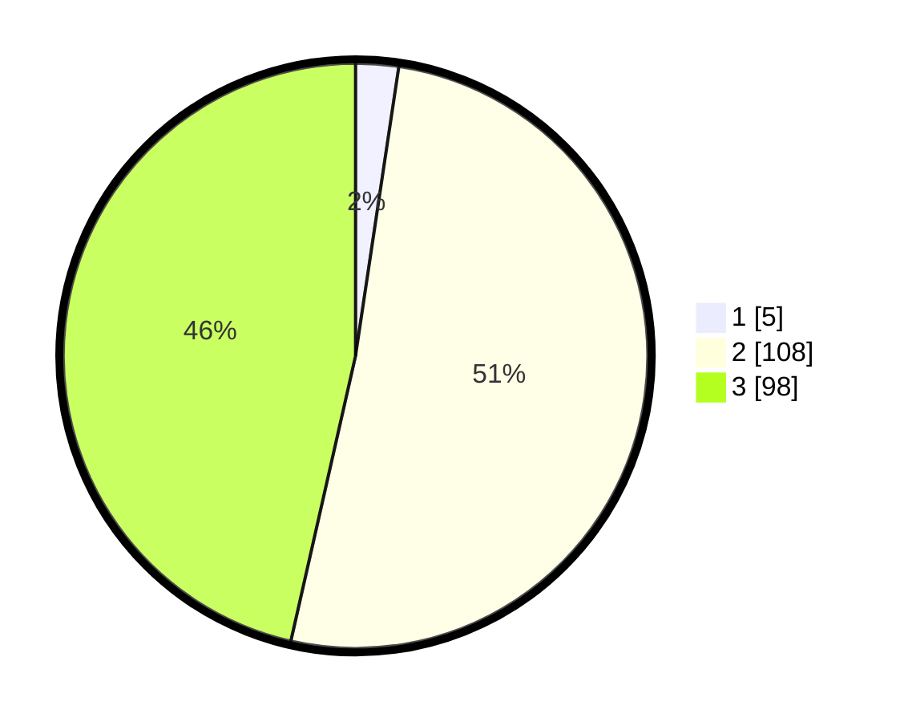

# Hasil

## Grafik

## Tabel

| No. | Nama Paslon    | Suara | Suara (raw) | Persentase |
|:--- |:-------------- | -----:| -----------:| ----------:|
| 1   | ANIES MUHAIMIN | 5     | [5][p-1]    | 2,37       |
| 2   | PRABOWO GIBRAN | 108   | [108][p-2]  | 51,18      |
| 3   | GANJAR MAHFUD  | 98    | [98][p-3]   | 46,45      |

[p-1]: https://github.com/gigit-pemilu/pemilu-2024-35-jawa-timur/blob/main/pilpres/hitung-suara/sub/35-jawa-timur/sub/05-blitar/sub/05-bakung/sub/2007-bululawang/sub/004-tps/sub/paslon-1.txt
[p-2]: https://github.com/gigit-pemilu/pemilu-2024-35-jawa-timur/blob/main/pilpres/hitung-suara/sub/35-jawa-timur/sub/05-blitar/sub/05-bakung/sub/2007-bululawang/sub/004-tps/sub/paslon-2.txt
[p-3]: https://github.com/gigit-pemilu/pemilu-2024-35-jawa-timur/blob/main/pilpres/hitung-suara/sub/35-jawa-timur/sub/05-blitar/sub/05-bakung/sub/2007-bululawang/sub/004-tps/sub/paslon-3.txt

## Foto C Plano

https://sirekap-obj-formc.kpu.go.id/9632/pemilu/ppwp/35/05/05/20/07/3505052007004-20240215-011320--7d4c5184-d8b4-49c0-8bc6-2dbeea986047.jpg

https://sirekap-obj-formc.kpu.go.id/9632/pemilu/ppwp/35/05/05/20/07/3505052007004-20240215-011412--9b2608d0-881b-4a8d-be5d-764c4428e912.jpg

https://sirekap-obj-formc.kpu.go.id/9632/pemilu/ppwp/35/05/05/20/07/3505052007004-20240215-011450--99b58a1e-a749-432e-9dc6-498b6fee8916.jpg

## Metadata

| Key        | Value               |
| ---------- | ------------------- |
| Time Stamp | 2024-02-15 09:00:24 |

