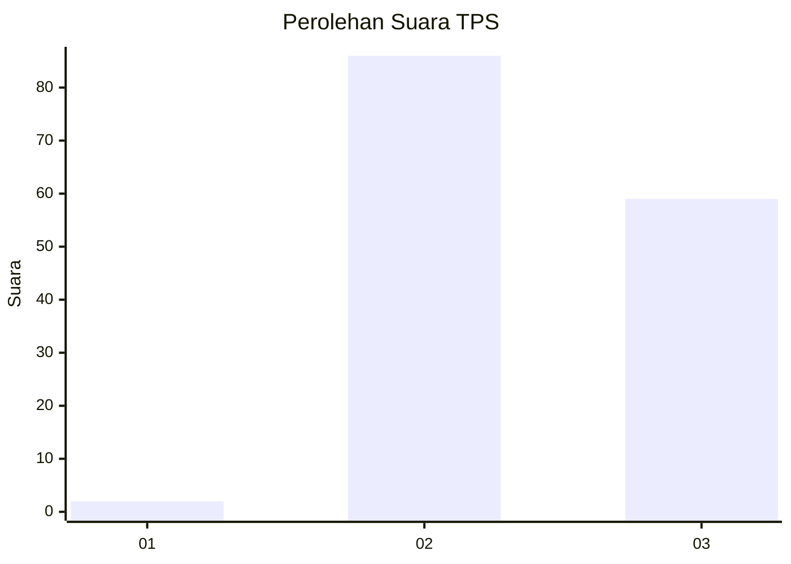
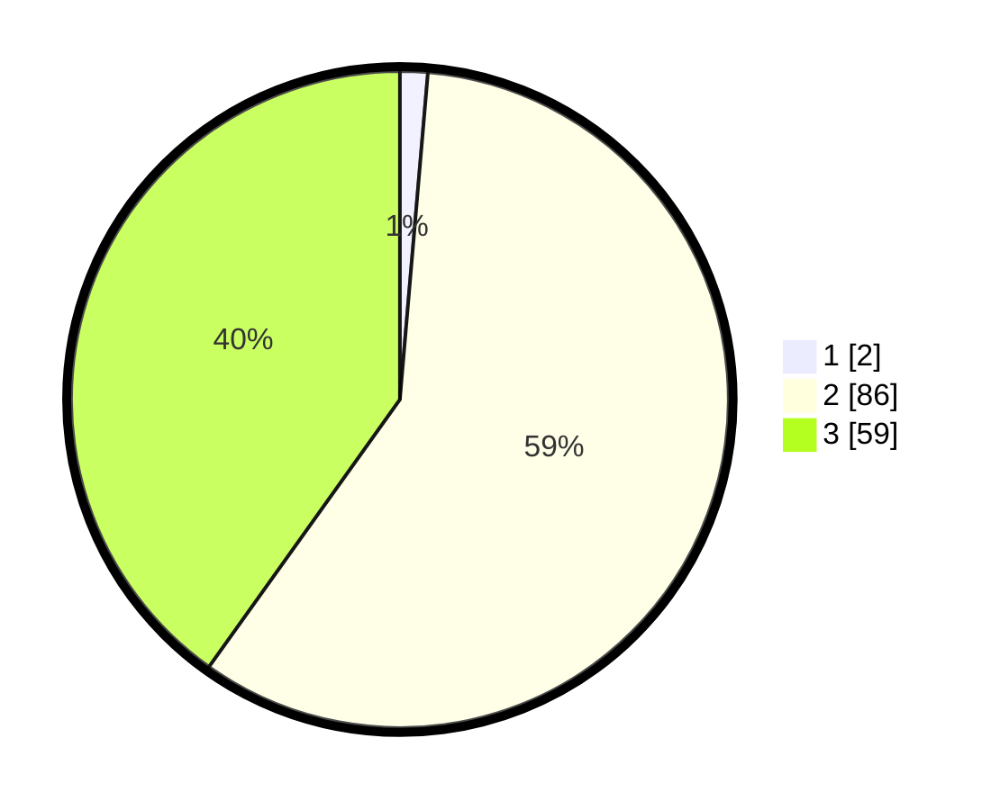

# Hasil

## Grafik

## Tabel

| No. | Nama Paslon    | Suara | Suara (raw) | Persentase |
|:--- |:-------------- | -----:| -----------:| ----------:|
| 1   | ANIES MUHAIMIN | 2     | [2][p-1]    | 1,36       |
| 2   | PRABOWO GIBRAN | 86    | [86][p-2]   | 58,50      |
| 3   | GANJAR MAHFUD  | 59    | [59][p-3]   | 40,14      |

[p-1]: https://github.com/gigit-pemilu/pemilu-2024-35-jawa-timur/blob/main/pilpres/hitung-suara/sub/35-jawa-timur/sub/05-blitar/sub/05-bakung/sub/2008-kedungbanteng/sub/010-tps/sub/paslon-1.txt
[p-2]: https://github.com/gigit-pemilu/pemilu-2024-35-jawa-timur/blob/main/pilpres/hitung-suara/sub/35-jawa-timur/sub/05-blitar/sub/05-bakung/sub/2008-kedungbanteng/sub/010-tps/sub/paslon-2.txt
[p-3]: https://github.com/gigit-pemilu/pemilu-2024-35-jawa-timur/blob/main/pilpres/hitung-suara/sub/35-jawa-timur/sub/05-blitar/sub/05-bakung/sub/2008-kedungbanteng/sub/010-tps/sub/paslon-3.txt

## Foto C Plano

https://sirekap-obj-formc.kpu.go.id/9368/pemilu/ppwp/35/05/05/20/08/3505052008010-20240214-231508--bd09063d-dea2-4b48-ab1d-479084cdb728.jpg

https://sirekap-obj-formc.kpu.go.id/9368/pemilu/ppwp/35/05/05/20/08/3505052008010-20240214-231628--507c82b8-983a-4fe0-a144-d1dcd474a234.jpg

https://sirekap-obj-formc.kpu.go.id/9368/pemilu/ppwp/35/05/05/20/08/3505052008010-20240214-231750--1153932a-6eb3-4b55-87f6-ff450c05dc3a.jpg

## Metadata

| Key        | Value               |
| ---------- | ------------------- |
| Time Stamp | 2024-02-15 09:00:24 |

