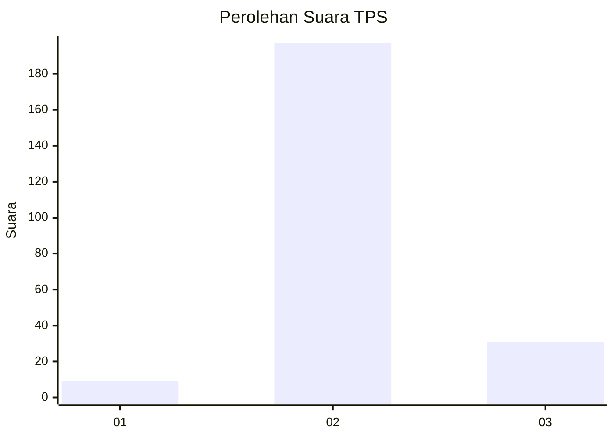
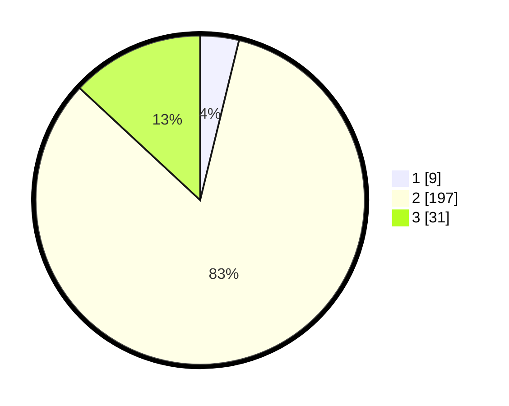

# Hasil

## Grafik

## Tabel

| No. | Nama Paslon    | Suara | Suara (raw) | Persentase |
|:--- |:-------------- | -----:| -----------:| ----------:|
| 1   | ANIES MUHAIMIN | 9     | [9][p-1]    | 3,80       |
| 2   | PRABOWO GIBRAN | 197   | [197][p-2]  | 83,12      |
| 3   | GANJAR MAHFUD  | 31    | [31][p-3]   | 13,08      |

[p-1]: https://github.com/gigit-pemilu/pemilu-2024-35-jawa-timur/blob/main/pilpres/hitung-suara/sub/35-jawa-timur/sub/05-blitar/sub/05-bakung/sub/2009-sidomulyo/sub/005-tps/sub/paslon-1.txt
[p-2]: https://github.com/gigit-pemilu/pemilu-2024-35-jawa-timur/blob/main/pilpres/hitung-suara/sub/35-jawa-timur/sub/05-blitar/sub/05-bakung/sub/2009-sidomulyo/sub/005-tps/sub/paslon-2.txt
[p-3]: https://github.com/gigit-pemilu/pemilu-2024-35-jawa-timur/blob/main/pilpres/hitung-suara/sub/35-jawa-timur/sub/05-blitar/sub/05-bakung/sub/2009-sidomulyo/sub/005-tps/sub/paslon-3.txt

## Foto C Plano

https://sirekap-obj-formc.kpu.go.id/29a5/pemilu/ppwp/35/05/05/20/09/3505052009005-20240217-113350--a428ca9f-7dbc-49f0-9c54-a6fb21fece8e.jpg

https://sirekap-obj-formc.kpu.go.id/29a5/pemilu/ppwp/35/05/05/20/09/3505052009005-20240217-113842--0f7be2fe-4c93-463b-bca2-3517a57bc7d8.jpg

https://sirekap-obj-formc.kpu.go.id/29a5/pemilu/ppwp/35/05/05/20/09/3505052009005-20240217-114100--11e76eae-bb22-4563-94a6-c381c003aa76.jpg

## Metadata

| Key        | Value               |
| ---------- | ------------------- |
| Time Stamp | 2024-02-17 13:37:34 |

