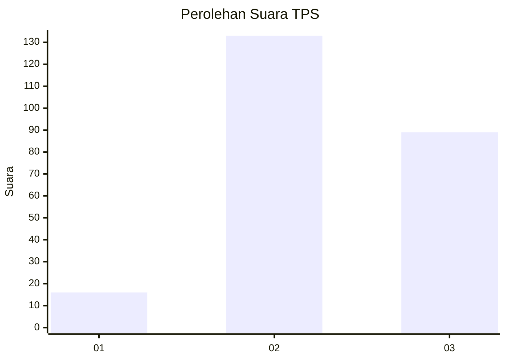
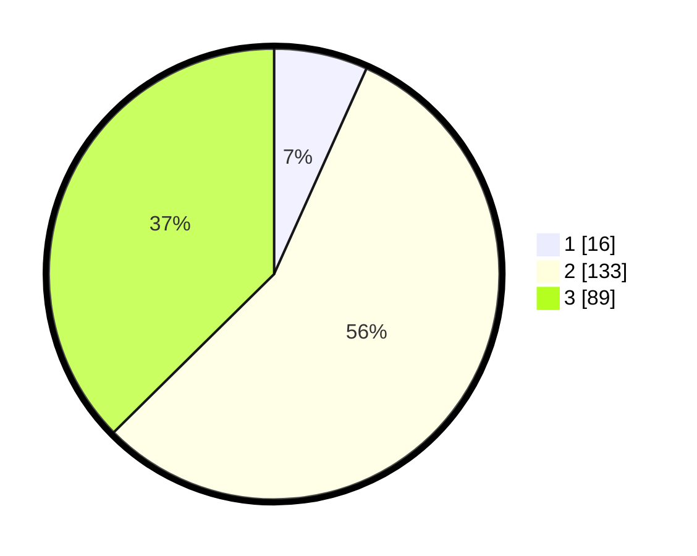

# Hasil

## Grafik

## Tabel

| No. | Nama Paslon    | Suara | Suara (raw) | Persentase |
|:--- |:-------------- | -----:| -----------:| ----------:|
| 1   | ANIES MUHAIMIN | 16    | [16][p-1]   | 6,72       |
| 2   | PRABOWO GIBRAN | 133   | [133][p-2]  | 55,88      |
| 3   | GANJAR MAHFUD  | 89    | [89][p-3]   | 37,39      |

[p-1]: https://github.com/gigit-pemilu/pemilu-2024/blob/main/pilpres/hitung-suara/sub/35-jawa-timur/sub/05-blitar/sub/05-bakung/sub/2009-sidomulyo/sub/006-tps/sub/paslon-1.txt
[p-2]: https://github.com/gigit-pemilu/pemilu-2024/blob/main/pilpres/hitung-suara/sub/35-jawa-timur/sub/05-blitar/sub/05-bakung/sub/2009-sidomulyo/sub/006-tps/sub/paslon-2.txt
[p-3]: https://github.com/gigit-pemilu/pemilu-2024/blob/main/pilpres/hitung-suara/sub/35-jawa-timur/sub/05-blitar/sub/05-bakung/sub/2009-sidomulyo/sub/006-tps/sub/paslon-3.txt

## Foto C Plano

https://sirekap-obj-formc.kpu.go.id/bc41/pemilu/ppwp/35/05/05/20/09/3505052009006-20240214-192409--b9ed8d01-7ac2-4676-842d-4be845cdb807.jpg

https://sirekap-obj-formc.kpu.go.id/bc41/pemilu/ppwp/35/05/05/20/09/3505052009006-20240215-035643--11c7c42c-97ac-4931-b784-6dc1a73b4c00.jpg

https://sirekap-obj-formc.kpu.go.id/bc41/pemilu/ppwp/35/05/05/20/09/3505052009006-20240215-035651--60e93c16-a2de-49ba-8823-963631ca7957.jpg

## Metadata

| Key        | Value               |
| ---------- | ------------------- |
| Time Stamp | 2024-02-15 09:00:24 |

