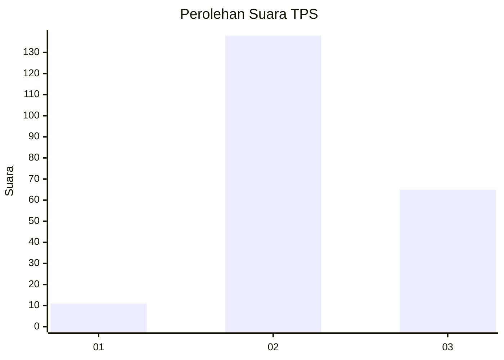

# Hasil

## Grafik

## Tabel

| No. | Nama Paslon    | Suara | Suara (raw) | Persentase |
|:--- |:-------------- | -----:| -----------:| ----------:|
| 1   | ANIES MUHAIMIN | 11    | [11][p-1]   | 5,14       |
| 2   | PRABOWO GIBRAN | 138   | [138][p-2]  | 64,49      |
| 3   | GANJAR MAHFUD  | 65    | [65][p-3]   | 30,37      |

[p-1]: https://github.com/gigit-pemilu/pemilu-2024-35-jawa-timur/blob/main/pilpres/hitung-suara/sub/35-jawa-timur/sub/05-blitar/sub/05-bakung/sub/2009-sidomulyo/sub/010-tps/sub/paslon-1.txt
[p-2]: https://github.com/gigit-pemilu/pemilu-2024-35-jawa-timur/blob/main/pilpres/hitung-suara/sub/35-jawa-timur/sub/05-blitar/sub/05-bakung/sub/2009-sidomulyo/sub/010-tps/sub/paslon-2.txt
[p-3]: https://github.com/gigit-pemilu/pemilu-2024-35-jawa-timur/blob/main/pilpres/hitung-suara/sub/35-jawa-timur/sub/05-blitar/sub/05-bakung/sub/2009-sidomulyo/sub/010-tps/sub/paslon-3.txt

## Foto C Plano

https://sirekap-obj-formc.kpu.go.id/3ec4/pemilu/ppwp/35/05/05/20/09/3505052009010-20240214-214235--46c080e7-caca-47d3-b4cf-d1307051de36.jpg

https://sirekap-obj-formc.kpu.go.id/3ec4/pemilu/ppwp/35/05/05/20/09/3505052009010-20240218-193527--55c77304-645f-48c8-9da1-d77719ad5fc2.jpg

https://sirekap-obj-formc.kpu.go.id/3ec4/pemilu/ppwp/35/05/05/20/09/3505052009010-20240214-214501--be071d47-d941-4bfd-bb87-612a553b93df.jpg

## Metadata

| Key        | Value               |
| ---------- | ------------------- |
| Time Stamp | 2024-02-22 18:00:00 |

## DATA PEMILIH TETAP

Jumlah pemilih dalam DPT: **299**.
 * L: **0**.
 * P: **156**.

## DATA PENGGUNA HAK PILIH

Jumlah pengguna hak pilih dalam DPT: **300**.
 * L: **626**.
 * P: **733**.

Jumlah pengguna hak pilih dalam DPTb: **0**.
 * L: **770**.
 * P: **33**.

Jumlah pengguna hak pilih dalam DPK: **0**.
 * L: **107**.
 * P: **777**.

Jumlah pengguna hak pilih: **7**.
 * L: **0**.
 * P: **0**.

## JUMLAH SUARA SAH DAN TIDAK SAH

JUMLAH SELURUH SUARA SAH: **214**.

JUMLAH SUARA TIDAK SAH: **13**.

JUMLAH SELURUH SUARA SAH DAN SUARA TIDAK SAH: **227**.

