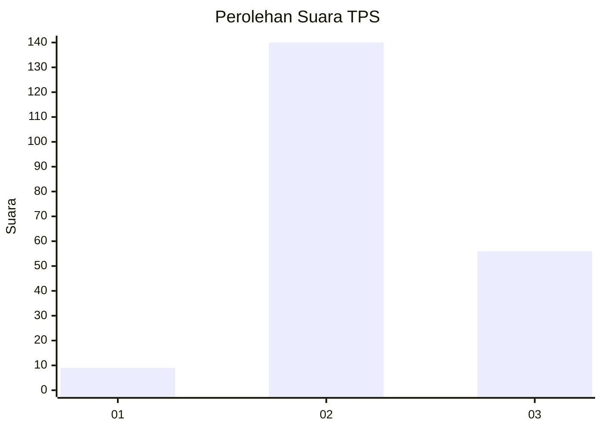

# Hasil

## Grafik

## Tabel

| No. | Nama Paslon    | Suara | Suara (raw) | Persentase |
|:--- |:-------------- | -----:| -----------:| ----------:|
| 1   | ANIES MUHAIMIN | 9     | [9][p-1]    | 4,39       |
| 2   | PRABOWO GIBRAN | 140   | [140][p-2]  | 68,29      |
| 3   | GANJAR MAHFUD  | 56    | [56][p-3]   | 27,32      |

[p-1]: https://github.com/gigit-pemilu/pemilu-2024-35-jawa-timur/blob/main/pilpres/hitung-suara/sub/35-jawa-timur/sub/05-blitar/sub/05-bakung/sub/2010-lorejo/sub/003-tps/sub/paslon-1.txt
[p-2]: https://github.com/gigit-pemilu/pemilu-2024-35-jawa-timur/blob/main/pilpres/hitung-suara/sub/35-jawa-timur/sub/05-blitar/sub/05-bakung/sub/2010-lorejo/sub/003-tps/sub/paslon-2.txt
[p-3]: https://github.com/gigit-pemilu/pemilu-2024-35-jawa-timur/blob/main/pilpres/hitung-suara/sub/35-jawa-timur/sub/05-blitar/sub/05-bakung/sub/2010-lorejo/sub/003-tps/sub/paslon-3.txt

## Foto C Plano

https://sirekap-obj-formc.kpu.go.id/ec02/pemilu/ppwp/35/05/05/20/10/3505052010003-20240214-213608--75314e20-417c-477e-b907-7a5143df10a6.jpg

https://sirekap-obj-formc.kpu.go.id/ec02/pemilu/ppwp/35/05/05/20/10/3505052010003-20240214-213638--96c0df1e-f8b8-43fe-80e2-789e807b7711.jpg

https://sirekap-obj-formc.kpu.go.id/ec02/pemilu/ppwp/35/05/05/20/10/3505052010003-20240214-213705--3e73ec40-4cb9-42c8-a3d1-b9c210a42a8f.jpg

## Metadata

| Key        | Value               |
| ---------- | ------------------- |
| Time Stamp | 2024-02-15 12:00:28 |

