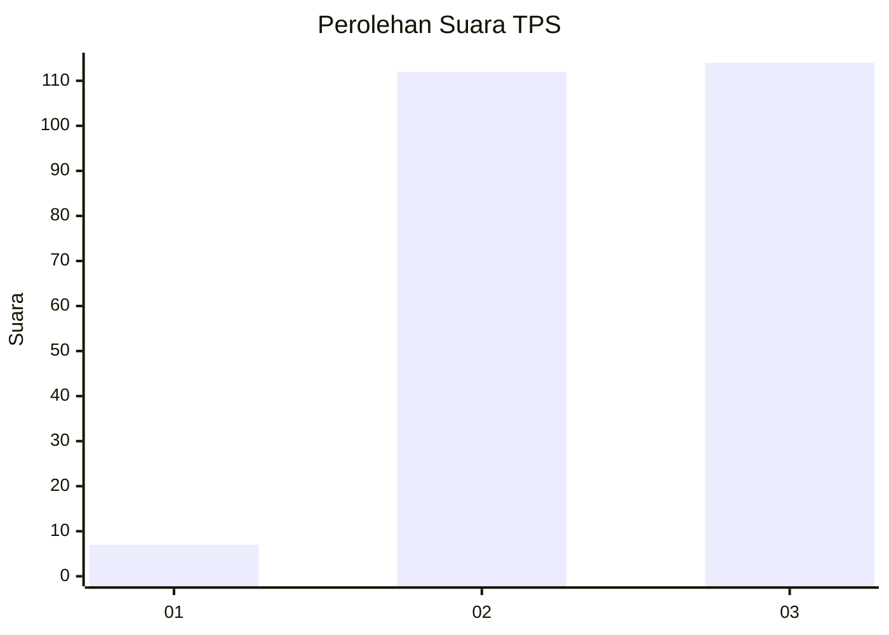
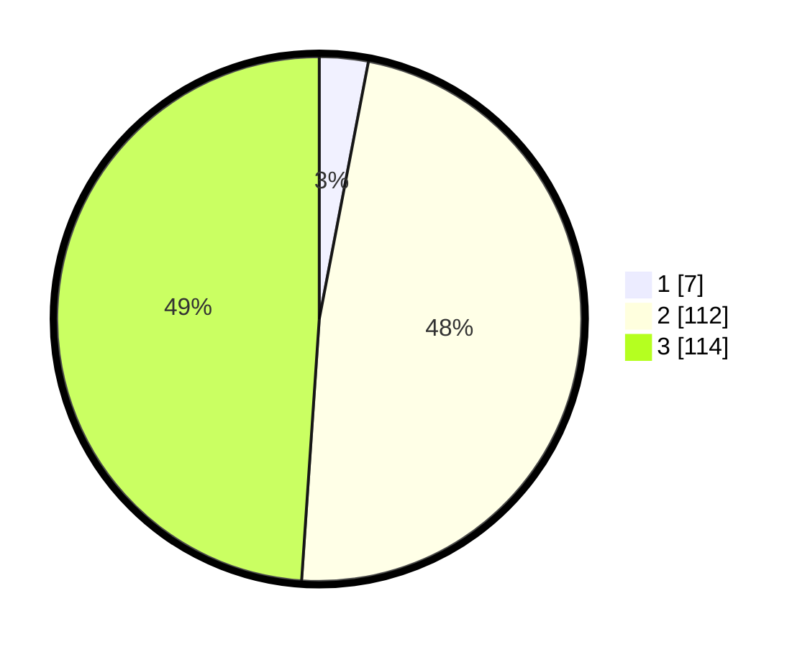

# Hasil

## Grafik

## Tabel

| No. | Nama Paslon    | Suara | Suara (raw) | Persentase |
|:--- |:-------------- | -----:| -----------:| ----------:|
| 1   | ANIES MUHAIMIN | 7     | [7][p-1]    | 3,00       |
| 2   | PRABOWO GIBRAN | 112   | [112][p-2]  | 48,07      |
| 3   | GANJAR MAHFUD  | 114   | [114][p-3]  | 48,93      |

[p-1]: https://github.com/gigit-pemilu/pemilu-2024-35-jawa-timur/blob/main/pilpres/hitung-suara/sub/35-jawa-timur/sub/05-blitar/sub/05-bakung/sub/2011-tumpakkepuh/sub/001-tps/sub/paslon-1.txt
[p-2]: https://github.com/gigit-pemilu/pemilu-2024-35-jawa-timur/blob/main/pilpres/hitung-suara/sub/35-jawa-timur/sub/05-blitar/sub/05-bakung/sub/2011-tumpakkepuh/sub/001-tps/sub/paslon-2.txt
[p-3]: https://github.com/gigit-pemilu/pemilu-2024-35-jawa-timur/blob/main/pilpres/hitung-suara/sub/35-jawa-timur/sub/05-blitar/sub/05-bakung/sub/2011-tumpakkepuh/sub/001-tps/sub/paslon-3.txt

## Foto C Plano

https://sirekap-obj-formc.kpu.go.id/837e/pemilu/ppwp/35/05/05/20/11/3505052011001-20240217-140314--e7265ab6-87b0-4716-92f8-fabeaa831a34.jpg

https://sirekap-obj-formc.kpu.go.id/837e/pemilu/ppwp/35/05/05/20/11/3505052011001-20240217-064942--a6938767-c590-4e3b-8345-e7d050e20574.jpg

https://sirekap-obj-formc.kpu.go.id/837e/pemilu/ppwp/35/05/05/20/11/3505052011001-20240217-065106--32fa2b40-b498-48d9-a14f-ebbbecfee100.jpg

## Metadata

| Key        | Value               |
| ---------- | ------------------- |
| Time Stamp | 2024-02-17 14:45:18 |

