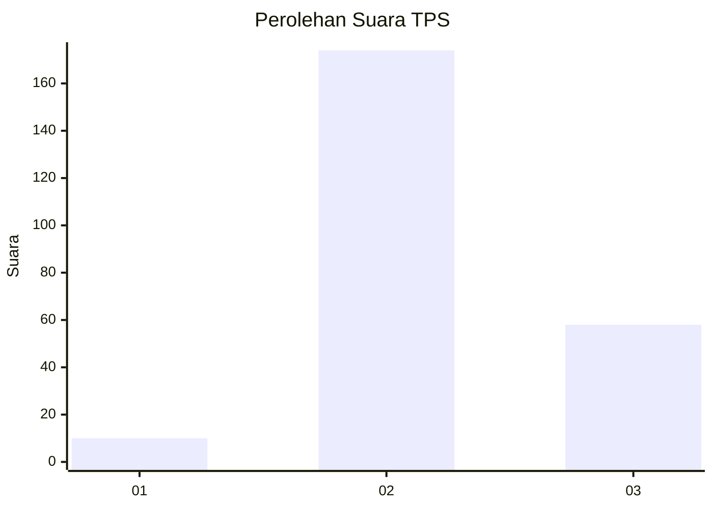
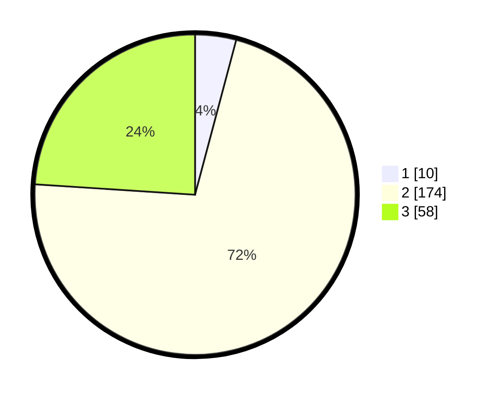

# Hasil

## Grafik

## Tabel

| No. | Nama Paslon    | Suara | Suara (raw) | Persentase |
|:--- |:-------------- | -----:| -----------:| ----------:|
| 1   | ANIES MUHAIMIN | 10    | [10][p-1]   | 4,13       |
| 2   | PRABOWO GIBRAN | 174   | [174][p-2]  | 71,90      |
| 3   | GANJAR MAHFUD  | 58    | [58][p-3]   | 23,97      |

[p-1]: https://github.com/gigit-pemilu/pemilu-2024/blob/main/pilpres/hitung-suara/sub/35-jawa-timur/sub/05-blitar/sub/05-bakung/sub/2011-tumpakkepuh/sub/005-tps/sub/paslon-1.txt
[p-2]: https://github.com/gigit-pemilu/pemilu-2024/blob/main/pilpres/hitung-suara/sub/35-jawa-timur/sub/05-blitar/sub/05-bakung/sub/2011-tumpakkepuh/sub/005-tps/sub/paslon-2.txt
[p-3]: https://github.com/gigit-pemilu/pemilu-2024/blob/main/pilpres/hitung-suara/sub/35-jawa-timur/sub/05-blitar/sub/05-bakung/sub/2011-tumpakkepuh/sub/005-tps/sub/paslon-3.txt

## Foto C Plano

https://sirekap-obj-formc.kpu.go.id/e49a/pemilu/ppwp/35/05/05/20/11/3505052011005-20240216-222757--f9b4be80-fc14-4095-bad8-effe34caef79.jpg

https://sirekap-obj-formc.kpu.go.id/e49a/pemilu/ppwp/35/05/05/20/11/3505052011005-20240216-223022--738f8889-ea8a-463d-8746-98a99d0bbeec.jpg

https://sirekap-obj-formc.kpu.go.id/e49a/pemilu/ppwp/35/05/05/20/11/3505052011005-20240216-223226--2f317686-213b-4541-b963-d5cfa4e45dcc.jpg

## Metadata

| Key        | Value               |
| ---------- | ------------------- |
| Time Stamp | 2024-02-17 13:37:34 |

