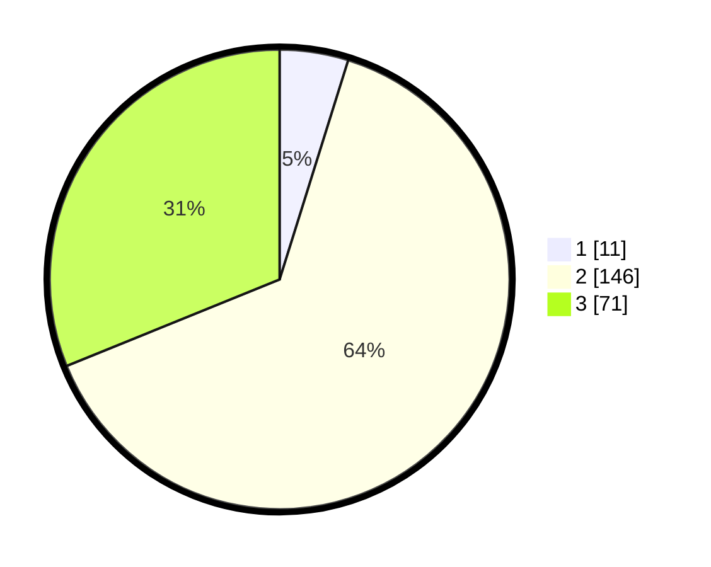

# Hasil

## Grafik

## Tabel

| No. | Nama Paslon    | Suara | Suara (raw) | Persentase |
|:--- |:-------------- | -----:| -----------:| ----------:|
| 1   | ANIES MUHAIMIN | 11    | [11][p-1]   | 4,82       |
| 2   | PRABOWO GIBRAN | 146   | [146][p-2]  | 64,04      |
| 3   | GANJAR MAHFUD  | 71    | [71][p-3]   | 31,14      |

[p-1]: https://github.com/gigit-pemilu/pemilu-2024/blob/main/pilpres/hitung-suara/sub/35-jawa-timur/sub/05-blitar/sub/06-ponggok/sub/2003-gembongan/sub/017-tps/sub/paslon-1.txt
[p-2]: https://github.com/gigit-pemilu/pemilu-2024/blob/main/pilpres/hitung-suara/sub/35-jawa-timur/sub/05-blitar/sub/06-ponggok/sub/2003-gembongan/sub/017-tps/sub/paslon-2.txt
[p-3]: https://github.com/gigit-pemilu/pemilu-2024/blob/main/pilpres/hitung-suara/sub/35-jawa-timur/sub/05-blitar/sub/06-ponggok/sub/2003-gembongan/sub/017-tps/sub/paslon-3.txt

## Foto C Plano

https://sirekap-obj-formc.kpu.go.id/3cbc/pemilu/ppwp/35/05/06/20/03/3505062003017-20240214-215908--8844782d-349c-4328-b8bc-e72707f5d6d5.jpg

https://sirekap-obj-formc.kpu.go.id/3cbc/pemilu/ppwp/35/05/06/20/03/3505062003017-20240214-191705--756f36f2-7826-4a8e-9e1d-655f5a1397b7.jpg

https://sirekap-obj-formc.kpu.go.id/3cbc/pemilu/ppwp/35/05/06/20/03/3505062003017-20240214-192258--b83e65be-47bc-4a7f-b4b0-dd52f1e1e65c.jpg

## Metadata

| Key        | Value               |
| ---------- | ------------------- |
| Time Stamp | 2024-02-15 12:00:28 |

