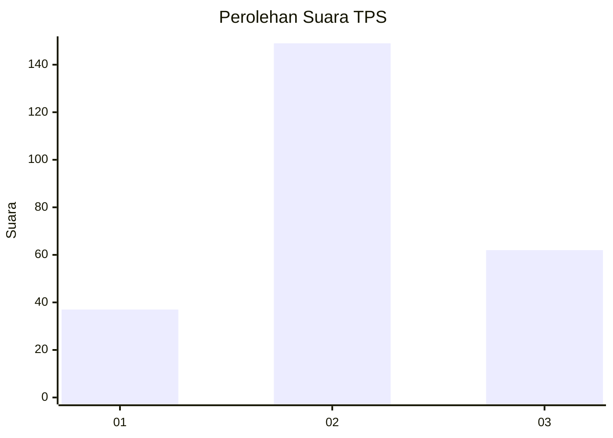
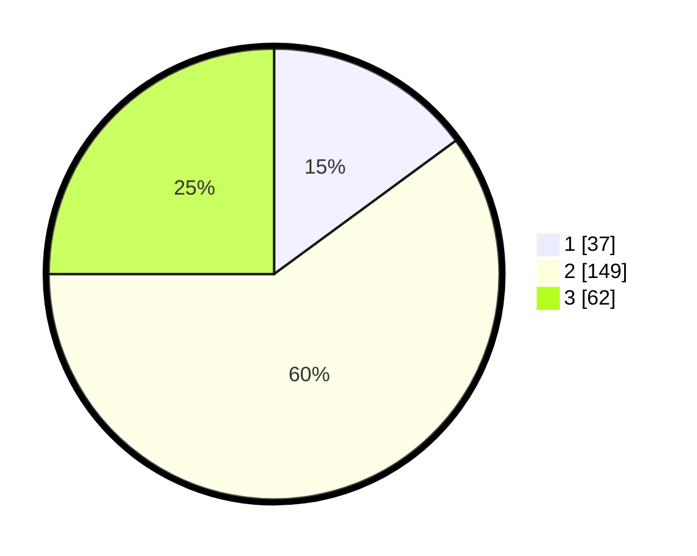

# Hasil

## Grafik

## Tabel

| No. | Nama Paslon    | Suara | Suara (raw) | Persentase |
|:--- |:-------------- | -----:| -----------:| ----------:|
| 1   | ANIES MUHAIMIN | 37    | [37][p-1]   | 14,92      |
| 2   | PRABOWO GIBRAN | 149   | [149][p-2]  | 60,08      |
| 3   | GANJAR MAHFUD  | 62    | [62][p-3]   | 25,00      |

[p-1]: https://github.com/gigit-pemilu/pemilu-2024/blob/main/pilpres/hitung-suara/sub/35-jawa-timur/sub/05-blitar/sub/06-ponggok/sub/2005-kebonduren/sub/026-tps/sub/paslon-1.txt
[p-2]: https://github.com/gigit-pemilu/pemilu-2024/blob/main/pilpres/hitung-suara/sub/35-jawa-timur/sub/05-blitar/sub/06-ponggok/sub/2005-kebonduren/sub/026-tps/sub/paslon-2.txt
[p-3]: https://github.com/gigit-pemilu/pemilu-2024/blob/main/pilpres/hitung-suara/sub/35-jawa-timur/sub/05-blitar/sub/06-ponggok/sub/2005-kebonduren/sub/026-tps/sub/paslon-3.txt

## Foto C Plano

https://sirekap-obj-formc.kpu.go.id/1680/pemilu/ppwp/35/05/06/20/05/3505062005026-20240214-205340--c429a30c-58fe-416b-9e2f-ea8b4786b00d.jpg

https://sirekap-obj-formc.kpu.go.id/1680/pemilu/ppwp/35/05/06/20/05/3505062005026-20240214-205633--4aa5440b-cf59-422a-8df1-e91e811a2ecf.jpg

https://sirekap-obj-formc.kpu.go.id/1680/pemilu/ppwp/35/05/06/20/05/3505062005026-20240214-205845--0a7e7ea1-5171-45bb-afa2-e447c733bed7.jpg

## Metadata

| Key        | Value               |
| ---------- | ------------------- |
| Time Stamp | 2024-02-17 13:37:34 |

