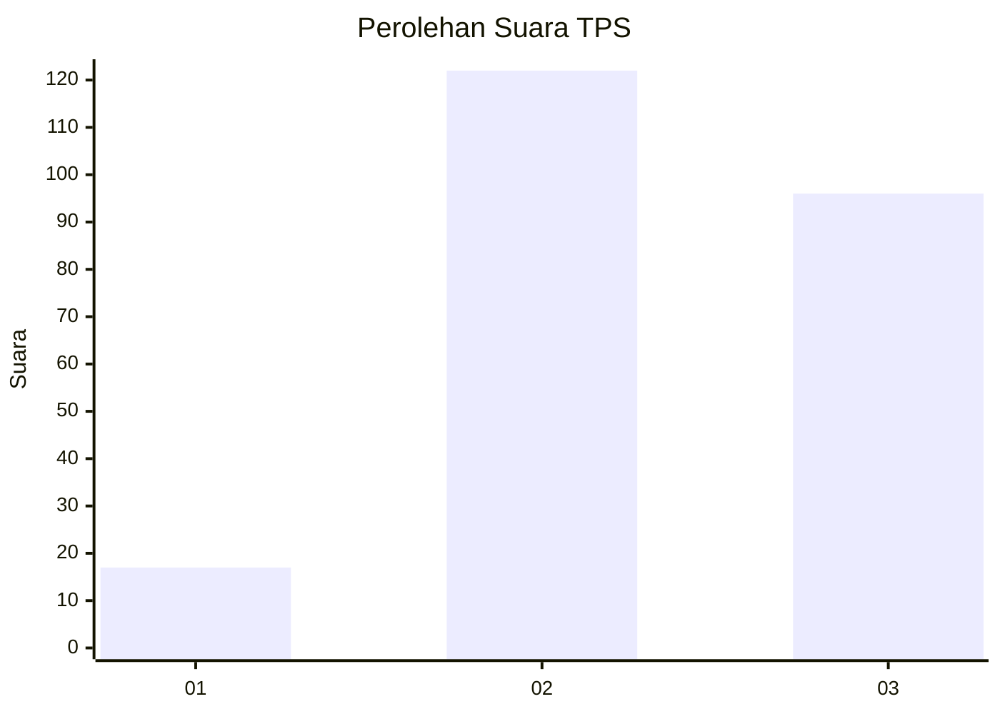
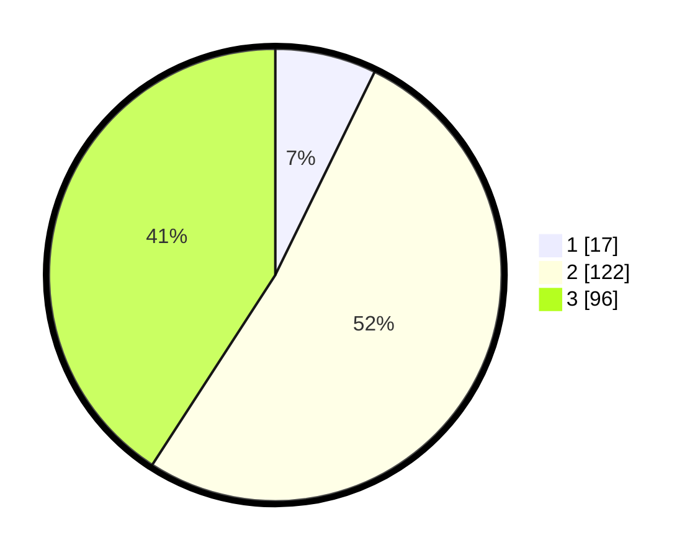

# Hasil

## Grafik

## Tabel

| No. | Nama Paslon    | Suara | Suara (raw) | Persentase |
|:--- |:-------------- | -----:| -----------:| ----------:|
| 1   | ANIES MUHAIMIN | 17    | [17][p-1]   | 7,23       |
| 2   | PRABOWO GIBRAN | 122   | [122][p-2]  | 51,91      |
| 3   | GANJAR MAHFUD  | 96    | [96][p-3]   | 40,85      |

[p-1]: https://github.com/gigit-pemilu/pemilu-2024-35-jawa-timur/blob/main/pilpres/hitung-suara/sub/35-jawa-timur/sub/05-blitar/sub/06-ponggok/sub/2007-ponggok/sub/014-tps/sub/paslon-1.txt
[p-2]: https://github.com/gigit-pemilu/pemilu-2024-35-jawa-timur/blob/main/pilpres/hitung-suara/sub/35-jawa-timur/sub/05-blitar/sub/06-ponggok/sub/2007-ponggok/sub/014-tps/sub/paslon-2.txt
[p-3]: https://github.com/gigit-pemilu/pemilu-2024-35-jawa-timur/blob/main/pilpres/hitung-suara/sub/35-jawa-timur/sub/05-blitar/sub/06-ponggok/sub/2007-ponggok/sub/014-tps/sub/paslon-3.txt

## Foto C Plano

https://sirekap-obj-formc.kpu.go.id/8b47/pemilu/ppwp/35/05/06/20/07/3505062007014-20240215-220051--6baf0c2f-8bbd-46c5-a01e-900f97cf9316.jpg

https://sirekap-obj-formc.kpu.go.id/8b47/pemilu/ppwp/35/05/06/20/07/3505062007014-20240215-220108--d6e70026-1e0a-470d-a2e9-368153325560.jpg

https://sirekap-obj-formc.kpu.go.id/8b47/pemilu/ppwp/35/05/06/20/07/3505062007014-20240215-220118--b92d433d-02cd-42e7-b038-df75a43896fe.jpg

## Metadata

| Key        | Value               |
| ---------- | ------------------- |
| Time Stamp | 2024-02-16 11:00:29 |

