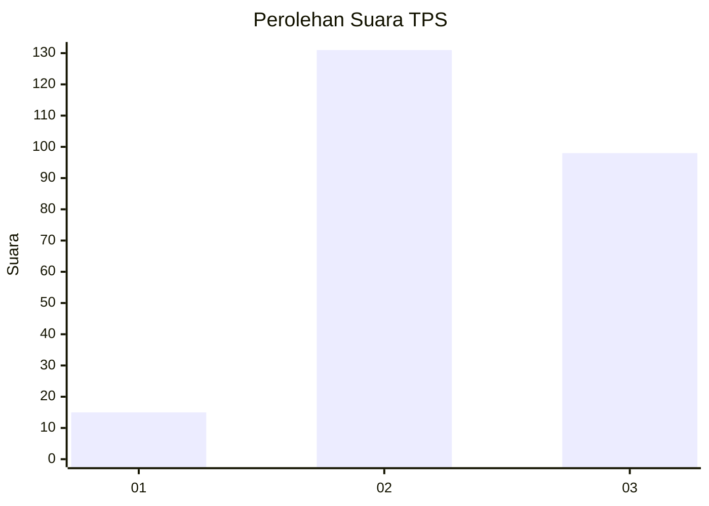
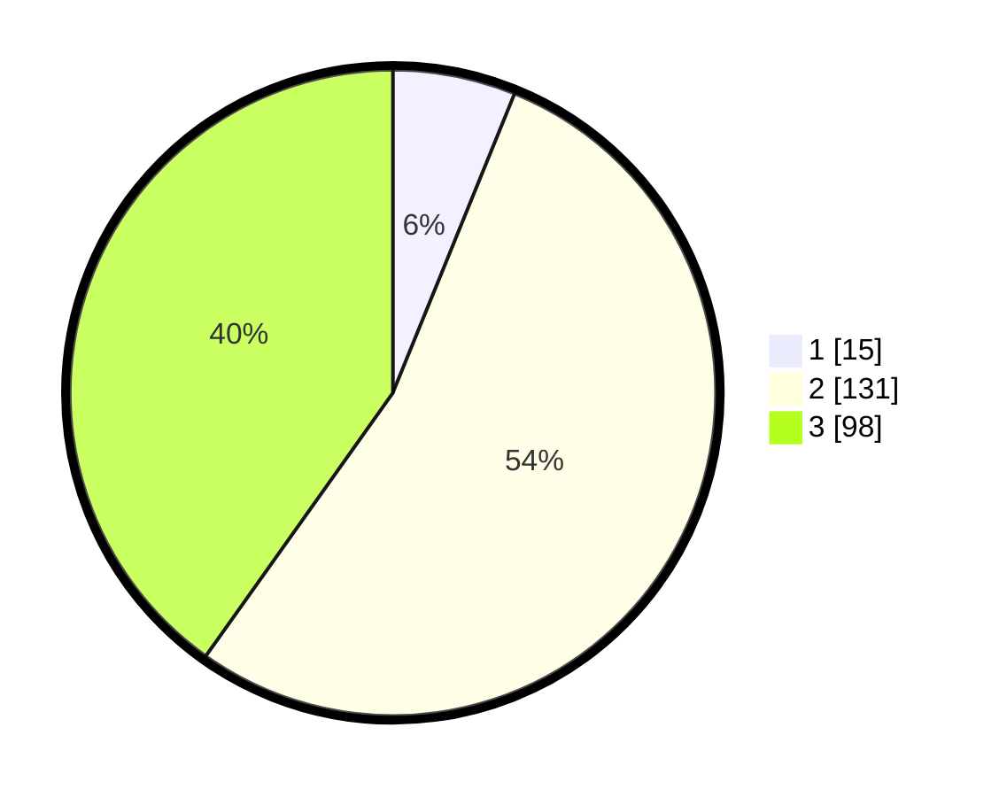

# Hasil

## Grafik

## Tabel

| No. | Nama Paslon    | Suara | Suara (raw) | Persentase |
|:--- |:-------------- | -----:| -----------:| ----------:|
| 1   | ANIES MUHAIMIN | 15    | [15][p-1]   | 6,15       |
| 2   | PRABOWO GIBRAN | 131   | [131][p-2]  | 53,69      |
| 3   | GANJAR MAHFUD  | 98    | [98][p-3]   | 40,16      |

[p-1]: https://github.com/gigit-pemilu/pemilu-2024-35-jawa-timur/blob/main/pilpres/hitung-suara/sub/35-jawa-timur/sub/05-blitar/sub/06-ponggok/sub/2007-ponggok/sub/023-tps/sub/paslon-1.txt
[p-2]: https://github.com/gigit-pemilu/pemilu-2024-35-jawa-timur/blob/main/pilpres/hitung-suara/sub/35-jawa-timur/sub/05-blitar/sub/06-ponggok/sub/2007-ponggok/sub/023-tps/sub/paslon-2.txt
[p-3]: https://github.com/gigit-pemilu/pemilu-2024-35-jawa-timur/blob/main/pilpres/hitung-suara/sub/35-jawa-timur/sub/05-blitar/sub/06-ponggok/sub/2007-ponggok/sub/023-tps/sub/paslon-3.txt

## Foto C Plano

https://sirekap-obj-formc.kpu.go.id/078b/pemilu/ppwp/35/05/06/20/07/3505062007023-20240214-214802--d8d0f94d-86d3-4d4e-b839-6764e4b043e9.jpg

https://sirekap-obj-formc.kpu.go.id/078b/pemilu/ppwp/35/05/06/20/07/3505062007023-20240214-215310--ce098136-8bbc-487b-8c68-c2f2f029faee.jpg

https://sirekap-obj-formc.kpu.go.id/078b/pemilu/ppwp/35/05/06/20/07/3505062007023-20240214-215445--4629d7e9-eebb-4e0e-82ec-e291feb7458c.jpg

## Metadata

| Key        | Value               |
| ---------- | ------------------- |
| Time Stamp | 2024-02-15 15:00:29 |

