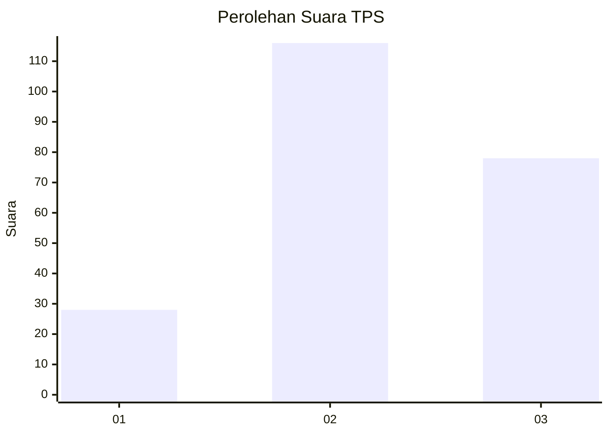
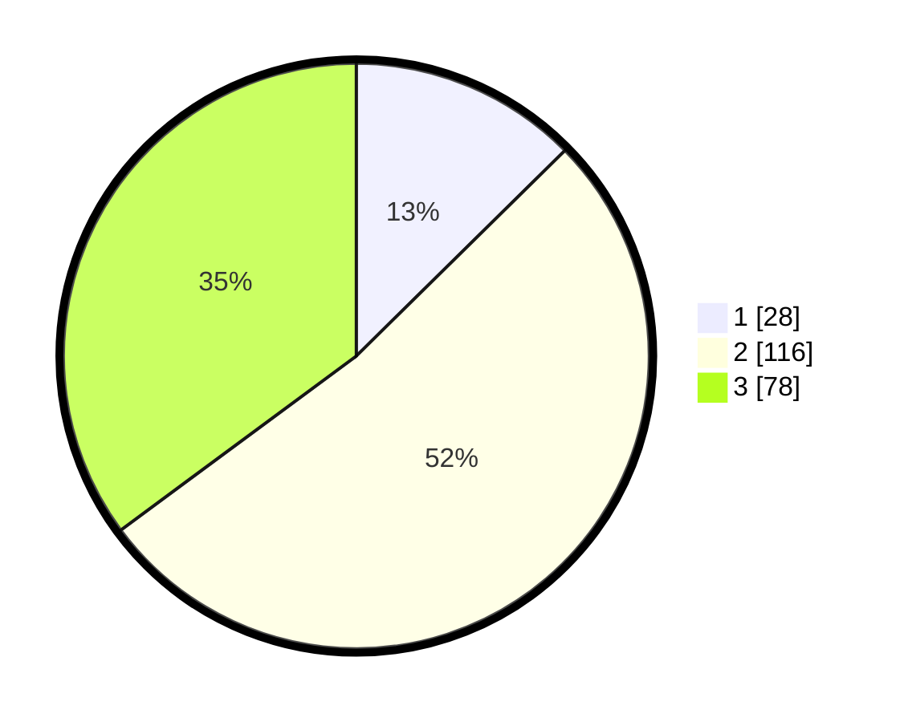

# Hasil

## Grafik

## Tabel

| No. | Nama Paslon    | Suara | Suara (raw) | Persentase |
|:--- |:-------------- | -----:| -----------:| ----------:|
| 1   | ANIES MUHAIMIN | 28    | [28][p-1]   | 12,61      |
| 2   | PRABOWO GIBRAN | 116   | [116][p-2]  | 52,25      |
| 3   | GANJAR MAHFUD  | 78    | [78][p-3]   | 35,14      |

[p-1]: https://github.com/gigit-pemilu/pemilu-2024/blob/main/pilpres/hitung-suara/sub/35-jawa-timur/sub/05-blitar/sub/06-ponggok/sub/2010-jatilengger/sub/001-tps/sub/paslon-1.txt
[p-2]: https://github.com/gigit-pemilu/pemilu-2024/blob/main/pilpres/hitung-suara/sub/35-jawa-timur/sub/05-blitar/sub/06-ponggok/sub/2010-jatilengger/sub/001-tps/sub/paslon-2.txt
[p-3]: https://github.com/gigit-pemilu/pemilu-2024/blob/main/pilpres/hitung-suara/sub/35-jawa-timur/sub/05-blitar/sub/06-ponggok/sub/2010-jatilengger/sub/001-tps/sub/paslon-3.txt

## Foto C Plano

https://sirekap-obj-formc.kpu.go.id/5fa2/pemilu/ppwp/35/05/06/20/10/3505062010001-20240214-195053--103f3287-ebbc-4fb5-877a-0b4aa79414af.jpg

https://sirekap-obj-formc.kpu.go.id/5fa2/pemilu/ppwp/35/05/06/20/10/3505062010001-20240214-200218--26cf9740-aa11-4906-8646-c8ee110d92cb.jpg

https://sirekap-obj-formc.kpu.go.id/5fa2/pemilu/ppwp/35/05/06/20/10/3505062010001-20240214-200707--727708a6-15c4-40a4-81cc-4194381d9c59.jpg

## Metadata

| Key        | Value               |
| ---------- | ------------------- |
| Time Stamp | 2024-02-14 21:46:01 |

